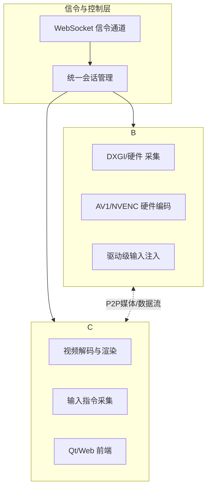

# HopeDesk 远程桌面

基于 **WebRTC** 与现代信令架构构建的远程控制方案，充分发挥**WebSocket的广泛兼容性**与成熟生态，专为追求稳定连接、高清画质与系统级控制的专业场景而设计。（仅供学习与研究目的使用，下文所述功能均已由开发者个人测试验证）

---

## 🚀 核心亮点

- **稳健高效的信令架构**：采用以**WebSocket为核心的稳健信令架构**。利用WebSocket技术实现高兼容性的连接建立、会话管理与穿透，在提供无与伦比的跨平台与防火墙穿透能力的同时，确保连接的稳定与可靠。
- **卓越视觉体验**：采用高效屏幕捕获与**AV1软件编码**，提供高清流畅画面。**已集成基于NVIDIA NVENC的硬件编码支持**，为远程运行大型3A游戏、专业设计软件提供强大的性能支撑，显著提升画质与流畅度。
- **系统级沉浸操控**：通过驱动级输入技术实现零延迟键鼠映射，完美支持UAC安全桌面，支持**远程畅玩各类大型游戏**，提供沉浸式体验。
- **自适应网络连接**：优先建立P2P直连传输，结合智能路由选择，确保在任何网络环境下都能获得稳定、低延迟的连接。

---

## 🏗️ 系统架构

HopeDesk 采用分层解耦设计，确保系统兼具高兼容性与高可靠性。



**信令层工作流**：
1. 客户端通过**WebSocket**建立稳定、兼容的信令连接。
2. 所有业务逻辑基于统一的会话管理层进行，实现信令传输与业务逻辑的解耦，简化系统设计，提升可维护性。

---

## 🚀 快速开始（使用配置）

### 前提条件
- Windows 操作系统（被控端）
- 已获取 HopeDesk 完整发布包（`HopeDesk-release` 与 `HopeDeskNative-release`）

### 步骤 1：安装驱动级输入支持
为实现系统级沉浸操控，需先安装输入驱动：
1.  在 `HopeDeskNative-release` 目录下，以**管理员身份**打开命令行。
2.  执行命令：`install-interception.exe /install`
3.  **重启电脑**使驱动生效。

### 步骤 2：配置被控端 (Host)
1.  导航至 `HopeDeskNative-release` 目录，找到并编辑 `config.ini` 文件。
2.  根据您的实际部署路径，配置核心文件位置与基础信息，关键配置项如下：

    ```ini
    [WebRTC]
    ; 配置 HopeDeskSystem.exe 的路径（相对于 config.ini 所在目录或绝对路径）
    WebRTCEXE=../HopeDeskSystem-release/HopeDeskSystem.exe
    ; 系统服务名称，可保持默认
    WebRTCService=HopeDeskSystem
    ; HopeDeskSystem 相关配置文件所在目录
    WebRTCConfigPath=../HopeDeskSystem-release/

    [Stun]
    ; STUN 服务器地址，用于NAT穿透
    Host=stun:121.5.37.53:3478

    [Turn]
    ; TURN 中继服务器地址，用于无法直连时的备选传输
    Host=turn:121.5.37.53:3478
    Username=HopeTiga
    Password=dy913140924

    [WebRTCSignalServer]
    ; 信令服务器地址
    Host=121.5.37.53
    Port=8088
    ```

    **注意**：请确保 `WebRTCEXE` 和 `WebRTCConfigPath` 指向的路径在您的系统中真实有效。STUN/TURN 及信令服务器配置为示例，请根据实际可用服务进行替换。

### 步骤 3：启动与连接
1.  运行 `HopeDeskNative-release` 目录下的主程序（或服务）作为被控端。
2.  在操控端（Windows Qt客户端或Web浏览器）输入被控端生成的连接码或ID，即可建立远程连接。

---

## 🛠️ 核心功能特性

### 🖥️ 画质与性能
- **高清自适应编码**：采用高效率的AV1软件编码器，在有限带宽下提供更佳画质。支持动态调整帧率与分辨率，适应复杂网络。
- **硬件编码支持**：**已集成基于NVIDIA NVENC的硬件编码**，能够利用GPU进行编码加速，大幅降低大型应用（如3A游戏、视频编辑软件）远程运行时的CPU占用，实现更高帧率、更低延迟与更佳画质，是**远程高品质游戏与专业应用体验的关键保障**。
- **为游戏优化**：当前架构结合硬件编码，已能高质量、高帧率地流畅支持远程运行大型游戏，将远程游戏的画质和流畅度提升至新高度。

### 🔀 稳健的信令架构
- **高兼容性与穿透力**：采用广泛支持的**WebSocket协议**作为核心信令通道，确保在企业网络、公共Wi-Fi等各种复杂网络环境下都能可靠建立连接，具备出色的防火墙穿透能力。
- **架构简化与稳定**：单一、成熟的核心信令协议降低了系统复杂度，提高了整体的稳定性和可调试性，同时保持了完整的会话管理、控制与协商能力。
- **统一会话管理**：清晰的上层业务逻辑与稳定的接口，为功能扩展和多平台支持奠定坚实基础。

### 🎮 专业级操控体验
- **真正的远程游戏支持**：结合硬件编码与驱动级输入，可高画质、高帧率流畅运行大型游戏，实现近乎本地的操作响应，满足游戏、设计等专业场景。
- **驱动级系统输入**：绕过系统权限限制，可直接向安全桌面、管理员窗口发送输入，实现完整的系统控制能力。
- **完善的输入支持**：全功能键盘按键（包括Win键、多媒体键）、多按钮鼠标、滚轮操作均被完美支持与同步。

### 🌐 健壮的网络连接
- **P2P优先策略**：在NAT类型允许的情况下，始终优先建立点对点直连，确保最低的端到端延迟。
- **强大的穿透能力**：集成STUN/TURN标准，在复杂网络环境下也能通过中继实现连接。
- **多平台无缝接入**：基于WebSocket的信令架构使得Web浏览器、桌面客户端及其他平台能够以统一、标准的方式轻松接入系统。

---

## ⚡ 技术选型：稳健信令的智慧

HopeDesk 采用以 WebSocket 为核心的稳健信令架构，旨在各类生产环境中提供最高级别的兼容性和连接可靠性。

| 场景 / 需求 | 采用的技术与策略 | 优势体现 |
| :--- | :--- | :--- |
| **全平台客户端连接、高兼容性要求** | **WebSocket** | 作为业界标准，被所有现代浏览器和主流网络库支持，确保最广泛的终端接入能力。 |
| **企业网络/高限制性防火墙环境** | **WebSocket (HTTPS/WSS)** | 基于标准HTTP/HTTPS端口(80/443)，穿越常见防火墙和代理的策略最简单，连接成功率极高。 |
| **连接稳定性与可维护性** | **WebSocket 持久连接** | 成熟的协议、广泛的调试工具和社区知识库，显著提升系统整体稳定性与排障效率。 |
| **标准化与未来扩展** | **WebSocket 标准生态** | 完美契合WebRTC数据通道的信令需求，便于与现有Web生态集成，并为未来功能扩展提供清晰路径。 |

---

## 📱 平台支持

- **Windows 被控端**：✅ 完整支持（核心平台，享驱动级输入、硬件采集与**NVENC硬件编码**）
- **Windows 桌面操控端**：✅ 完整支持（基于Qt，通过WebSocket信令连接）
- **Web 浏览器操控端**：✅ 完整支持（通过WebSocket + WebRTC，可进行远程控制与桌面观看）
- **Linux / macOS 被控端**：🗓️ 规划中（将基于统一的架构进行扩展）
- **移动端（App）**：🗓️ 规划中

---

## ⚠️ 重要声明
本文档所描述的 **HopeDesk 远程桌面系统** 是一个**个人学习与研究项目**。其中涉及的所有技术细节、功能特性（包括但不限于WebSocket信令、AV1/NVENC编码、驱动级输入、P2P连接等）均已由开发者**个人进行实现与功能验证**，并在此作为技术实践总结进行分享。

**该系统仅可用于合法、授权的学习与测试环境，严禁用于任何侵犯他人隐私、破坏系统安全或违反相关法律法规的用途。**
