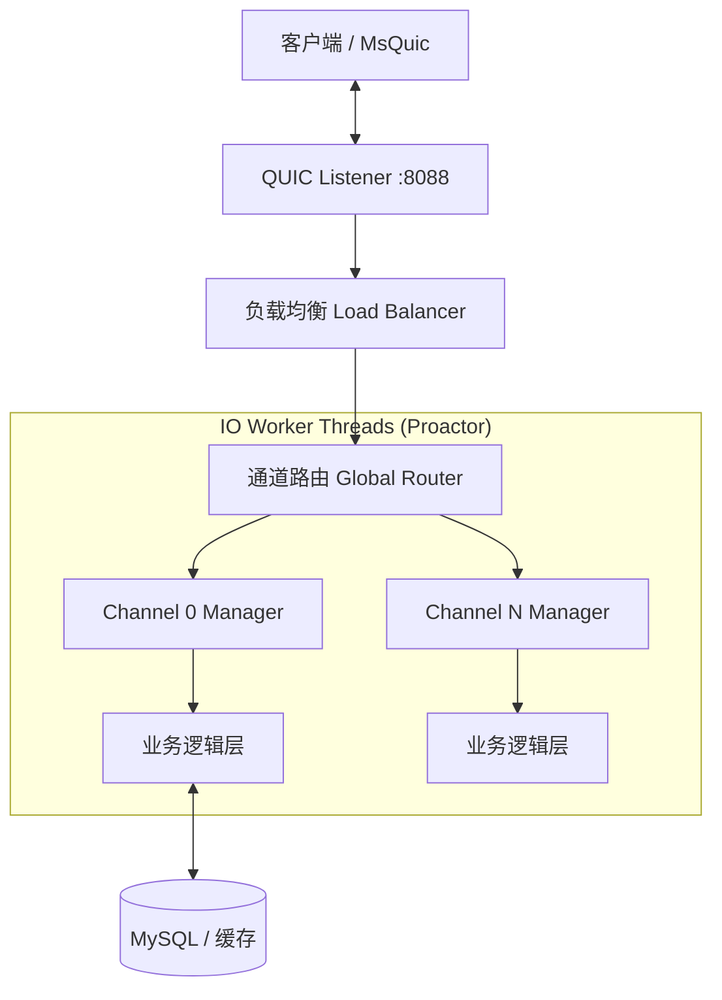

# WebRTC-Native-Manager 高性能远程桌面系统

基于 **WebRTC-Native**、**Boost**、**MsQuic（QUIC）** 与 **Interception（驱动级）** 构建的下一代 P2P 远程控制方案，致力于在保证系统级操控与超低延迟的同时，实现跨平台、高并发的远程桌面体验。

---

## 🚀 核心亮点

- **极致性能**：采用 C++20 协程与 Proactor 模式，结合 WebRTC-Native AV1 编码，实现高帧率、低延迟的桌面流传输。
- **下一代信令**：基于 MsQuic 实现 0-RTT 快速连接与多路复用，彻底解决 TCP 队头阻塞问题。
- **系统级操控**：通过 Interception 驱动实现键盘鼠标的零延迟输入，完美支持 UAC 安全桌面与大型游戏场景。
- **真正的 P2P**：最小化服务器依赖，优先建立基于 UDP 的点对点直连传输，支持 STUN/TURN 辅助穿透。

---

## 🏗️ 系统架构概览

### 信令服务器（MsQuic Signaling Server）
- **核心技术**：C++20 Coroutines + Boost.Asio + MsQuic
- **并发模型**：Proactor I/O 模型 + 多通道 Actor 隔离架构，实现高并发无锁处理
- **主要职责**：基于 QUIC 协议实现信令交换、SDP/ICE 协商及节点注册管理

### 被控端（Host / Source）
- **画面采集**：DXGI 高性能屏幕捕获 + WebRTC（AV1）编码
- **输入模拟**：Interception 驱动级输入注入，绕过 Windows 权限限制（如 UAC）
- **状态同步**：通过 Windows Hooks 实时捕获并同步光标状态

### 操控端（Client / Controller）
- **渲染输出**：WebRTC 视频解码 + Qt QRHI 高效渲染
- **输入采集**：驱动级输入设备捕获，通过 DataChannel 低延迟传输控制指令

---

## 🧩 信令服务器架构详解

系统采用 **分层 + 多通道（Multi-Channel）** 设计，确保高并发场景下的低延迟响应。

**整体拓扑**（Mermaid 描述）：

**内部数据流**：
- **接入层**：管理 MsQuic Socket 生命周期，处理 QUIC 流的多路复用
- **业务层**：消息路由与会话状态管理，支持跨通道异步消息投递（PostAsyncTask）
- **数据层**：独立数据库连接池与 LRU 缓存机制

---

## 🛠️ 功能特性矩阵

### 🖥️ 视觉与传输
- **DXGI 高性能采集**：支持 30/60 FPS 动态帧率调整
- **AV1 编码**：较 H.264 提供更高压缩率与画质
- **自适应流控**：根据实时带宽动态调整码率与画质
- **MsQuic 传输**：支持 0-RTT 握手，在弱网环境下表现优异

### 🎮 操控与输入
- **驱动级输入（Interception）**：实现零延迟输入，完美支持 FPS/MOBA 等游戏场景
- **UAC 穿透**：可完全控制 Windows 安全桌面（登录界面、UAC 弹窗等）
- **全功能键鼠支持**：包括组合键（Win/Ctrl/Alt）、中键、侧键及滚轮
- **状态双向同步**：本地与远程鼠标状态实时同步

### 🌐 连接与网络
- **P2P 直连**：优先尝试局域网/公网直连，STUN/TURN 辅助穿透
- **智能重连**：内置进程守护与断网自动恢复机制
- **多端支持**：完整支持 Windows 客户端与 Web/H5 移动端（基于 WebRTC）

---

## ⚡ 协议栈对比：MsQuic vs WebSocket

本系统摒弃传统 WebSocket 信令方案，全面采用基于 QUIC 的 MsQuic 协议。

| 特性 | MsQuic（本系统） | 传统 WebSocket | 优势分析 |
|------|----------------|---------------|----------|
| 连接耗时 | 0-RTT / 1-RTT | 3-RTT（TCP+TLS+WS） | 秒开连接，重连极快 |
| 多路复用 | 单连接多流（Stream） | 需建立多个 TCP 连接 | 避免队头阻塞，资源占用低 |
| 弱网表现 | 优秀（前向纠错） | 较差（丢包重传慢） | 网络切换不断连（连接迁移） |
| 头部开销 | QPACK 压缩 | 无 / 较大 | 传输效率更高 |

---

## 📅 平台支持计划

- **Windows**：✅ 完整支持（当前核心平台）
- **Web/H5**：✅ 支持基础远程操控
- **Linux / macOS**：🗓️ 规划中（基于 MsQuic 跨平台特性实现）

---
