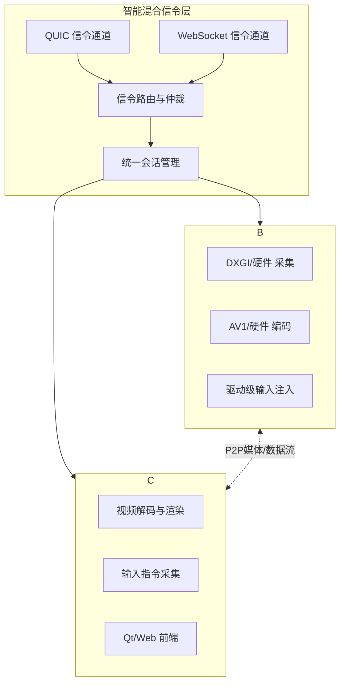

# HopeDesk 远程桌面系统

基于 **WebRTC-Native** 与现代混合信令架构构建的下一代远程控制方案，深度融合**QUIC协议的**与**WebSocket的广泛兼容性**，专为追求超低延迟、高清画质与系统级控制的专业场景而设计。

---

## 🚀 核心亮点

- **智能混合信令**：创新采用 **QUIC 与 WebSocket 混合信令架构**。QUIC 协议保障核心控制链路的高性能与极速连接，WebSocket 提供无与伦比的跨平台与防火墙穿透兼容性，兼顾速度与普适性。
- **卓越视觉体验**：采用高效屏幕捕获与**AV1软件编码**，提供高清流畅画面。**规划集成硬件编解码支持**，旨在为远程运行大型3D游戏、专业设计软件提供更强的性能支撑，进一步释放系统潜力。
- **系统级沉浸操控**：通过驱动级输入技术实现零延迟键鼠映射，完美支持UAC安全桌面，现已支持**远程畅玩各类大型游戏**，提供沉浸式体验。
- **自适应网络连接**：优先建立P2P直连传输，结合智能路由选择，确保在任何网络环境下都能获得稳定、低延迟的连接。

---

## 🏗️ 系统架构

HopeDesk 采用混合信令与分层解耦设计，确保系统兼具高性能与高可靠性。

**信令层工作流**：
1. 客户端同时尝试建立 **QUIC**（高性能首选）与 **WebSocket**（兼容性后备）信令连接。
2. 信令路由层根据网络环境、协议握手速度与稳定性智能选择或混合使用主信道。
3. 所有业务逻辑基于统一的会话管理层进行，实现信令传输与业务逻辑的解耦。

---

## 🛠️ 核心功能特性

### 🖥️ 画质与性能
- **高清自适应编码**：采用高效率的AV1软件编码器，在有限带宽下提供更佳画质。支持动态调整帧率与分辨率，适应复杂网络。
- **硬件编解码规划**：我们已规划**硬件编解码**支持路径，旨在利用GPU加速，显著降低大型应用（如3A游戏、视频编辑软件）远程运行时的CPU占用，实现更高帧率与更低延迟，这是**远程高品质游戏体验的关键进化方向**。
- **为游戏优化**：当前架构已能流畅支持远程游戏。**未来硬件编码的引入**，将把大型游戏的远程画质和流畅度提升至新高度。

### 🔀 智能混合信令
- **双协议优势融合**：**QUIC协议**用于对延迟敏感的核心信令（如输入、会话控制），实现0-RTT快速重连，避免队头阻塞。**WebSocket协议**作为通用通道，确保在苛刻的企业网络或特殊环境中也能可靠连接。
- **智能择优与降级**：系统自动选择最优信令通道，并在网络变化时无缝切换，保障控制会话持续在线。
- **统一会话管理**：无论底层使用何种信令，上层业务逻辑一致，简化开发并提供稳定接口。

### 🎮 专业级操控体验
- **真正的远程游戏支持**：目前已可流畅运行多数大型游戏。配合驱动级输入技术，实现近乎本地的操作响应，满足游戏、设计等专业场景。
- **驱动级系统输入**：绕过系统权限限制，可直接向安全桌面、管理员窗口发送输入，实现完整的系统控制能力。
- **完善的输入支持**：全功能键盘按键（包括Win键、多媒体键）、多按钮鼠标、滚轮操作均被完美支持与同步。

### 🌐 健壮的网络连接
- **P2P优先策略**：在NAT类型允许的情况下，始终优先建立点对点直连，确保最低的端到端延迟。
- **强大的穿透能力**：集成STUN/TURN标准，在复杂网络环境下也能通过中继实现连接。
- **多平台接入**：混合信令架构使得Web端、移动端能够轻松通过WebSocket接入，而桌面客户端则能充分利用QUIC的性能优势。

---

## ⚡ 技术选型：混合信令的智慧

HopeDesk 采用 QUIC 与 WebSocket 混合信令，旨在不同场景下发挥各自最大优势。

| 场景 / 需求 | 采用的协议 | 优势体现 |
| :--- | :--- | :--- |
| **桌面客户端连接、对延迟敏感的操作** | **QUIC** | 0-RTT快速连接，无队头阻塞，连接迁移，为控制指令提供最快响应。 |
| **Web浏览器/H5端接入、高限制性防火墙环境** | **WebSocket** | 极高的兼容性，基于HTTP/HTTPS端口，穿越能力强，部署简单。 |
| **弱网与不稳定网络** | **QUIC为主** | 更好的丢包恢复能力和多路复用特性，保持会话流畅。 |
| **首次连接成功率与通用性** | **WebSocket 保底** | 作为广泛支持的协议，确保在任何环境下都能建立基础连接。 |

---

## 📱 平台支持

- **Windows 被控端**：✅ 完整支持（核心平台，享驱动级输入与采集）
- **Windows 桌面操控端**：✅ 完整支持（基于Qt，优先使用QUIC信令）
- **Web 浏览器操控端**：✅ 完整支持（通过WebSocket + WebRTC，可进行远程控制与桌面观看）
- **Linux / macOS 被控端**：🗓️ 规划中（将基于统一的架构进行扩展）
- **移动端（App）**：🗓️ 规划中
