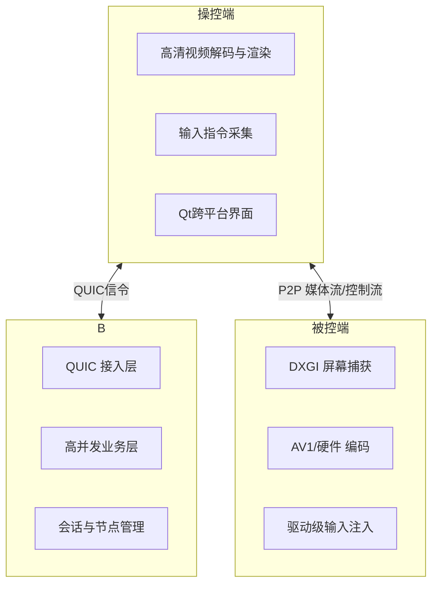

# HopeDesk 下一代远程桌面系统

基于 **WebRTC-Native** 与 **MsQuic（QUIC）** 协议构建的高性能 P2P 远程控制方案，专为追求超低延迟、高清画质与系统级控制的专业场景设计。无论是远程办公、技术支持，还是畅玩大型游戏，HopeDesk 都致力于提供无与伦比的流畅体验。

---

## 🚀 核心亮点

- **极致性能与画质**：采用 C++20 协程与高效的异步架构。支持 **软件编码（AV1）** 与**规划中的硬件编解码**，实现高帧率、低延迟的顶级视觉体验，为远程游戏和专业应用提供强大支持。
- **下一代信令连接**：基于 MsQuic 实现 0-RTT 快速连接与多路复用，连接快如闪电，彻底解决网络阻塞问题。
- **系统级无感操控**：通过驱动级技术实现键盘鼠标的零延迟输入，完美支持 **UAC 安全桌面**与**远程畅玩大型游戏**的需求。
- **真正的 P2P 直连**：最小化服务器依赖，优先建立点对点直连，仅在必要时通过中继服务器辅助，确保最低传输延迟。

---

## 🏗️ 系统架构

HopeDesk 由三个核心组件协同工作，构建稳定高效的控制链路。

---

## 🛠️ 核心功能特性

### 🖥️ 卓越的视觉体验
- **高性能画面采集与编码**：利用 DXGI 高效捕获屏幕。当前支持先进的 **AV1 软件编码**，在画质与带宽间取得绝佳平衡。
- **硬件编解码规划**：我们正规划集成**硬件编解码**支持，以进一步释放性能，为**远程运行大型3D游戏、专业设计软件**提供更强大的处理能力，降低主机CPU负载。
- **自适应流媒体**：根据实时网络状况，动态调整帧率、分辨率和码率，保证任何网络下都流畅。

### 🎮 为游戏而生的操控
- **远程游戏支持**：现已支持远程畅玩各类游戏，包括**大型3D游戏**。结合驱动级输入技术与高效视频流，提供可玩的沉浸式体验。
- **未来增强**：**硬件编解码**的引入将进一步提升大型游戏场景下的画质与流畅度，实现媲美本地的游戏串流效果。
- **驱动级输入**：通过底层技术实现几乎零延迟的键鼠输入，完美映射所有按键和操作，支持组合键、鼠标侧键等。
- **完全系统控制**：可操控 Windows 登录界面、UAC 管理员权限弹窗等安全桌面，无障碍进行远程维护。

### 🌐 稳定高效的连接
- **智能 P2P 连接**：优先尝试点对点直连，失败时自动通过 STUN/TURN 服务器智能中继，确保连接成功率。
- **基于 QUIC 的现代信令**：采用 MsQuic 协议，实现 0-RTT 快速握手与单连接多路复用，连接建立更快，弱网环境下更稳定。
- **断线自动恢复**：具备进程守护与网络自适应能力，网络波动时可快速恢复会话，工作不中断。

---

## ⚡ 技术优势：为何选择 QUIC 与 WebRTC-Native？

HopeDesk 采用业界前沿的 MsQuic (QUIC) 与 WebRTC-Native 组合，相比传统方案优势显著。

| 对比维度 | HopeDesk (QUIC + WebRTC) | 传统方案 (WebSocket + TCP) |
| :--- | :--- | :--- |
| **连接速度** | **0-RTT / 1-RTT 快速连接** | 通常需要 3-RTT (TCP+TLS+WS) |
| **多路复用** | **单连接多流，无队头阻塞** | 多个TCP连接或存在阻塞 |
| **弱网环境** | **前向纠错，连接迁移，表现优异** | 丢包重传慢，易中断 |
| **传输效率** | **头部压缩，加密与传输层结合** | 开销相对较大 |

---

## 📱 平台支持

- **Windows 被控端**：✅ 完整支持（核心平台）
- **Windows 操控端**：✅ 完整支持（基于Qt）
- **Web 浏览器操控端**：✅ 支持基础远程控制（通过 WebRTC）
- **Linux / macOS**：🗓️ 已在规划中（得益于 MsQuic 的跨平台特性）

---
HopeDesk 不仅是一个远程桌面工具，更是一个为高性能、高可靠性场景打造的远程访问基础设施。
