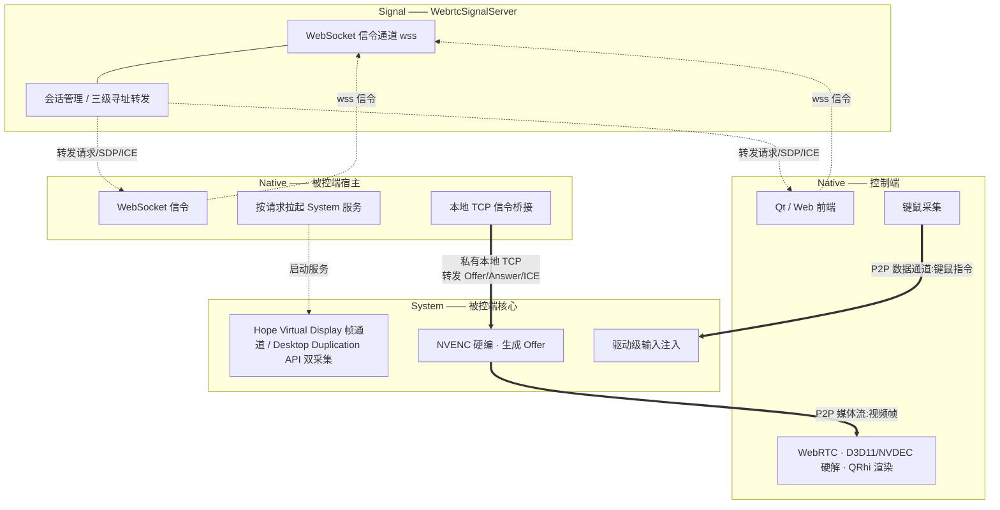

# HopeDesk 远程桌面

基于 **WebRTC** 与现代信令架构构建的远程控制方案，充分发挥**WebSocket的广泛兼容性**与成熟生态，专为追求稳定连接、高清画质与系统级控制的专业场景而设计。（仅供学习与研究目的使用，下文所述功能均已由开发者个人测试验证）

整个系统由三部分协同：**Native**（同一程序在两端各跑一个实例——控制端负责解码渲染与本地键鼠采集，支持 **NVDEC 硬件解码**；被控端实例作为宿主，收到控制请求后拉起 System 并经本地私有 TCP 桥接 Signal ↔ System 信令）、**System**（被控端核心服务，负责屏幕采集——Hope Virtual Display 虚拟显示器帧通道 / Desktop Duplication API 双后端、**NVENC 硬件编码**与驱动级输入注入，不直连信令服务器）、**Signal**（多通道协程化 WebSocket 信令服务器，承载会话管理与路由转发）。信令服务器内部架构（通道分片、三级寻址、过载保护、跨节点 RPC）详见 [`WebrtcSignalServer.md`](./WebrtcSignalServer.md)。

---

## 🚀 核心亮点

- **稳健高效的信令架构**：采用以**WebSocket为核心的稳健信令架构**。利用WebSocket技术实现高兼容性的连接建立、会话管理与穿透，在提供无与伦比的跨平台与防火墙穿透能力的同时，确保连接的稳定与可靠。
- **卓越视觉体验**：采用高效屏幕捕获与**AV1软件编码**，提供高清流畅画面。被控端**已集成基于NVIDIA NVENC的硬件编码**，操控端**集成 D3D11(DXVA)/NVDEC 硬件解码**（AV1 走 D3D11 零拷贝，H264/H265 走 NVDEC），端到端 GPU 加速，为远程运行大型3A游戏、专业设计软件提供强大的性能支撑，显著提升画质与流畅度。
- **双采集模式**：System 内置两套采集后端——**高性能模式**（Hope Virtual Display 虚拟显示器驱动的共享帧通道，GPU 纹理零拷贝直通 NVENC，绕开 Desktop Duplication API 桌面采集，延迟更低、支持 HDR）与**兼容模式**（Desktop Duplication API 桌面采集，无需虚拟显示器驱动即可在任何机器运行，支持 CPU/GPU/PRO 三级传输）。控制端"模式"一键切换：**游戏模式→Hope Virtual Display 高性能**，**办公模式→Desktop Duplication API 兼容**。
- **干净的采集画面**：启用**硬件光标**后，被控端光标经虚拟显示器驱动的带外通道渲染，不合成进帧缓冲，捕获帧天然不含系统光标。
- **系统级沉浸操控**：通过驱动级输入技术实现零延迟键鼠映射，完美支持UAC安全桌面，支持**远程畅玩各类大型游戏**，提供沉浸式体验。
- **自适应网络连接**：优先建立P2P直连传输，结合智能路由选择，确保在任何网络环境下都能获得稳定、低延迟的连接。

---

## 🏗️ 系统架构

HopeDesk 运行时存在**两个 Native 实例**：控制端 Native 与被控端 Native（宿主）。**System 不直接连接信令服务器**，只经**本地私有 TCP**与被控端 Native 通信；被控端 Native 充当 Signal ↔ System 的信令桥接，并在收到控制请求时拉起 System 服务。媒体与输入走 WebRTC 点对点直连，不经过信令服务器。


```mermaid
graph TD
    subgraph S [Signal —— WebrtcSignalServer]
        S1[WebSocket 信令通道 wss]
        S2[会话管理 / 三级寻址转发]
        S1 --- S2
    end

    subgraph NA [Native —— 控制端]
        NA1[Qt / Web 前端]
        NA2[WebRTC · D3D11/NVDEC 硬解 · QRhi 渲染]
        NA3[键鼠采集]
    end

    subgraph NB [Native —— 被控端宿主]
        NB1[WebSocket 信令]
        NB2[本地 TCP 信令桥接]
        NB3[按请求拉起 System 服务]
    end

    subgraph M [System —— 被控端核心]
        M1[Hope Virtual Display 帧通道 / Desktop Duplication API 双采集]
        M2[NVENC 硬编 · 生成 Offer]
        M3[驱动级输入注入]
    end

    NA1 -. wss 信令 .-> S1
    NB1 -. wss 信令 .-> S1
    S2 -. 转发请求/SDP/ICE .-> NA1
    S2 -. 转发请求/SDP/ICE .-> NB1
    NB3 -. 启动服务 .-> M1
    NB2 == 私有本地 TCP<br/>转发 Offer/Answer/ICE ==> M2
    M2 == P2P 媒体流:视频帧 ==> NA2
    NA3 == P2P 数据通道:键鼠指令 ==> M3
```

**连接建立流程**：
1. 控制端 Native 与被控端 Native 各自以 `accountId` 经 `wss://` 接入 Signal。
2. 控制端 Native 发起连接请求（`requestType=1`），Signal 按三级寻址转发到被控端 Native。
3. 被控端 Native 收到"请求控制自己"的请求 → 注册并 **启动 System 服务**（Windows 服务）。
4. System 启动后经 **本地私有 TCP** 连回被控端 Native；被控端 Native 将请求与 WebRTC 配置经 TCP 下发给 System。
5. **System 作为编码方生成 WebRTC Offer**，经 TCP 交给被控端 Native，再由其经 WebSocket/Signal 转发给控制端 Native。
6. 控制端 Native `SetRemoteDescription(offer)` → `CreateAnswer`，Answer 经 Signal → 被控端 Native → TCP → System；ICE 候选沿同一路径交换。
7. 协商完成建立 **P2P 直连**：System（NVENC 编码）→ 媒体流视频帧 → 控制端 Native（D3D11/NVDEC 硬解 + QRhi 渲染）；控制端键鼠 → 数据通道 → System 驱动级注入。
8. NAT 不允许直连时经 STUN/TURN 中继兜底；媒体与数据均不过信令服务器，被控端 Native 仅做信令桥接。

---

## 🚀 快速开始（使用配置）

### 前提条件
- Windows 操作系统（被控端）
- 已获取 HopeDesk 完整发布包（`HopeDesk`）

### 步骤 1：安装驱动级输入支持
为实现系统级沉浸操控，需先安装输入驱动：
1.  在 `HopeDeskNative` 目录下，以**管理员身份**打开命令行。
2.  执行命令：`install-interception.exe /install`
3.  **重启电脑**使驱动生效。

### 步骤 2：安装虚拟显示器驱动（高性能采集）
为启用 Hope Virtual Display 高性能采集（绕开 Desktop Duplication API），需安装 HopeDesk 虚拟显示器驱动。驱动包已预签名，直接使用安装器即可：
1.  进入 `HopeDesk/driver` 目录，以**管理员身份**运行 `HopeDeskVddInstaller.exe`（SetupAPI 安装器，默认安装 `ZakoVDD.inf` 到 `Root\ZakoVDD`，自动清理旧设备节点）。
2.  若提示 **REBOOT required**，重启后再使用；未安装本驱动时 System 自动回退 Desktop Duplication API 兼容采集，不影响连接。
3.  需要自定义签名或完整「清理 + 签名 + 安装」流程的用户，可改用 `install.bat`——该脚本专供**拥有 WDK 且不想使用默认签名**的用户（也内置免 WDK 的 PowerShell 签名回退；驱动已签名时自动跳过签名）。
4.  **签名提示**：驱动为自签名测试证书签名，**无需开启测试签名**。

### 步骤 3：配置被控端 (Host)
1.  导航至 `HopeDeskNative` 目录，找到并编辑 `config.ini` 文件。
2.  根据您的实际部署路径，配置核心文件位置与基础信息，关键配置项如下：

    ```ini
    [Webrtc]
    ; 配置 HopeDeskSystem.exe 的路径（绝对路径或相对于 config.ini 所在目录）
    SystemServiceExe=../HopeDeskSystem/HopeDeskSystem.exe
    ; 系统服务名称（可自定义，避免与已安装的同名服务冲突；留空则取 exe 文件名）
    SystemService=HopeDeskSystem
    ; WebRTC 调试日志开关（对应「设置 → 系统设置」里的勾选）：true=写 logs/webrtc.log（RTC_LOG 最详细，排查 ICE/DTLS）
    DebugLog=false

    [Stun]
    ; STUN 服务器地址，用于NAT穿透
    Host=stun:121.5.37.53:3478

    [Turn]
    ; TURN 中继服务器地址，用于无法直连时的备选传输
    Host=turn:121.5.37.53:3478
    Username=HopeTiga
    Password=dy913140924

    [WebrtcSignalServer]
    ; 信令服务器地址
    Host=121.5.37.53
    Port=8088

    [Render]
    ; 垂直同步开关：1=开启（锁定显示器刷新率），0=关闭（渲染不再被刷新率锁帧）
    VSync=0
    ```

    > 以上配置也可在程序内 **「设置 → 系统设置」** 标签页可视化修改并即时生效：垂直同步在下次远程连接时生效；信号服务器 / STUN / TURN / WebRTC 程序 / 服务名等在**未连接**时可修改，服务名或可执行路径变更时会自动处理已注册系统服务的删除与重新注册。
    >
    > **注意**：请确保 `SystemServiceExe` 指向的路径在您的系统中真实有效。STUN/TURN 及信令服务器配置为示例，请根据实际可用服务进行替换。

### 步骤 4：启动与连接
1.  运行 `HopeDeskNative` 目录下的主程序（或服务）作为被控端。
2.  在操控端（Windows Qt客户端或Web浏览器）输入被控端生成的连接码或ID，即可建立远程连接。

---

## 🛠️ 核心功能特性

### 🖥️ 画质与性能
- **高清自适应编码**：采用高效率的AV1软件编码器，在有限带宽下提供更佳画质。支持动态调整帧率与分辨率，适应复杂网络。
- **硬件编码支持**：**已集成基于NVIDIA NVENC的硬件编码**，能够利用GPU进行编码加速，大幅降低大型应用（如3A游戏、视频编辑软件）远程运行时的CPU占用，实现更高帧率、更低延迟与更佳画质，是**远程高品质游戏与专业应用体验的关键保障**。
- **硬件解码支持**：操控端 Native 集成 **D3D11(DXVA) 与 NVDEC(CUVID) 双硬件解码**：
  - **AV1 硬解**走 **D3D11 DXVA**，默认**零拷贝**（解码直写共享纹理、渲染端免上传直接采样）；若驱动不支持/解码失败（GPU 移除、共享纹理解码崩溃），**自动切换到 VideoProcessor 拷贝路径**（解码进私有纹理 → VideoProcessorBlt 拷到共享纹理，绕开驱动不支持的零拷贝），仍失败则运行时回退软解（dav1d）。
  - **H264/H265 硬解**走 **NVDEC(CUVID)**；H265 软解走 libde265。
  - 每次连接**按新设备重建解码器**，避免沿用上一连接已销毁的旧设备。
- **渲染**：QRhiWidget + **取最新帧 + vsync 持续渲染**（render 内调 update，Qt 官方 vsync 节流模式），呈现对齐显示刷新率，无撕裂、无画面跳动，端到端 GPU 加速链路闭环。
- **为游戏优化**：当前架构结合硬件编码加速，已实现对《英雄联盟》《黑神话：悟空》等大型游戏的远程流畅游玩，在保持高画质的同时稳定输出高帧率与低延迟，将远程游戏体验提升至全新高度。实测借助 **NVENC 硬编**远程游玩《黑神话：悟空》可高画质流畅通关 **黑风大王、黑熊精、杨戬** 等 Boss 战，并稳定运行《英雄联盟》等网游，操控响应接近本地。
- **虚拟显示器高性能采集（Hope Virtual Display）**：System 默认通过自研 **Hope Virtual Display 虚拟显示器驱动**（IddCx Indirect Display）创建虚拟显示器，从驱动的共享帧通道直接捕获。GPU 共享纹理**零拷贝**直通 NVENC，完全绕开 Desktop Duplication API（桌面采集 API 的固有开销），延迟更低、吞吐更高、支持 HDR 元数据；驱动自动按客户端请求的分辨率/刷新率（最高 144Hz+）发布帧。
- **Desktop Duplication API 兼容采集（ScreenCapture）**：未安装或未使用虚拟显示器驱动时，System 自动退回 **Desktop Duplication API 桌面采集**，任何机器都能运行。提供 **CPU / GPU / PRO 三级传输**（由控制端"加速策略"指定）：CPU 走 BGRA 软转 I420；GPU 走计算着色器转 I420；PRO 走 D3D11 VideoProcessor 转 NV12。已关闭脏矩形，走全帧传输。
- **采集模式自动切换**：控制端"模式"选择 **游戏模式** → System 使用 Hope Virtual Display 高性能采集；选择 **办公模式** → 使用 Desktop Duplication API 兼容采集。Hope Virtual Display 不可用（驱动未装/未加载）时也能优雅回退到 Desktop Duplication API，保证连接不中断。
- **干净的采集画面**：System 每次会话自动开启虚拟显示器的**硬件光标**（`HARDWARECURSOR=1`），光标经 IddCx 带外通道渲染，不合成进帧缓冲，捕获帧不含系统光标。
- **编解码与采集状态可见**：**控制端 Native** 实时显示当前解码器（`解码: AV1 硬解`——codec + 硬解/软解）；**被控端 Native** 实时显示当前编码器（`编码: AV1 硬编`——codec + 硬编/软编）与实际使用的采集技术（`采集: Hope Virtual Display` / `Desktop Duplication API`），由远端/System 上报获得；断开控制后两端状态均自动清空，不残留上一会话。
- **WebRTC 调试日志**：**控制端 Native**「设置 → 系统设置」提供「WebRTC 调试日志」开关（写入 `Webrtc.DebugLog`）。开启后 Native 与 System 均把 libwebrtc 的 `RTC_LOG`（`LS_VERBOSE` 级别，含 ICE 连通性检查、candidate pair 状态、DTLS 握手）写入 `logs/webrtc.log`，开关经注册消息下发给 System（System 以服务方式运行时日志落在 `C:\Windows\System32\logs\webrtc.log`）。日志量大，建议仅排查连接问题时开启。

### 🔀 稳健的信令架构
- **高兼容性与穿透力**：采用广泛支持的**WebSocket协议**作为核心信令通道，确保在企业网络、公共Wi-Fi等各种复杂网络环境下都能可靠建立连接，具备出色的防火墙穿透能力。
- **架构简化与稳定**：单一、成熟的核心信令协议降低了系统复杂度，提高了整体的稳定性和可调试性，同时保持了完整的会话管理、控制与协商能力。
- **统一会话管理**：清晰的上层业务逻辑与稳定的接口，为功能扩展和多平台支持奠定坚实基础。

#### 📡 WebrtcSignalServer
信令面中转服务，自研、协程化、SSL 可选，基于 boost::asio 协程 + WebSocket 承载信令转发、HTTP 承载运维查询：

- **多通道分片**：启动按 `threadSize` 切出 N 个通道，每通道独占一个 `io_context` + 线程；连接 round-robin 分配，**单连接生命周期绑定单线程、无跨线程锁**。
- **一致性哈希路由**：按 `accountId % threadSize` 定 home 通道，转发走「本通道直查 → socket 路由缓存 → home 通道寻址」三级寻址，跨通道最多两跳，命中缓存一跳；过期 404 自愈清缓存。
- **过载保护**：本地协程派发 + 全局任务队列（moodycamel 无锁队列）两级调度，超阈值走全局队列削峰，满则回 503 背压，防雪崩。
- **连接管理**：`accountId` 鉴权接入、踢旧连接、TCP keepalive 探活；关闭时 `linger{1,0}` 发 RST 强关，避免 TIME_WAIT 堆积。
- **运维 HTTP**：`/api/v1/managers/overview`、`/stat` 提供通道与连接统计（Bearer token 鉴权）。
- **可扩展**：预留 ylt/coro_rpc 跨节点 RPC（`requestForward` 把信令托付给持有 targetId 的节点）、Polaris 服务发现、MySQL 连接池（持久化层预留）。

> 完整架构（线程模型、配置注入、转发时序、RPC 两层错误模型、任务队列阈值等）见 [`WebrtcSignalServer.md`](./WebrtcSignalServer.md)。

### 🎮 专业级操控体验
- **真正的远程游戏支持**：结合硬件编码与驱动级输入，可高画质、高帧率流畅运行大型游戏，实现近乎本地的操作响应，满足游戏、设计等专业场景。
- **驱动级系统输入**：绕过系统权限限制，可直接向安全桌面、管理员窗口发送输入，实现完整的系统控制能力。
- **完善的输入支持**：全功能键盘按键（包括Win键、多媒体键）、多按钮鼠标、滚轮操作均被完美支持与同步。

### 🌐 健壮的网络连接
- **P2P优先策略**：在NAT类型允许的情况下，始终优先建立点对点直连，确保最低的端到端延迟。
- **强大的穿透能力**：集成STUN/TURN标准，在复杂网络环境下也能通过中继实现连接。
- **多平台无缝接入**：基于WebSocket的信令架构使得Web浏览器、桌面客户端及其他平台能够以统一、标准的方式轻松接入系统。

---

## ⚡ 技术选型：稳健信令的智慧

HopeDesk 采用以 WebSocket 为核心的稳健信令架构，旨在各类生产环境中提供最高级别的兼容性和连接可靠性。

| 场景 / 需求 | 采用的技术与策略 | 优势体现 |
| :--- | :--- | :--- |
| **全平台客户端连接、高兼容性要求** | **WebSocket** | 作为业界标准，被所有现代浏览器和主流网络库支持，确保最广泛的终端接入能力。 |
| **企业网络/高限制性防火墙环境** | **WebSocket (HTTPS/WSS)** | 基于标准HTTP/HTTPS端口(80/443)，穿越常见防火墙和代理的策略最简单，连接成功率极高。 |
| **连接稳定性与可维护性** | **WebSocket 持久连接** | 成熟的协议、广泛的调试工具和社区知识库，显著提升系统整体稳定性与排障效率。 |
| **标准化与未来扩展** | **WebSocket 标准生态** | 完美契合WebRTC数据通道的信令需求，便于与现有Web生态集成，并为未来功能扩展提供清晰路径。 |

---

## 📱 平台支持

- **Windows 被控端**：✅ 完整支持（核心平台，享驱动级输入、硬件采集与**NVENC硬件编码**）。高性能采集（Hope Virtual Display）需 Windows + NVIDIA 显卡（NVENC）及已安装虚拟显示器驱动；兼容采集（Desktop Duplication API）无需 NVIDIA 也能运行。
- **Windows 桌面操控端**：✅ 完整支持（基于Qt，通过WebSocket信令连接，支持**D3D11(DXVA)/NVDEC 硬件解码**）
- **Web 浏览器操控端**：✅ 完整支持（通过WebSocket + WebRTC，可进行远程控制与桌面观看）
- **Linux / macOS 被控端**：🗓️ 规划中（将基于统一的架构进行扩展）
- **移动端（App）**：🗓️ 规划中

---

## ⚠️ 重要声明
本文档所描述的 **HopeDesk 远程桌面系统** 是一个**个人学习与研究项目**。其中涉及的所有技术细节、功能特性（包括但不限于WebSocket信令、AV1/NVENC编码、NVDEC硬件解码、驱动级输入、P2P连接等）均已由开发者**个人进行实现与功能验证**，并在此作为技术实践总结进行分享。

**该系统仅可用于合法、授权的学习与测试环境，严禁用于任何侵犯他人隐私、破坏系统安全或违反相关法律法规的用途。**
