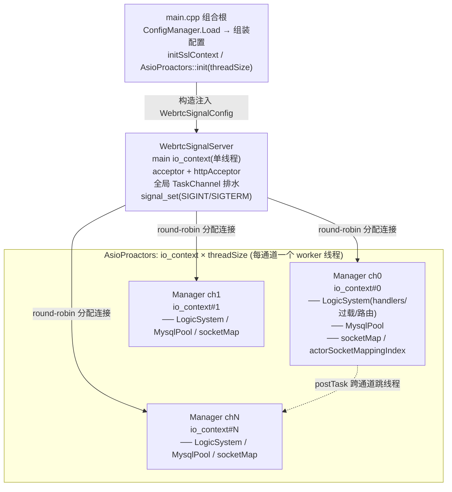
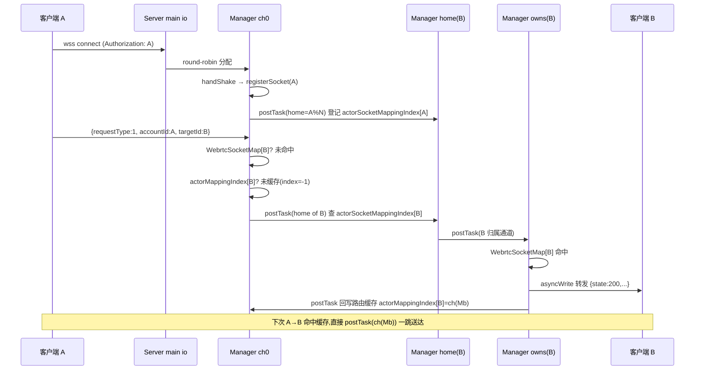
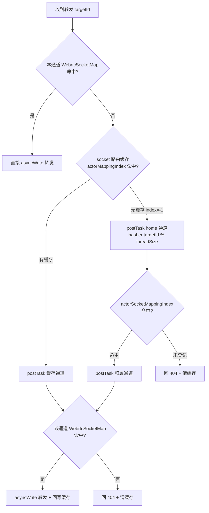
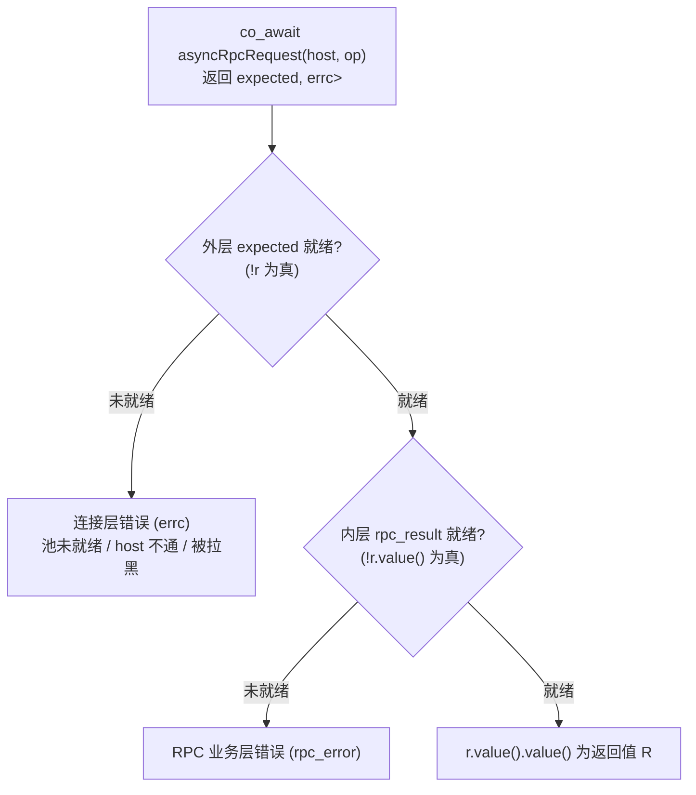
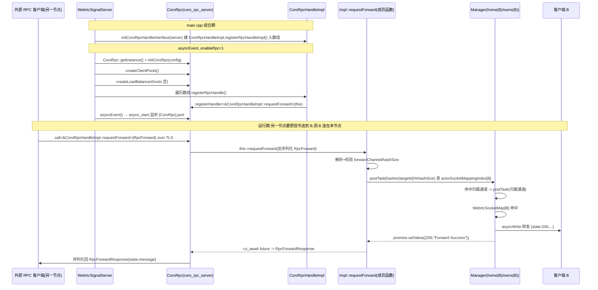

# WebrtcSignalServer 架构文档

> 一台多通道、协程化、SSL 可选的 Webrtc 信令服务器。WebSocket 承载信令转发，HTTP 承载运维查询，预留 CoroRpc 做节点间 RPC、HttpClient 做服务注册发现（Polaris）。
>
> 本文按「架构 → 流程 → 性能 → 使用方式 → 信令 → HTTP → HttpClient → CoroRpc → MySQL」组织，对应代码目录 `WebrtcSignalServer/`。

---

## 1. 概述

WebrtcSignalServer 是 Webrtc 信令面的中转服务：

- **信令通道**：WebSocket（`wss://` 默认开 SSL），客户端用 `accountId` 鉴权接入，服务器按 `requestType` 处理/转发信令到 `targetId`。
- **运维通道**：HTTPS，提供通道/连接统计接口。
- **分片并发**：启动时按 `threadSize` 切出 N 个「通道(channel)」，每个通道独占一个 `io_context`+线程；连接按 round-robin 分配，路由按 `accountId` 一致性哈希跨通道寻址。
- **过载保护**：本地协程派发 + 全局任务队列两级调度，超阈值走全局队列削峰，满则回 503。
- **配置解耦**：`ConfigManager` 只在 `main.cpp` 出现，业务类全部构造注入 / 全局配置，不在类内读 ini。

平台：Linux 为主（makefile 用 clang++ + io_uring + ThinLTO），Windows 仅作开发/调试编译路径。SSL 默认开启，可用宏关闭。

---

## 2. 目录结构

```
WebrtcSignalServer/
├── main.cpp                      # 组合根:读 ini、组装配置结构体、启动
├── Ssl.h / Ssl.cpp               # 全局 ssl::context + initSslContext/getSslContext
├── config.ini                    # 配置文件(ini)
├── makefile                      # clang/linux 构建
├── iocp/
│   └── AsioProactors.h/.cpp      # io_context 池(每线程一个 io_context)
├── signal/                       # 信令+HTTP 主体
│   ├── WebrtcSignalServer.*      # 顶层服务:acceptor、全局任务队列、通道编排
│   ├── WebrtcSignalManager.*     # 单通道:socket 表、actor 路由索引、LogicSystem
│   ├── WebrtcSignalSocket.*      # WebSocket 连接:握手、收发协程、keepalive
│   ├── WebrtcLogicSystem.*       # 业务派发:handler 表、过载调度、forward 路由、HTTP 路由
│   ├── WebrtcSignalPacket.*      # 信令包:socket+json request+requestType
│   ├── HttpSocket.*              # HTTPS 连接:握手、keep-alive、读写
│   ├── HttpClient.*              # 出站 HTTP 客户端(对接 Polaris 等服务发现)
│   ├── HttpFilters.*             # HTTP 鉴权:放行规则(addRule)+全局过滤器(addFilter)
│   ├── AsioConcurrentQueue.h     # moodycamel 队列 + sam 信号量 的 awaitable 封装
│   └── AwaitableTask.h           # TaskChannel:全局任务队列(concurrent_channel + moodycamel)
├── rpc/
│   ├── CoroRpc.h/.cpp                 # ylt/coro_rpc 封装(server+client pool+LB,单例 getInstance)
│   ├── CoroRpcHandleInterface.h       # RPC handler 抽象基类(纯虚 registerRpcHandle,只持 server 引用)
│   ├── CoroRpcHandleImpl.h/.cpp       # RPC handler 实现(requestForward 跨节点转发,自注册)
│   └── Rpc.h/.cpp                     # RpcForward/RpcForwardResponse + 默认 handler 注册 initCoroRpcHandleInterface
├── mysql/
│   ├── MysqlConfig.h             # 全局 MysqlConfig 结构体 + inline globalMysqlConfig
│   ├── WebrtcMysqlManagerPools.* # boost::mysql 连接池(每通道一个)
│   └── AsyncTransactionGuard.h   # 事务 RAII(START TRANSACTION / COMMIT / ROLLBACK)
└── utils/
    ├── ConfigManager.h           # ini/json/xml 配置单例(只在 main 用)
    ├── Utils.h/.cpp              # 日志(LOG_INFO/...)、控制台级别
    ├── concurrentqueue.h         # moodycamel::ConcurrentQueue(改名 hopeMoodycamel 隔离)
    └── SpinLock.h
```

## 3. 整体架构

### 3.1 分层



### 3.2 线程模型

| 线程 | io_context | 职责 |
|------|-----------|------|
| main loop(1 个) | `ioContext{1}` | accept(WebSocket+HTTP)、全局 TaskChannel 排水、`signal_set` |
| worker × `threadSize` | `AsioProactors` 池中各自一个 | 本通道连接的握手/读写协程、handler 执行、MySQL pool |

- **连接绑定通道**：accept 后 `loadBalanceWebrtcManger()` 用 `managerIndex.fetch_add(1) % threadSize` round-robin 选一个 Manager，socket 的 `co_spawn` 落在该 Manager 的 io_context 上；此后该连接的收发、handler 都在同一个 worker 线程，**无跨线程锁**。
- **跨通道通信**：两个原语（`WebrtcSignalServer::postTask` 按 `handler` 返回类型重载），都把活儿派到 `channelIndex` 通道的 io_context 上跑、lambda 收到 `shared_ptr<WebrtcSignalManager>`，区别在协程/非协程与完成令牌：
  - `postTask(channelIndex, handler, token = CompletionPostTask)`——**协程 + completion-token 版**（`handler` 返回 `awaitable<T>(shared_ptr<M>)`）。内部 `async_initiate` + `co_spawn`。默认令牌 `CompletionPostTask` = fire-and-forget + 异常落日志（返回 `void`）；传 `boost::asio::use_awaitable` 即可 `co_await` 拿返回值（`handler` 返回 `awaitable<json>` 则直接得到 `json`），续体按 asio executor 亲和落回**调用方 io**（不跨线程），适合"发一跳、等它干完再继续"。返回类型由令牌决定（`async_result`）：默认 → `void`，`use_awaitable` → `awaitable<T>`。
  - `postTask(channelIndex, handler)`——**普通 post 版**（`handler` 是 `void(shared_ptr<M>)` 的可调用对象）。内部 `boost::asio::post`，**不建协程、无协程帧开销**，返回 `bool`（校验 channelIndex）。给"纯同步活儿、不需要 `co_await`、不需要异常语义"的 fire-and-forget 跳用（如回写/清缓存）。轻量优先用普通重载；要 `co_await` 或要跨通道协程语义才用协程重载。
  - 入参非法（channelIndex 越界/manager 为空）时：普通 `postTask` 直接 `LOG_ERROR` + 返回 `false`；协程 `postTask` 走 async 契约——通过令牌完成一个 `runtime_error` 异常（默认令牌打日志、`use_awaitable` 在调用方 `co_await` 处抛出），不 `co_spawn`，避免 `use_awaitable` 调用方挂死。
  - 路由转发的线程跳转用这两个重载完成（forward 路径已确认无死代码、无冗余查找、无冗余自跳，到极限）。
- **条件编译**：
  - `__linux__`：accept 走每通道 `SO_REUSEPORT` 多 acceptor（`WebrtcSignalManager::asyncAccept`），Linux 专用路径。
  - 非 Linux（含 Windows）：单 acceptor 在 main loop，accept 后分发。
  - `HOPE_RTC_SIGNAL_SERVER_LOGIC`：LogicSystem 用独立 logic io 池（`AsioProactors::getLogicInstance`）而非本通道 io。
  - `Webrtc_SIGNAL_SOCKET_DISABLE_SSL` / `Webrtc_SIGNAL_HTTP_SOCKET_DISABLE_SSL`：关闭对应连接的 SSL。

### 3.3 配置解耦（重点）

`ConfigManager`（`utils/ConfigManager.h`，boost::property_tree，单例）**只在 `main.cpp` 用一次**：

```
main.cpp: ConfigManager.Instance().Load("config.ini")
        → 读 [WebrtcSignalServer] 填 WebrtcSignalConfig(构造注入)
        → 读 [CoroRpc]          填 WebrtcSignalConfig.coroRpcServerConfig + enableRpc
        → 读 [Mysql]            填 globalMysqlConfig(全局)
```

两条注入路径：

1. **浅层(3 跳)走构造注入**：`WebrtcSignalConfig` → `WebrtcSignalServer` → `WebrtcSignalManager`（用标量小结构体 `WebrtcSignalChannelConfig` 收拢，避免把 CoroRpc 头拖进 Manager）→ `WebrtcLogicSystem`（threshold/exitThreshold/asyncThreshold）/ `WebrtcSignalSocket`（socketWaitTime）。
2. **深层(4 跳、跨子系统)走全局**：`mysql/MysqlConfig.h` 里 `inline MysqlConfig globalMysqlConfig;`，main 填一次，`WebrtcMysqlManagerPools` 读。穿透 server→manager→logicSystem→pools 四层，中间三层不关心 mysql 参数，故按约定走全局而非透传。

业务类内部**不再出现 `ConfigManager::Instance()`**。

---

## 4. 启动与关闭流程

### 启动（`main.cpp`）

1. 设置控制台 UTF-8。
2. `ConfigManager.Load("config.ini")`，`initLogger()`，按 `DEBUG/INFO/WARN/ERROR` 设控制台日志级别。
3. `initSslContext(certificateFile, privateKeyFile)`（主 WebSocket/HTTP 的 SSL 上下文）。
4. 组装 `WebrtcSignalConfig`（port/httpPort/enableHttp/enablePublicPort/threadSize/overload/threshold/exitThreshold/asyncThreshold/socketWaitTime + `[CoroRpc]` 子配置）与 `globalMysqlConfig`。
5. `AsioProactors::init(threadSize)` 启动 worker 线程池。
6. 构造 `WebrtcSignalServer(ioContext, WebrtcSignalConfig)`（内部 `initialize()` 建 N 个 Manager，每个 Manager 建 LogicSystem+MysqlPool 并 `asyncEvent()`）。
7. `WebrtcSignalServer->asyncEvent()`：开 accept 协程、全局任务队列排水协程、各 LogicSystem 的 `asyncTaskExecute()`。
8. `signal_set(SIGINT/SIGTERM).async_wait(...)`。
9. `ioContext.run()`。

### 关闭（收到 SIGINT/SIGTERM）

1. `WebrtcSignalServer->closeEvent()`：`taskQueues.close()`、清空 managers（触发各 Manager/LogicSystem/MysqlPool 析构 → `pool->cancel()`）。
2. `work.reset()` + `ioContext.stop()`。
3. `closeLogger()`。
4. `AsioProactors` 析构：各 worker `work.reset()`→`io_context.stop()`→`join`。

---

## 5. 信令流程（WebSocket）

### 5.1 接入握手（`WebrtcSignalSocket::handShake`）

1. （SSL 时）`async_handshake(server)`，带 `cancel_after(handshakeTimeout)`（`socketWaitTime` ms，注入）。
2. `async_read` 读 HTTP Upgrade 请求。
3. 取 `accountId`：优先 `Authorization` 头，否则 `?authorization=` query。
4. 缺 `accountId` → `LOG_WARN` 拒绝 + `closeSocket()`。
5. `webSocket.async_accept(req)` 完成 WebSocket 升级。
6. `setTcpKeepAlive`（按平台调 SO_KEEPALIVE / TCP_KEEPIDLE/INTVL/CNT）。
7. `manager->registerSocket(accountId, this)`：
   - 若同 `accountId` 已有旧连接 → 旧连接 `closeEvent()`（踢旧）。
   - 写入 `WebrtcSocketMap[accountId]`。
   - `postTask(mapChannelIndex, ...)` 在 home channel 的 `actorSocketMappingIndex[accountId] = {sessionId, channelIndex}` 登记归属。

### 5.2 收发循环

- `asyncEvent()` 起 `reviceCoroutine` + `writerCoroutine` 两个协程。
- **revice**：`async_read` → 解析 JSON 到 `WebrtcSignalPacket.request`（`monotonic_resource` arena）→ 取 `requestType` → `logicSystem->postTask(packet)`。
- **writer**：从 `AsioConcurrentQueue<std::string>`（moodycamel + sam 信号量）dequeue → `async_write`。`asyncWrite(packet)` 入队。
- 异常/断开 → `onDisConnectHandle(accountId, sessionId)` → `removeConnection`。

### 5.3 关闭：RST 强关

`closeSocket()` 设 `linger{1,0}` 后 `close()`，跳过 TCP FIN 四次挥手直接发 RST，**避免 TIME_WAIT 堆积、快速释放资源**。

### 5.4 业务派发与过载（`WebrtcLogicSystem`）

`postTask(packet)`：

```
handler = WebrtcHandlers[requestType]
若找不到 → LOG_ERROR "Unknown Request Type"
找到:
  taskQueueSize++
  if taskQueueSize>=threshold && localTaskQueueSize>=threshold && WebrtcLogicHandlers[type]==true:
      走全局队列: taskQueues.enqueue(lambda)  // 削峰
      失败(队列满) → taskQueueSize--, 回 503 busy
  else:
      localTaskQueueSize++
      co_spawn(本通道 io, func(packet))       // 快路径,本线程就地跑
      完成回调: taskQueueSize--, localTaskQueueSize--,
               若 localTaskQueueSize 回落到 asyncThreshold+1 → 重启 asyncTaskExecute()
```

- 值返回的兄弟原语 `coPostTask(packet)` 走 `webrtcValueHandlers[type]`，同队列/削峰逻辑，但 handler 返回 `awaitable<boost::json::value>`，最终以 `void(std::exception_ptr, json)` 回调值（或经默认 token `CompletionCoPostTask` 只记异常）。
- `WebrtcLogicHandlers[type]` 标记该 handler 是否可搬到全局队列。**当前信令 1–7、9 全为 false**，即信令始终本地派发（低延迟、贴在连接所在线程）；全局队列主要服务可搬迁的 HTTP handler（`overview` 为 true）。
- 全局 `TaskChannel` 由 `threadSize+1` 个排水协程消费（main loop 1 个 + 每通道 LogicSystem 1 个），moodycamel 多消费安全。

### 5.5 forward 路由（核心）

转发 handler（requestType 1/2/3/6/7）把消息送到 `targetId`。三级寻址：

```
1) 本通道直查: manager.webrtcSocketMap[targetId] 命中 → 直接 asyncWrite 转发（0 跳）
2) 未命中 → 查源 socket 路由缓存 actorMappingIndex[targetId] → index
   ├─ 有缓存(index≠-1): 跳缓存通道查 webrtcSocketMap
   │    ├─ 命中: 转发(1 跳),缓存正确不回写
   │    └─ 未命中(缓存过期): 重路由到 home 查全局索引 → 归属通道 → 转发
   └─ 无缓存(index=-1): 跳 home 查全局索引 → 归属通道 → 转发
3) home 通道查 actorSocketMappingIndex[targetId] → 归属通道
   ├─ 命中: 跳归属通道,webrtcSocketMap 取 socket 转发;回写源 socket 路由缓存
   └─ 未登记: 回 404 "TargetId is not register",清源 socket 过期缓存项
```

跨通道跳由 §3.2 的两个原语承载：查询 / 转发这类要跨通道协程语义的跳走 `postTask`（协程版，返回 `awaitable`）；回写路由缓存、清过期缓存这类纯同步 fire-and-forget 的跳走 `postTask`（普通版，无协程帧，更轻）。

临界跳数（只算"把包送达目标"；回写是 fire-and-forget，不阻塞转发，不计）：

| 场景 | 跳数 |
|------|------|
| 目标在源通道 | 0 |
| 无缓存，home==源，目标在 T | 1（源→T） |
| 无缓存，home≠源，目标在 T | 2（源→home→T） |
| 缓存命中，目标在缓存通道 | 1（源→缓存） |
| 缓存失效重路由 | 最多 3（源→缓存→home→T），第一跳是"信缓存"的代价 |

要点：
- **一致性哈希 home**：`hasher(targetId) % hashSize`（`hashSize=threadSize`），targetId→home 映射稳定。`actorSocketMappingIndex`（targetId→{sessionId,channel}）是全局索引，只存在于 home 线程，查它必须跳 home——这是无缓存 / home≠源路径要 2 跳的根因。
- **两级缓存**：源 socket 的 `actorMappingIndex`（targetId→channel）就近缓存，home 的 `actorSocketMappingIndex` 全局索引。命中缓存省一跳；缓存命中这条是 1 跳的常见好路径。
- **过期自愈**：缓存指向的通道查不到 socket（缓存过期）就重路由到 home 重新寻址；404 时清掉源 socket 上指向错误通道的缓存项，下次重新寻址。缓存失效多出的那一跳是缓存换来的代价——要消只能放弃缓存（每条都先跳 home）或给缓存加版本号，得不偿失。
- **线程安全**：`webrtcSocketMap`/`actorSocketMappingIndex`/`actorMappingIndex` 各自只在所属通道的 io_context 线程上访问，跨通道读写一律经 `postTask`（普通/协程两个重载）跳到该线程，无锁。
- **已到极限**：同一协程内同步连查的都是不同表（无重查）；跨通道跳进新协程后的查找是挂起后的全新查找（状态可能已变，不是冗余）。当前无死代码、无冗余自跳，剩余多跳是"状态按通道分片、单线程所有"的硬下限，再减要动数据模型（全局路由表/索引副本），不属于路径调优。

### 5.6 转发图示（Mermaid）

**转发时序图**（客户端 A 接入 ch0，向 targetId B 转发；B 的 home 通道与归属通道不同）：



**三级寻址决策图**：



### 5.7 requestType 一览

| requestType | 含义 | handler |
|-------------|------|---------|
| 1 | REQUEST（普通转发） | forwardHandler |
| 3 | STOPREMOTE | forwardHandler |
| 6 | CLOSESYSTEM | forwardHandler |
| 7 | SYSTEMREADLY | forwardHandler |
| 9 | RPC 跨节点转发 | CoroRpc::asyncRpcRequest → requestForward（见 §8.7） |

5 未使用。1/3/6/7 复用同一个 `forwardHandler`，仅 `requestTypeStr` 不同（日志区分）；9 走 CoroRpc 跨节点 RPC。

---

## 6. HTTP 接口（`HttpSocket` + `WebrtcLogicSystem::initHttpHandlers`）

### 6.1 连接处理

- SSL（默认）或 plain；`asyncHandShake` 带 5s 超时。
- `asyncRead` → `postHttpTask(socket, request)` → `asyncReadKeepAlive`：
  - 解析 `Keep-Alive: timeout=N` 设 `timeoutSec`。
  - 起保活定时器协程，到期未活动则 `async_shutdown` + `closeSocket`。
  - 继续异步读下一个请求（HTTP keep-alive pipeline）。
- `asyncWrite` 在 keep-alive 时刷新保活定时。

### 6.2 派发与过载

`postHttpTask` 与信令同构：`httpHandlers[targetUrl]` 命中 → 过载判断（`httpLogicHandlers[url]` 决定可否搬全局队列）→ 本地 co_spawn 或全局队列；满则回 503；未命中路由回 404。

### 6.3 路由与鉴权（`HttpFilters`）

| 方法+路径 | 作用 |
|-----------|------|
| `/api/v1/managers/overview` | 返回 `totalManagers`(通道数) |
| `/api/v1/managers/stat` | body `{"channelIndex":N}`，返回该通道 socket 列表(accountId/remoteAddr/sessionId/cachedRouteCount) |
| `/api/v1/managers/login` | 放行规则(免 token,见下)；当前无对应 handler,未命中路由回 404 |
| 其他 | 未命中路由回 404 JSON |

**鉴权由每通道的 `HttpFilters` 承担**（`WebrtcLogicSystem` 的成员 `httpFilters`，每实例一份，不走 thread_local / 单例，便于规则内协程查库）。配置在 `initFilters()`（`asyncEvent` 依次调 `initHandlers → initFilters → initHttpHandlers`）：

- `addRule(pathPattern)`：**放行规则**，纯路径、无回调。请求路径命中即**直接放行**，不再走过滤器。`matchPath` 规则：空或 `*` 全中；尾部 `*` 前缀匹配；否则精确相等。
- `addFilter(check)`：**全局过滤器**，真正的校验回调 `bool(shared_ptr<HttpSocket>, const request&)`。**未命中任何规则**的请求才落到这里，任一返回 `false` 即拒绝。
- `authorization()` 裁决顺序（先规则、后过滤器）：规则命中 → 放行短路；无规则命中 → 逐个过全局过滤器；什么都没配置 → 直接放行。

当前配置（`initFilters()`）：

```cpp
httpFilters.addRule("/api/v1/managers/login");        // 登录路径放行,免 token
httpFilters.addFilter([](std::shared_ptr<HttpSocket> httpSocket,
                         const boost::beast::http::request<boost::beast::http::string_body>& httpRequest) -> bool {
    // 校验 Authorization: Bearer 913140924@qq.com
    // 缺头 / 前缀不是 "Bearer " / token 不匹配 → false
    ...
});
```

鉴权失败时 `postHttpTask`（本地与过载两条派发路径一致）写回：

```json
{"state":403,"message":"webrtcSignalServer forbidden, please check your request","data":null}
```

> 注意：token 是逐字节精确比较，客户端发什么就比什么。用 ApiPost/Postman 等工具测试时填了 token 却发出去另一个值，通常不是服务端问题——检查「鉴权/Auth 标签页」里保存的 Bearer Token 或环境变量是否覆盖了手动 Header。

- **跨通道查询**：`/stat` 若查询的不是当前通道，用 `postTask(targetIdx,...)` 跨通道取数据，再 `postTask` 回当前通道写响应（`threadChannelIndex` 是 thread_local，用于判断同通道直接 `co_await` 还是跨通道 `co_spawn`）。

### 6.4 响应序列化

`serializeHttpResp(state, message, data)` 用 `monotonic_resource` arena 构 JSON：`{"state":..,"message":"..","data":..}`。固定文案错误用 `absl::StrFormat` 内联，带变量的走 boost::json 转义。

---

## 7. HttpClient（出站 HTTP 客户端）

`signal/HttpClient.*`，基于 boost::beast + boost::urls，协程化出站 HTTP（**与服务端 HttpSocket 不同**：HttpSocket 是入站服务端连接，HttpClient 是主动请求外部服务）。

### 7.1 接口

- `HttpClient(io_context, enableSsl)`。
- `connect(host, port)`：resolve → `async_connect` →（SSL 时）`async_handshake(client)`。
- `asyncRequest(url, request) -> awaitable<Response>`：
  1. 解析 `host:port`（IPv6 带 `[]` 不拆，默认端口 443/80）。
  2. 补 `target` 默认 `/`、补 `Host` 头。
  3. **连接复用**：socket 仍开且 host/port 未变 → 复用，否则 `closeStream` + 重连。
  4. `async_write` + `async_read`。
  5. 按响应 `Connection: close` / HTTP 版本判断 keep-alive，不 keep-alive 则 `close()`。

### 7.2 用途：对接 Polaris 服务发现

HttpClient 是出站客户端，供服务端（或调用方）访问外部 HTTP 服务。典型场景是 **Polaris 服务注册发现**：

- `POST /v1/RegisterInstance` 注册实例（service/namespace/host/port/healthCheck heartbeat ttl/location/metadata）。
- `POST /v1/Discover` 发现实例。
- `POST /v1/Heartbeat` 心跳。
- `POST /v1/DeregisterInstance` 反注册。
- `GET /naming/v1/namespaces` 等。

示例（向 Polaris 注册实例）：

```cpp
auto client = std::make_shared<HttpClient>(ioc, /*enableSsl=*/false);  // Polaris 常用明文 80

boost::asio::co_spawn(ioc, [client, token]() mutable -> boost::asio::awaitable<void> {
    HttpClient::Request req;
    req.version(11);
    req.method(boost::beast::http::verb::post);
    req.target("/v1/RegisterInstance");
    req.set(boost::beast::http::field::content_type, "application/json");
    req.set("X-Polaris-Token", token);                 // 纯 Token,不加 "Bearer "

    boost::json::object obj;
    obj["service"] = "Webrtc-signal-server";
    obj["namespace"] = "coro";
    obj["host"] = "127.0.0.1";
    obj["port"] = 10087;
    obj["protocol"] = "tcp";
    obj["version"] = "1.0.0";
    obj["weight"] = 100;
    obj["healthy"] = true;
    obj["enableHealthCheck"] = true;
    boost::json::object healthCheck;
    healthCheck["type"] = "HEARTBEAT";
    boost::json::object heartbeat;
    heartbeat["ttl"] = 5;
    healthCheck["heartbeat"] = heartbeat;
    obj["healthCheck"] = healthCheck;
    req.body() = boost::json::serialize(obj);
    req.prepare_payload();

    auto resp = co_await client->asyncRequest("127.0.0.1:8090", req);
    // Discover / Heartbeat / DeregisterInstance 同理,换 target + body
}, boost::asio::detached);
```

> HttpClient 由调用方自行使用；信令服务器启动流程当前未调用它。

---

## 8. CoroRpc（节点间 RPC）

`rpc/CoroRpc.*` 是对 ylt/coro_rpc 的封装，提供 **RPC 服务端 + 客户端连接池 + 负载均衡器**。  
`enableRpc=1` 时由 `WebrtcSignalServer::asyncEvent()` 拉起（见 §8.5）。  
本节统一描述 RPC 的配置、服务端 handler 注册、客户端调用模式以及在本服务器中的集成。

### 8.1 配置（`CoroRpcServerConfig`，对应 `[CoroRpc]` ini）

| 字段 | 含义 |
|------|------|
| `port` / `threadSize` | RPC 监听端口 / 处理线程数 |
| `enableSsl` | 是否启用 TLS（单向或双向） |
| `basePath` | 证书目录 |
| `certFile` / `keyFile` | 服务端证书与私钥（单向/双向均需） |
| `caCertFile` | 校验客户端证书的 CA（mTLS 时必配） |
| `enableClientVerify` | 是否校验客户端证书（mTLS 时为 `true`） |
| `enableDoubleSsl` | 是否启用 mTLS 双向认证 |
| `clientCertFile` / `clientKeyFile` | mTLS 时，作为下游客户端需出示的证书/私钥 |

`WebrtcSignalConfig.enableRpc` 控制是否启用（默认 0）。

### 8.2 服务端 handler 注册

ylt/coro_rpc 的 handler 必须是**命名空间作用域的自由函数**或**类的成员函数指针**——编译期函数指针注册，不接受 `std::function`/lambda。

**自由函数 handler**（无状态）：
```cpp
struct RpcRequest { int request; std::string json; };
async_simple::coro::Lazy<RpcRequest> calculate(RpcRequest req) {
    auto val = co_await coro_io::post([req]() { return req; });
    co_return val.value();
}
hope::rpc::CoroRpc* rpc = hope::rpc::CoroRpc::getInstance();
rpc->registerHandler<calculate>();      // 自由函数
```

**成员函数 handler**（有状态，需要访问服务器对象）：
```cpp
class CoroRpcHandleImpl : public CoroRpcHandleInterface {
public:
    async_simple::coro::Lazy<RpcForwardResponse> requestForward(RpcForward req);
};
CoroRpcHandleImpl impl;
rpc->registerHandler<&CoroRpcHandleImpl::requestForward>(&impl);  // 必须传 this
```

> 本服务器采用成员函数方式，`CoroRpcHandleImpl` 继承抽象基类 `CoroRpcHandleInterface`（基类持有 `WebrtcSignalServer` 引用），在 `registerRpcHandle()` 中通过 `CoroRpc::getInstance()->registerHandler<&CoroRpcHandleImpl::requestForward>(this)` 注册，从而在 RPC 调用时能访问信令服务。

`registerHandler` 支持同时注册自由函数和成员函数，签名与返回类型必须一致。

### 8.3 客户端调用模式

`CoroRpc` 同时提供客户端能力：`createClientPools()` 创建连接池，`createLoadBalancer(hosts)` 配置负载均衡器后，即可向下游节点发起 RPC。

**两层错误模型**  
所有异步 RPC 调用返回 `async_simple::coro::Lazy<expected<rpc_result<R>, std::errc>>`，需拆两层判断：



**调用自由函数 handler**（服务端按 `registerHandler<func>` 注册）：
```cpp
auto r = co_await rpc->asyncRpcRequest(
    "127.0.0.1:10011",
    [](coro_rpc::coro_rpc_client& cli)
    -> async_simple::coro::Lazy<coro_rpc::rpc_result<RpcRequest>> {
        RpcRequest req{ 1, R"({"name":"Alice","age":30})" };
        co_return co_await cli.call<calculate>(req);
    });
if (!r)              { /* 连接层失败 */ }
else if (!r.value()) { /* RPC 业务失败 */ }
else                 { auto& resp = r.value().value(); /* 使用 resp */ }
```

**调用成员函数 handler**（服务端按 `registerHandler<&Class::method>(obj)` 注册）：
```cpp
auto result = co_await rpc->asyncRpcRequest(
    "127.0.0.1:10011",
    [](coro_rpc::coro_rpc_client& client)
    -> async_simple::coro::Lazy<coro_rpc::rpc_result<RpcForwardResponse>> {
        RpcForward req{ 0, R"({"accountId":"A","targetId":"B","requestType":1})" };
        co_return co_await client.call<&CoroRpcHandleImpl::requestForward>(req);
        // 成员指针只作编译期标识，服务端调用时传入事先注册的 this
    });
// 两层错误处理同上
```

**负载均衡版** `asyncLbRpcRequest(op)`：用 `createLoadBalancer` 配置的 host 列表轮询/加权分发，`op` 多一个 `string_view host` 参数告知本次选中的节点：
```cpp
auto r = co_await rpc->asyncLbRpcRequest(
    [](coro_rpc::coro_rpc_client& cli, std::string_view host)
    -> async_simple::coro::Lazy<coro_rpc::rpc_result<int>> {
        co_return co_await cli.call<someFunc>();
    });
```

**原始字节（attachment）** `asyncRequestRaw<func>(host, payload)`：不走序列化，直接传字节。服务端 handler 须为 `void(coro_rpc::context<void>)`，用 `release_request_attachment()` 取请求、`set_response_attachment()` 回字节。返回的 `string_view` 指向响应缓冲，需立即使用。

**异步等待 `asyncAwait(func, args...)`**：接收一个【协程函数】+ 参数，参数以协程参数形式（走协程 ABI）传进 Lazy，投递到 RPC 内部 io 池异步执行，不阻塞当前协程（若在 asio 协程中调用，则立即返回）。常用于在 `boost::asio::awaitable` 上下文中发起 RPC（见 §8.7）。

**host 黑名单**：对端下线后调 `removeHost(host)`（或 `removeHostsNotIn(onlineList)`）将其剔除，后续 `asyncRpcRequest` 对该 host 直接返回 `std::errc::not_connected`，不再走网络；同时清除该 host 的空闲连接。

### 8.4 SSL 三模式

- `SSL_MODE_NONE`：明文（`enableSsl = false`）。
- `SSL_MODE_SINGLE`：单向 TLS（服务端出示证书，不校验客户端）。
- `SSL_MODE_DOUBLE`：mTLS（双向认证，需配 `enableDoubleSsl=true`、`enableClientVerify=true`、`caCertFile` 以及客户端的 `clientCertFile`/`clientKeyFile`）。

构造时校验：mTLS 必须同时提供 clientCertFile + clientKeyFile；若 `enableClientVerify=true` 但未启用 mTLS 则抛 `runtime_error`。

### 8.5 在信令服务器中的集成

`CoroRpc` 是**全局单例**（`CoroRpc::getInstance()`），不再由 `WebrtcSignalServer` 持有。服务器只维护一个 RPC handler 数组：`std::vector<std::unique_ptr<CoroRpcHandleInterface>> coroRpcHandleInterfaces`，每个元素是自包含的 handler 对象（默认是 `CoroRpcHandleImpl`），在 `asyncEvent` 中逐个自注册。

当 `enableRpc=1` 时，`WebrtcSignalServer::asyncEvent()` 按以下顺序拉起 RPC：

```cpp
hope::rpc::CoroRpc* coroRpc = hope::rpc::CoroRpc::getInstance();

if (!coroRpc->initCoroRpc(webrtcSignalConfig.coroRpcServerConfig)) {          // 用 [CoroRpc] 配置初始化服务端,失败则中止启动
    LOG_ERROR("CoroRpc::initCoroRpc Failed");
    asyncEvents.store(false);
    return false;
}

coroRpc->createClientPools();                                                // 初始化连接池

std::vector<std::string> hosts;                                              // 启动为空，运行时由服务发现填充

coroRpc->createLoadBalancer(hosts);                                          // 空 LB，后续可更新

for (std::unique_ptr<hope::rpc::CoroRpcHandleInterface>& coroRpcHandleInterface : coroRpcHandleInterfaces) {
    coroRpcHandleInterface->registerRpcHandle();                             // 数组里每个 handler 自注册 requestForward
}

coroRpc->asyncEvent();                                                       // 启动 coro_rpc_server

LOG_INFO("WebrtcSginalServer Protocol: CoroRpc , Listen Accept Port: %zu", webrtcSignalConfig.coroRpcServerConfig.port);
```

`coroRpcHandleInterfaces` 的填充（vector 的 registerHandle）由 `initCoroRpcHandleInterface` 在 `main.cpp` 组合期调用一次完成——构造默认 handler，经 `registerRpcHandleImpl` move 进数组：

```cpp
void initCoroRpcHandleInterface(std::shared_ptr<hope::signal::WebrtcSignalServer> webrtcSignalServer) {
    std::unique_ptr<hope::rpc::CoroRpcHandleInterface> coroRpcHandleInterface =
        std::make_unique<hope::rpc::CoroRpcHandleImpl>(*webrtcSignalServer.get());
    webrtcSignalServer->registerRpcHandleImpl(std::move(coroRpcHandleInterface));   // 注册进 vector
}

void WebrtcSignalServer::registerRpcHandleImpl(std::unique_ptr<hope::rpc::CoroRpcHandleInterface> coroRpcHandleInterface) {
    coroRpcHandleInterfaces.push_back(std::move(coroRpcHandleInterface));           // move 进数组,asyncEvent 里逐个 registerRpcHandle()
}
```

- `coroRpc` 是**单例** `CoroRpc::getInstance()`，`initCoroRpc(config)` 初始化服务端、`asyncEvent()` 开始监听。
- `coroRpcHandleInterfaces` 是 `WebrtcSignalServer` 的 `std::vector<std::unique_ptr<CoroRpcHandleInterface>>` 数组成员，`asyncEvent` 里逐个 `registerRpcHandle()` 自注册。
- 对外接口 `registerRpcHandleImpl(std::unique_ptr<CoroRpcHandleInterface>)` 把 handler **move 进**数组，允许外部注册更多 RPC handler。
- 默认 handler 由自由函数 `initCoroRpcHandleInterface(std::shared_ptr<WebrtcSignalServer>)`（声明在 `rpc/Rpc.h`，定义在 `rpc/Rpc.cpp`）创建并注册：`std::make_unique<CoroRpcHandleImpl>(*server)` 后 `server->registerRpcHandleImpl(std::move(...))`；`main.cpp` 构造 server 后调用一次，**实现不写在 main.cpp 里**。
- `closeEvent()` 中 `CoroRpc::getInstance()->closeEvent();` 停止 RPC 服务。

**默认 RPC handler：`CoroRpcHandleImpl::requestForward`**  
`CoroRpcHandleImpl` 继承抽象基类 `CoroRpcHandleInterface`（纯虚 `registerRpcHandle()`，基类持有 `WebrtcSignalServer&`）。`registerRpcHandle()` 通过 `CoroRpc::getInstance()->registerHandler<&CoroRpcHandleImpl::requestForward>(this)` 注册。  
其语义：接收一个 `RpcForward` 结构（包含 `forwardChannel` 和 `forwardPacket` 信令 JSON），在本节点内部按 §5.5 的三级寻址将信令转发到目标 `targetId` 所在的本地通道，并最终 `asyncWrite` 到目标 socket。若目标不在本节点，由调用方负责路由到正确节点。  
返回 `RpcForwardResponse{state, message}`，其中 `state=200` 表示转发成功，`404` 表示目标未在本节点登记，`400`/`500` 为入参或内部错误。

实现要点：
- 解析 `forwardPacket` 得到 `accountId`、`targetId`，校验 `forwardChannel` 范围及 `hashSize`。
- 通过 `hasher(targetId)%hashSize` 定位目标 home 桶，再查 `actorSocketMappingIndex` 得到目标归属通道。
- 用 `postTask` 跳转到归属通道，查找 `webrtcSocketMap`，命中则 `asyncWrite`，否则回 404。
- 由于协程 `postTask` 返回 `boost::asio::awaitable`，而 handler 返回 `async_simple::coro::Lazy`，两者不能直接互操作，采用 `Promise/Future` 桥接（见 §8.7 模板）。

### 8.6 RPC 转发时序（Mermaid）



### 8.7 实用模板：在 asio 协程与 async_simple 协程间桥接

#### A. 服务端 handler 写法（Promise/Future 桥接）

当 RPC handler（返回 `async_simple::coro::Lazy<R>`）需要调用 `boost::asio::awaitable` 协程（如 `postTask` 跨通道干活）时，用 `async_simple::Promise/Future` 桥接：

```cpp
async_simple::coro::Lazy<RpcForwardResponse>
CoroRpcHandleImpl::requestForward(RpcForward rpcforward) {
    // 1. 同步校验（解析、越界等），出错则 co_return 错码

    // 2. 建 Promise/Future 对
    async_simple::Promise<RpcForwardResponse> promise;
    auto future = promise.getFuture();

    // 3. 将 promise 移动进 asio 协程 lambda，在目标通道跑完活后 setValue
    WebrtcSignalServer.postTask(channelIndex,
        [promise = std::move(promise), /* 其它捕获 */]
        (std::shared_ptr<WebrtcSignalManager> m) mutable -> boost::asio::awaitable<void> {
            RpcForwardResponse resp = /* 干活、查表、转发 */;
            promise.setValue(resp);
            co_return;
        });

    // 4. 本协程等待 Future，它本身是 awaitable
    co_return co_await std::move(future);
}
```

要点：
- Promise 随 lambda 跨线程，Future 留在 handler 协程。
- `co_await std::move(future)` 是正确用法，不要 `syncAwait` 或轮询。
- 一个 Promise 只能 `setValue` 一次，异常时也要 set（如捕获异常后设错误码），避免未来永久挂起。

#### B. 客户端发起 RPC（在 asio 协程中）

在 `boost::asio::awaitable` 协程（如信令 handler）中发起 RPC，由于 `asyncRpcRequest` 返回 `async_simple::coro::Lazy`，不能直接用 `co_await` 与之互操作。此时利用 `CoroRpc::asyncAwait(func, args...)` 配合 `boost::asio::steady_timer` 实现“发起 → 等待完成或超时”的同步效果。

典型做法（取自实际代码）：

```cpp
// 获取 RPC 单例，检查是否已就绪
hope::rpc::CoroRpc * coroRpc = hope::rpc::CoroRpc::getInstance();
if (!coroRpc->isOpen()) {
    LOG_WARN("CoroRpc is not accepted yet, request aborted");
    co_return;
}

// 准备 RPC 请求参数
std::string forwardPacketJson = R"({"accountId":"A","targetId":"B","requestType":1})";
std::shared_ptr<RpcForwardResponse> rpcForwardResponse = std::make_shared<RpcForwardResponse>();

// 定时器：设置超时（如 3000ms），用 shared_ptr 以便 Lazy 里也能 cancel
std::shared_ptr<boost::asio::steady_timer> steadyTimer =
    std::make_shared<boost::asio::steady_timer>(ioContext);
steadyTimer->expires_after(std::chrono::milliseconds(3000));

// 通过 asyncAwait 发起 RPC：协程函数零 capture，全部数据走参数
coroRpc->asyncAwait(
    [](hope::rpc::CoroRpc* rpc, std::shared_ptr<boost::asio::steady_timer> timer,
       std::string packet, std::shared_ptr<RpcForwardResponse> resp)
    -> async_simple::coro::Lazy<void> {
        std::string targetHost = "127.0.0.1:" + std::to_string(rpc->coroRpcServerConfig.port);
        auto result = co_await rpc->asyncRpcRequest(
            targetHost,
            [packet = std::move(packet), targetHost](coro_rpc::coro_rpc_client& client)
            -> async_simple::coro::Lazy<coro_rpc::rpc_result<RpcForwardResponse>> {
                RpcForward req(0, std::move(packet));
                co_return co_await client.call<&hope::rpc::CoroRpcHandleImpl::requestForward>(req);
            });
        // 两层错误处理
        if (!result) {
            LOG_ERROR("connect failed");
        } else if (!result.value()) {
            LOG_ERROR("coroRpc failed");
        } else {
            *resp = result.value().value();
            timer->cancel();   // 成功，取消定时器
        }
        co_return;
    },
    coroRpc, steadyTimer, std::move(forwardPacketJson), rpcForwardResponse);

// 等 Lazy 完成或超时：定时器被 cancel() 取消 → ec==operation_aborted → 完成；
// 自然到期（ec 为空/success）→ 超时。
auto [ec] = co_await steadyTimer->async_wait(boost::asio::as_tuple(boost::asio::use_awaitable));
if (ec != boost::asio::error::operation_aborted) {
    LOG_WARN("RpcForward wait timeout (3s), response not received");
    co_return;
}

// 正常处理 rpcForwardResponse
LOG_INFO("rpcResponse state:%d message:%s", rpcForwardResponse->state, rpcForwardResponse->message.c_str());
```

**关键点**：
- `asyncAwait(func, args...)` 将协程函数产生的 Lazy 投递到 RPC 内部 io 池执行，**不阻塞当前 asio 协程**（立即返回），但通过 `steady_timer` 外部等待，使协程挂起直到 RPC 完成或超时。
- 协程函数必须是**零 capture**（`[]`），`coroRpc`/`timer`/`packet`/`resp` 全由 `asyncAwait` 以参数传入。
- RPC 成功时主动 `cancel()` 定时器，此时 `async_wait` 立即返回 `operation_aborted`，表示正常完成；**只有 `ec == operation_aborted` 才是完成，其它情况（自然到期）都是超时**，应 `co_return` 跳过后续处理。
- 两层错误检查 `!result` 和 `!result.value()` 缺一不可，直接 `.value().value()` 会在任一层失败时抛出异常。

此模式同样适用于其他需要将 `async_simple::Lazy` 与 `boost::asio::awaitable` 同步等待的场景。

#### C. 更新下游节点列表

启动时 LB 为空，运行时通过 Polaris 服务发现获取在线节点，调用：
- `rpc->createLoadBalancer(hosts)` 重建 LB（完全替换）。
- 或 `rpc->removeHostsNotIn(hosts)` 裁剪不在新列表的节点，保留仍在线的。
- 单独下线某节点用 `rpc->removeHost(host)`。

跨节点 forward 的完整闭环：本节点信令 handler 三级寻址全 miss 后，通过 LB 将 `requestForward` 发给可能持有目标连接的远端节点（该节点收到后在其本地完成寻址和转发）。

---

## 9. MySQL（`mysql/`）

### 9.1 连接池 `WebrtcMysqlManagerPools`

- 每个 `WebrtcLogicSystem` 构造时建一个 `boost::mysql::connection_pool`，跑在该通道 io_context 上（`co_spawn` `pool->async_run`）。
- 配置来自全局 `globalMysqlConfig`（host/port/user/password/database/multiQueries/poolInitialSize/poolMaxSize/connectTimeout/pingInterval/pingTimeout），main 启动时填一次，启动后只读无锁。
- `getTransactionMysqlManager() -> awaitable<ScopedMysqlConnection>`：`async_get_connection` 取连接，包成 `ScopedMysqlConnection`（`getConnection()` 拿 `any_connection*`）。
- 析构：`post` 一个 `pool->cancel()`。

### 9.2 事务守卫 `AsyncTransactionGuard`

RAII 事务：`create(conn)` 执行 `START TRANSACTION`；`commit()`/`asyncRollback()` 显式提交/回滚；`rollback()` 同步回滚。**析构不自动异步回滚**——调用方需显式 `commit()` 或 `asyncRollback()`，否则事务悬空（依赖连接归还/服务端超时）。

> 现状：MysqlPool 已在每通道构造，但信令 handler 里未见实际 SQL 调用——是预留的持久化层。

---

## 10. 任务队列与过载保护

### 10.1 数据结构

- `TaskChannel`（`AwaitableTask.h`）：`concurrent_channel<void(error_code)>`（awaitable 信号）+ `hopeMoodycamel::ConcurrentQueue<AwaitableTask>`（无锁队列）+ `atomic<ptrdiff_t> queueSize` + `maxCapacity`。
  - `enqueue`：先 `fetch_add` 比容量，超限回滚返回 false（背压）；否则入队 + `channel.try_send` 唤醒。
  - `dequeue`：先 `try_dequeue`，拿不到则 `async_receive` 挂起；channel 关闭则排空并返回 `nullopt`。
- `AsioConcurrentQueue<T>`（`AsioConcurrentQueue.h`）：同样的 moodycamel + `boost::sam::basic_semaphore`，给 socket 写队列用。

### 10.2 阈值（注入，来自 `WebrtcSignalConfig`）

| 参数 | 含义 |
|------|------|
| `overload` | 全局 `TaskChannel` 容量 = `overload*(threadSize+1)` |
| `threshold` | 本地+全局队列深度同时达到才走全局削峰 |
| `exitThreshold` | 本地队列深度达到则本地排水协程退出（让位） |
| `asyncThreshold` | 本地深度回落到此+1 时重启本地排水 |

### 10.3 两级调度

- **快路径（本地）**：`co_spawn` 到本通道 io，就地执行，低延迟。
- **慢路径（全局）**：入 `TaskChannel`，由 `threadSize+1` 个排水协程跨线程消费，削峰填谷。
- **背压**：全局队列满 → 直接回 503，保护服务不被拖垮。

---

## 11. 性能设计要点

1. **io_context-per-thread proactor 池**（`AsioProactors`），连接按通道分片，**单连接生命周期内绑定单线程，无锁**。
2. **一致性哈希路由**（`accountId % threadSize`）+ 每 socket 路由缓存，跨通道寻址最多两跳，命中缓存一跳。
3. **无锁队列** moodycamel::ConcurrentQueue（仓库自带副本改名为 `hopeMoodycamel` 隔离，避免与 ylt 自带 moodycamel 撞名/共享宏守卫）。
4. **concurrent_channel / sam 信号量** 做协程唤醒，避免轮询。
5. **RST 强关**（`linger{1,0}`）避免 TIME_WAIT，短连接高 churn 场景友好。
6. **TCP keepalive** 按平台精细调参，及时探活。
7. **boost::json `monotonic_resource`** arena 分配信令包/HTTP 响应，减少堆分配。
8. **过载两级调度 + 503 背压**，防止雪崩。
9. **构建优化**：clang `-O3 -march=native -flto=thin`、`-ffunction-sections -Wl,--gc-sections -Wl,--icf=all`、tcmalloc、Linux `io_uring`（`BOOST_ASIO_HAS_IO_URING`）、`-MMD -MP` 头依赖。
10. **round-robin accept** 均衡连接到各通道；Linux 下 `SO_REUSEPORT` 多 acceptor 分流。

---

## 12. 使用方式

### 12.1 配置 `config.ini`

```ini
[WebrtcSignalServer]
port = 8088              ; WebSocket 信令端口
httpPort = 9099          ; HTTP 运维端口
enableHttp = 1           ; 是否开 HTTP
enablePublicPort = 1     ; 1=监听 0.0.0.0,0=仅 127.0.0.1
size = 0                 ; 通道数,0=硬件并发数
certificateFile = server.crt
privateKeyFile = server.key
maxTlsHandShakeTime = 3000    ; WebSocket 握手超时 ms
maxTlsHttpHandShakeTime = 3000 ; HTTP TLS 握手超时 ms
maxHttpKeepAliveTime = 300    ; HTTP keep-alive 超时 s
DEBUG = 0                ; 控制台日志级别
INFO = 1
WARN = 1
ERROR = 0
overload = 256           ; 全局队列容量因子
threshold = 256          ; 削峰阈值
exitThreshold = 128
asyncThreshold = 32

[Mysql]
host = 127.0.0.1
port = 3306
username = root
password = root
database = mysql
poolInitialSize = 2
poolMaxSize = 4
connectTimeoutSeconds = 20
pingIntervalSeconds = 3600
pingTimeoutSeconds = 10
multiQueries = 0

[CoroRpc]
enableRpc = 0            ; 1 才启用 RPC(节点间转发 requestForward 用)
port = 10018
threadSize = 2
enableSsl = 1            ; 0=明文,1=单向 TLS
basePath = .             ; 证书目录,=当前工作目录
certFile = server.crt
keyFile = server.key
caCertFile = server.crt ; 校验服务端证书的 CA(单向也用它)
enableClientVerify = 0   ; 是否校验客户端证书(mTLS 时为 1)
enableDoubleSsl = 0      ; 0=单向 TLS,1=mTLS 双向认证
clientCertFile = server.crt ; 仅 enableDoubleSsl=1 时生效
clientKeyFile = server.key  ; 仅 enableDoubleSsl=1 时生效

[Protect]
process = WebrtcSignalServer.exe   ; 预留,当前无代码消费
```

### 12.2 构建

```sh
make clean && make
# 产物 release-x64/WebrtcSignalServer,附带拷贝 .so 与符号链接
```

- 需要 `include/{openssl,absl,boost,coroRpc}` 与 `lib/{openssl,absl,boost,tcmalloc}`（构建环境准备）。
- `-Iinclude/coroRpc` 提供 ylt 头。
- ylt/coro_rpc 为头文件库，无需额外链接库。

### 12.3 运行

```sh
cd <含 config.ini + server.crt + server.key 的目录>
./WebrtcSignalServer
```

### 12.4 客户端协议（信令）

- 连接：`wss://host:8088`，请求头带 `Authorization: <accountId>`（或 `?authorization=<accountId>`）。
- 发送 JSON：`{"requestType":1,"accountId":"A","targetId":"B", ...}`。
- 服务器转发给 B：原 JSON 补 `"state":200,"message":"WebrtcSignalServer forward"`。
- 目标未注册：回 `{"requestType":1,"state":404,"message":"TargetId is not register"}`。
- 过载：回 `{"requestType":1,"state":503,"message":"WebrtcSignalServer busy, please retry later"}`。
- requestType 4 = 主动断开。

### 12.5 运维 HTTP

```sh
curl -k https://host:9099/api/v1/managers/overview \
  -H "Authorization: Bearer 913140924@qq.com"

curl -k -X POST https://host:9099/api/v1/managers/stat \
  -H "Authorization: Bearer 913140924@qq.com" \
  -H "Content-Type: application/json" \
  -d '{"channelIndex":0}'
```

---

## 13. 关键数据结构速查

| 结构 | 位置 | 作用 |
|------|------|------|
| `WebrtcSignalConfig` | `WebrtcSignalServer.h` | 信号子系统配置（注入） |
| `WebrtcSignalChannelConfig` | `WebrtcSignalManager.h` | 透传到通道的标量配置 |
| `CoroRpcServerConfig` | `CoroRpc.h` | RPC 配置 |
| `MysqlConfig` / `globalMysqlConfig` | `mysql/MysqlConfig.h` | MySQL 全局配置 |
| `WebrtcSignalPacket` | `WebrtcSignalPacket.h` | 信令包（socket+json+requestType） |
| `TaskChannel` | `AwaitableTask.h` | 全局任务队列 |
| `AsioConcurrentQueue<T>` | `AsioConcurrentQueue.h` | socket 写队列 |
| `AwaitableTask` | `AwaitableTask.h` | `absl::AnyInvocable<awaitable<void>()>` |
| `ActorMapping` | `WebrtcSignalManager.h` | `{sessionId, channelIndex}` |
| `AsyncTransactionGuard` | `mysql/AsyncTransactionGuard.h` | 事务 RAII |
| `HttpFilters` | `signal/HttpFilters.h` | HTTP 鉴权(放行规则 + 全局过滤器) |

---

## 14. 注意事项

- ConfigManager 只在 main.cpp 使用；signal 子系统走构造注入（`WebrtcSignalConfig` / `WebrtcSignalChannelConfig`），MySQL 走全局 `globalMysqlConfig`。
- 仓库自带的 moodycamel 副本改名为 `hopeMoodycamel`、宏前缀改为 `HOPE_MOODYCAMEL_*`，避免与 ylt 自带的 moodycamel 撞名并共享 `#ifndef MOODYCAMEL_ALIGNAS` 守卫。升级上游 moodycamel 时需重新套用这两处改名（见 `utils/concurrentqueue.h` 顶部注释）。
- makefile：`SRCS` 按子目录列出全部 cpp；对象落 `release-x64/<子目录>/`，编译规则用 `@mkdir -p $(dir $@)` 建子目录；`-MMD -MP` 自动头依赖；`-Iinclude/coroRpc` 提供 ylt 头。`rpc/CoroRpcHandleImpl.cpp` 需确保在 `SRCS` 中。
- CoroRpc 在 `enableRpc=1` 时由 `WebrtcSignalServer::asyncEvent()` 拉起（见 §8.5）；ylt/coro_rpc 为头文件库，无需额外链接库。
- HttpClient 由调用方自行使用，信令服务器启动流程当前未调用它（见 §7.2）。
- MySQL 连接池每通道建好，handler 暂无 SQL 调用；`AsyncTransactionGuard` 析构不自动回滚，需显式 `commit()` / `asyncRollback()`。
- `[Protect]` 段当前无代码消费。
- HTTP 鉴权 token `913140924@qq.com` 为示例硬编码，生产环境需替换为真实鉴权。
