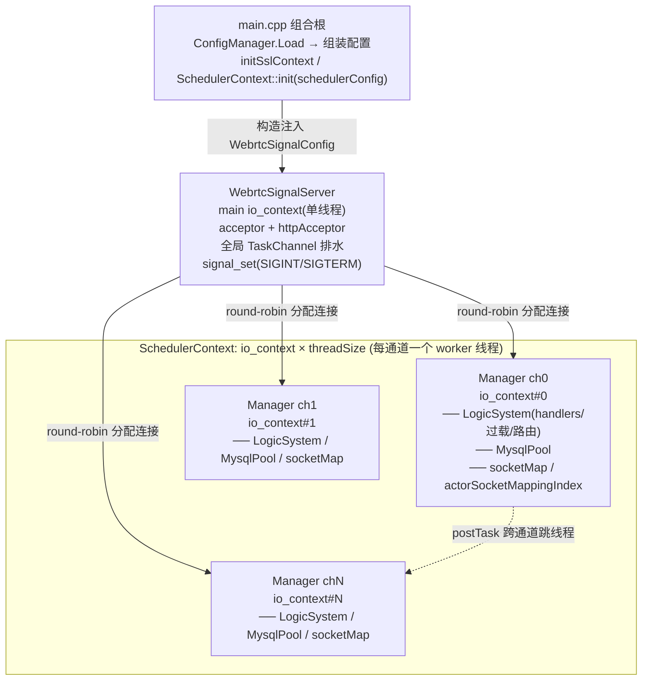
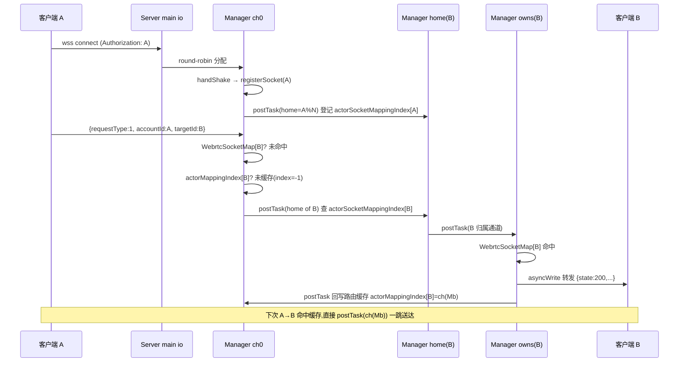
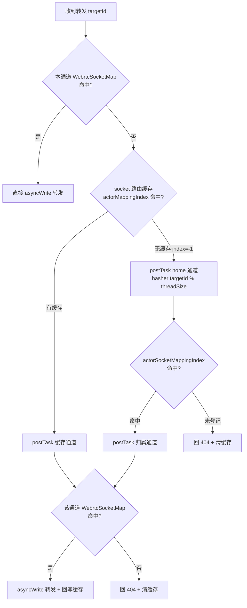
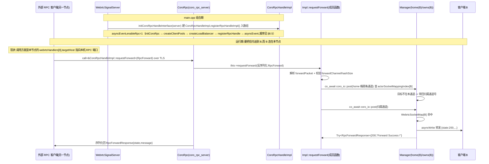

# WebrtcSignalServer 架构文档

> 一台多通道、协程化、SSL 可选的 Webrtc 信令服务器。WebSocket 承载信令转发，HTTP 承载运维查询，CoroRpc 做节点间 RPC（`[CoroRpc] enableRpc=1` 时启用），HttpClient 做服务注册发现（Polaris）。
>
> 本文按「架构 → 流程 → 性能 → 使用方式 → 信令 → HTTP → HttpClient → CoroRpc → MySQL」组织，对应代码目录 `WebrtcSignalServer/`。

---

## 1. 概述

WebrtcSignalServer 是 Webrtc 信令面的中转服务：

- **信令通道**：WebSocket（`wss://` 默认开 SSL），客户端用 `accountId` 鉴权接入，服务器按 `requestType` 处理/转发信令到 `targetId`。
- **运维通道**：HTTPS，提供通道/连接统计接口。
- **分片并发**：启动时按 `threadSize` 切出 N 个「通道(channel)」，每个通道独占一个 `io_context`+线程；连接按 round-robin 分配，路由按 `accountId` 一致性哈希跨通道寻址。
- **过载保护**：本地协程派发 + 全局任务队列两级调度，超阈值走全局队列削峰，满则回 503。
- **配置解耦**：`ConfigManager` 只在 `main.cpp` 出现，业务类全部构造注入 / 全局配置，不在类内读 ini。
- **节点间 RPC**：`CoroRpc` 既是 RPC 服务端（默认注册 `requestForward` 一个 handler）又是 RPC 客户端（连接池 + 负载均衡器），requestType 9 的信令就由它送出去（见 §8）。

平台：Linux 为主（makefile 用 clang++ + io_uring + ThinLTO），Windows 仅作开发/调试编译路径。SSL 默认开启，**编译期宏**可关：信令 `WEBRTC_SIGNAL_SOCKET_DISABLE_SSL`（Windows 侧由 `webrtc-signal-server.props:39` 提供，压测时才加）、HTTP `WEBRTC_SIGNAL_HTTP_SOCKET_DISABLE_SSL`。压测客户端 `Boost-Beast-Test` 是明文（`tls` 默认 false，没有开 TLS 的开关），所以压测必须关 SSL，否则两边握不上手。

---

## 2. 目录结构

```
WebrtcSignalServer/
├── main.cpp                      # 组合根:读 ini、组装配置结构体、启动
├── Ssl.h / Ssl.cpp               # 全局 ssl::context + initSslContext/getSslContext
├── config.ini                    # 配置文件(ini)
├── makefile                      # clang/linux 构建
├── executor/                     # io_context 池:namespace hope::executor
│   ├── SchedulerConfig.h      # 每池线程数 + io/logic 两对绑核开关
│   └── SchedulerContext.h/.cpp # io_context 池(每线程一个 io_context)
├── signal/                       # 信令+HTTP 主体
│   ├── WebrtcSignalConfig.h      # 信号子系统参数结构体 + loadWebrtcSignalConfig(读 [WebrtcSignalServer] 段)
│   ├── WebrtcSignalServer.*      # 顶层服务:acceptor、全局任务队列、通道编排
│   ├── WebrtcSignalManager.*     # 单通道:socket 表、actor 路由索引、LogicSystem
│   ├── WebrtcSignalSocket.*      # WebSocket 连接:握手、收发协程、keepalive
│   ├── WebrtcLogicSystem.*       # 业务派发:handler 表、过载调度、forward 路由、HTTP 路由
│   ├── WebrtcSignalPacket.*      # 信令包:socket+整帧packet+信封头 WebrtcEnvelopeView(requestType/state/message/accountId/targetId)
│   ├── HttpSocket.*              # HTTPS 连接:握手、keep-alive、读写
│   ├── HttpClient.*              # 出站 HTTP 客户端(对接 Polaris 等服务发现)
│   ├── HttpFilters.*             # HTTP 鉴权:放行规则(addRule)+全局过滤器(addFilter)
│   ├── AsioConcurrentQueue.h     # moodycamel 队列 + sam 信号量 的 awaitable 封装
│   └── AwaitableTask.h           # TaskChannel:全局任务队列(concurrent_channel + moodycamel)
├── rpc/
│   ├── CoroRpcConfig.h                # RPC 参数结构体 + loadCoroRpcConfig(读 [CoroRpc] 段)
│   ├── CoroRpc.h/.cpp                 # ylt/coro_rpc 封装(server+client pool+LB,单例 getInstance)
│   ├── CoroRpcHandleInterface.h       # RPC handler 抽象基类(纯虚 registerRpcHandle,只持 server 引用)
│   ├── CoroRpcHandleImpl.h/.cpp       # RPC handler 实现(requestForward 跨节点转发,自注册)
│   └── Rpc.h/.cpp                     # RpcForward/RpcForwardResponse + 默认 handler 注册 initCoroRpcHandleInterface
├── storage/                      # 存储层:namespace hope::storage(MySQL 与 Redis 都在这里)
│   ├── MysqlConfig.h             # MySQL 连接参数结构体 + loadMysqlConfig(读 [Mysql] 段)
│   ├── MysqlManagerPools.*       # boost::mysql 连接池(每通道一个)
│   ├── AsyncTransactionGuard.h   # 事务 RAII(START TRANSACTION / COMMIT / ROLLBACK)
│   ├── RedisConfig.h             # Redis 连接参数 + makeBoostRedisConfig/makeRedisSslContext/makeRedisLogger
│   ├── RedisWrapper.*             # boost::redis 连接(connection + 构造即 async_run)
│   └── Subscribe.*               # Redis 订阅(保留组件,当前无调用者)
└── utils/
    ├── ConfigManager.h           # ini/json/xml 配置单例(只在 main.cpp 与各 loadXxxConfig 里用)
    ├── MimallocConfig.h          # mimalloc 配置:默认值 + loadMimallocConfig(读 [Mimalloc] 段) + applyMimallocConfig(mi_option_set 注入)
    ├── LoggerConfig.h            # 日志配置:loadLoggerConfig(读 [Logger] 段) + applyLoggerConfig(建异步线程池/文件 sink)
    ├── Utils.h/.cpp              # spdlog 日志:异步线程池 + 控制台/滚动文件 sink + flush_every
    ├── concurrentqueue.h         # moodycamel::ConcurrentQueue(改名 hopeMoodycamel 隔离)
    ├── StringHasher.h            # 透明 string hasher(无种子) + StringKeyedNodeMap/FlatMap 别名
    └── SpinLock.h
```

### 2.1 日志（`utils/Utils.*`，基于 spdlog）

整个日志子系统基于 **spdlog**（header-only，内置 fmt）：

- **编译面**：只有 `utils/Utils.cpp` 一个 TU `#include <spdlog/spdlog.h>` 编译完整 spdlog；其余 TU 仅经 `Utils.h` 引入内置 `fmt`（`{}` 占位 + 编译期格式校验）与 `LOG_*` 宏。`SPDLOG_HEADER_ONLY` / `SPDLOG_ACTIVE_LEVEL` 由编译期定义。
- **异步**：`spdlog::async_logger`（名 `webrtc-signal`），线程池在 `initLogger()` 用 `spdlog::init_thread_pool(queueSize, threadCount)` 创建（两值来自 `[Logger]` 段，须先经 `applyLoggerConfig` → `setLoggerAsyncConfig` 设定）；队列满策略 `overrun_oldest`——丢最旧不阻塞业务线程。
- **双 sink**：
  - 控制台 `LevelFilterConsoleSink`（自实现 `base_sink`）：按 `[Logger]` 的 `DEBUG/INFO/WARN/ERROR` 开关 + ANSI 着色。**四个级别一律受各自开关控制**（warn/error 没有豁免）。屏幕输出是逐条 `fwrite` + `fflush(stdout)`，跑在 spdlog 异步线程上；info 量最大，关掉屏幕那一份的推荐值见 §12.1（只关屏幕，文件日志由 `logToFile` 单独控制）。
  - 文件 `rotating_file_sink_mt`：`logs/webrtc-signal-server.log`，单文件 `maxFileSizeMB`、保留 `maxFiles` 个（默认 10MB × 5）；`logToFileEnabled=0` 时该 sink 直接 `level::off`。
- **实时落盘**：`spdlog::flush_every(3s)` 周期 flush；`closeLogger()` 里 `logger->flush()` + `spdlog::shutdown()` 冲刷并停掉异步线程池。
- **宏短路**：四个宏都在调用点先查 `consoleOutputLevels[本级] != 0 || logToFileEnabled != 0`——控制台与文件都不需要时**连 fmt 格式化都不做**。
- **编码：全链路 UTF-8，且调用点不做任何转换**——`ec.message()` / `e.what()` 直接写进日志。Windows 侧靠 `webrtc-signal-server.props` 的 `BOOST_SYSTEM_USE_UTF8`（boost 的 `message_cp_win32()` 据此把系统消息代码页切成 `CP_UTF8`；`error_code::what()` 是 `message()` 加后缀，所以 `system_error::what()` 一起生效），Linux 侧靠 `main.cpp` 的 `setlocale(LC_ALL, "C.UTF-8")`（没有 zh_CN catalog 时 `strerror` 给英文，本就是合法 UTF-8），源/执行字符集由 props 里的 `/utf-8` 钉住。**调用点一律直接写 `ec.message()` / `e.what()`**——不套转换层，也不去改写 `what()` 里嵌着的系统文本；要动编码就动上面那个宏。
- **位置（`%s:%#`）**：默认取宏所在那一行。要报的不是这一行时用 `LOG_ERROR_FROM(sourceLocation, ...)`——把 `std::source_location` 的文件/行写进日志。`CompletionHandle`（`co_spawn` 的默认完成令牌）就是这么做的：在**构造点**用默认实参 `std::source_location::current()` 抓位置（默认实参在调用点求值），异常落日志时走 `LOG_ERROR_FROM`，于是报出来的是 `co_spawn` 那一行。**这里必须用 `LOG_ERROR_FROM`**：换成普通 `LOG_ERROR`，所有协程异常就都指向 `CompletionHandle.h` 的 catch 行，看不出真凶在哪个文件。
- **格式**：`[%Y-%m-%d %H:%M:%S.%e][%l] %s:%# %v`（时间毫秒 / 级别 / 文件:行 / 消息）。

## 3. 整体架构

### 3.1 分层



### 3.2 线程模型

| 线程 | io_context | 职责 |
|------|-----------|------|
| main loop(1 个) | `ioContext{1}` | accept(WebSocket+HTTP)、全局 TaskChannel 排水、`signal_set` |
| TPC reactor × `threadSize` | `SchedulerContext` 池中各自一个 | 本通道连接的握手/读写协程 |
| logic 池 × `threadSize`（仅 `HOPE_RTC_SIGNAL_SERVER_LOGIC`） | 第二个 `SchedulerContext` 单例 | 本通道的 handler 执行、转发、MySQL pool |

- **连接绑定通道**：accept 后 `loadBalanceWebrtcManger()` 用 `managerIndex.fetch_add(1) % threadSize` round-robin 选一个 Manager，socket 的 `co_spawn` 落在该 Manager 的 io_context 上；此后该连接的收发、handler 都在同一个 worker 线程，**无跨线程锁**。
- **跨通道通信**：两个原语（`WebrtcSignalServer::postTask` 按 `handler` 返回类型重载），都把活儿派到 `channelIndex` 通道的 io_context 上跑、lambda 收到 `shared_ptr<WebrtcSignalManager>`，区别在协程/非协程与完成令牌：
  - `postTask(channelIndex, handler, token = CompletionHandle)`——**协程 + completion-token 版**（`handler` 返回 `awaitable<T>(shared_ptr<M>)`）。内部 `async_initiate` + `co_spawn`。默认令牌 `CompletionHandle` = fire-and-forget + 异常落日志（返回 `void`）；传 `boost::asio::use_awaitable` 即可 `co_await` 拿返回值（`handler` 返回 `awaitable<json>` 则直接得到 `json`），续体按 asio executor 亲和落回**调用方 io**（不跨线程），适合"发一跳、等它干完再继续"。返回类型由令牌决定（`async_result`）：默认 → `void`，`use_awaitable` → `awaitable<T>`。
  - `postTask(channelIndex, handler)`——**普通 post 版**（`handler` 是 `void(shared_ptr<M>)` 的可调用对象）。内部 `boost::asio::post`，**不建协程、无协程帧开销**，返回 `bool`（校验 channelIndex）。给"纯同步活儿、不需要 `co_await`、不需要异常语义"的 fire-and-forget 跳用（如回写/清缓存）。轻量优先用普通重载；要 `co_await` 或要跨通道协程语义才用协程重载。
  - 入参非法（channelIndex 越界/manager 为空）时：普通 `postTask` 直接 `LOG_ERROR` + 返回 `false`；协程 `postTask` 走 async 契约——通过令牌完成一个 `runtime_error` 异常（默认令牌打日志、`use_awaitable` 在调用方 `co_await` 处抛出），不 `co_spawn`，避免 `use_awaitable` 调用方挂死。
  - 路由转发的线程跳转用这两个重载完成（forward 路径已确认无死代码、无冗余查找、无冗余自跳，到极限）。
- **条件编译**：
  - `__linux__`：accept 走每通道 `SO_REUSEPORT` 多 acceptor（`WebrtcSignalManager::asyncAccept`），Linux 专用路径。
  - 非 Linux（含 Windows）：单 acceptor 在 main loop，accept 后分发。
  - `HOPE_RTC_SIGNAL_SERVER_LOGIC`：LogicSystem 用独立 logic io 池（`SchedulerContext::getLogicInstance`）而非本通道 io，即**收发与派发分池**；实测吞吐/延迟见 §11.2。
  - `WEBRTC_SIGNAL_SOCKET_DISABLE_SSL` / `WEBRTC_SIGNAL_HTTP_SOCKET_DISABLE_SSL`：关闭对应连接的 SSL。

### 3.3 配置解耦（重点）

`ConfigManager`（`utils/ConfigManager.h`，boost::property_tree，单例）**只在 `main.cpp` 用一次**：

```
main.cpp: ConfigManager.Instance().Load("config.ini")
        → 读 [Mimalloc]         填 MimallocConfig → mi_option_set 注入(编译期,等价 MIMALLOC_* 环境变量)
        → 读 [Logger]           填 LoggerConfig → applyLoggerConfig(异步线程池队列/线程数 → 滚动文件 → initLogger → 控制台级别)
        → 读 [WebrtcSignalServer] 的 threadSize 与两对绑核开关 填 SchedulerConfig → SchedulerContext::init
        → 读 [WebrtcSignalServer] 其余键 填 WebrtcSignalConfig(loadWebrtcSignalConfig,构造注入)
        → 读 [CoroRpc]          填 WebrtcSignalConfig.coroRpcServerConfig(loadCoroRpcConfig;段里的 enableRpc 这个键由 loadWebrtcSignalConfig 跨段读)
        → 读 [Mysql]/[Redis]   填 WebrtcSignalConfig.mysqlConfig / .redisConfig(loadMysqlConfig / loadRedisConfig)
        → initSslContext(WebrtcSignalConfig.certificateFile / .privateKeyFile)
```

注入路径（只有一条，全是构造注入）：

1. **浅层(3 跳)**：`WebrtcSignalConfig` → `WebrtcSignalServer` → `WebrtcSignalManager`（用标量小结构体 `WebrtcSignalChannelConfig` 收拢，避免把 CoroRpc 头拖进 Manager）→ `WebrtcLogicSystem`（三个水位 + 存储层连接参数再收拢成 `WebrtcLogicConfig`，在 Manager 的构造点拼）/ `WebrtcSignalSocket`（socketWaitTime）。
2. **存储层参数跟着 `WebrtcLogicConfig` 走**：`MysqlConfig` 与 `RedisConfig` 都是 `WebrtcLogicConfig` 的成员。`WebrtcLogicSystem` 直接拿前者建 `MysqlManagerPools`；后者按 `connectionSize` 条喂给 `RedisWrapper`（`redisWrappers`，见 §9.3）。**存储层没有任何全局配置**，一律经注入进来。两棵树的共享源码逐文件一致，含 `storage/` 这个目录名与 `hope::storage` 这个 namespace（存储层类型名一律不带 `Webrtc` 前缀）。

业务类内部**不出现 `ConfigManager::Instance()`**，配置只从构造函数进来。

**读配置的唯一写法：`inline loadXxxConfig(XxxConfig&, const ConfigManager&)`**（2026-09-20 起全仓库统一）。每个组件一份 `XxxConfig.h`，`struct` 的成员默认值**就是** ini 缺项时的兜底值，loader 逐行 `GetString/GetInt/GetBool("<段名>." + 成员名, 当前值)`——ini key 与成员名机械对应，没有翻译层。**七个 ini 段各一份，`main.cpp` 里只剩调用**：`loadMimallocConfig`（`utils/MimallocConfig.h`）、`loadLoggerConfig`（`utils/LoggerConfig.h`，`[Logger]` 段；副作用在配对的 `applyLoggerConfig` 里）、`loadSchedulerConfig`（`executor/SchedulerConfig.h`）、`loadWebrtcSignalConfig`（`signal/WebrtcSignalConfig.h`）、`loadCoroRpcConfig`（`rpc/CoroRpcConfig.h`）、`loadMysqlConfig`（`storage/MysqlConfig.h`）、`loadRedisConfig`（`storage/RedisConfig.h`）。

三处刻意的不机械，都是兼容既有 `config.ini` 或单一所有权：① `WebrtcSignalConfig::threadSize` 由 `loadSchedulerConfig` 唯一读一次（通道数 = 每个池的线程数）；② `WebrtcSignalConfig::enableRpc` 的键在 `[CoroRpc]` 段（`CoroRpc.enableRpc`），由 `loadWebrtcSignalConfig` 跨段读；③ `[Logger]` 的级别键是大写的（`Logger.DEBUG`），成员名小写。

**已知陷阱：`ConfigManager::GetSize` 把 `<= 0` 当"回退到核数"**（默认退到 `std::thread::hardware_concurrency()`）。所以语义上 0 就是 0 的键一律走 `GetInt` + 手工夹取，不能走 `GetSize`：`Redis.maxReadSize`/`Redis.connectionSize`、`SchedulerConfig` 的两个绑核偏移量、`WebrtcSignalConfig` 的端口与开关（`enableHttp`/`enablePublicPort` 关掉的 0 会被 `GetSize` 换成兜底值）。

---

## 4. 启动与关闭流程

### 启动（`main.cpp`）

1. 设置控制台 UTF-8（Windows `SetConsoleOutputCP(CP_UTF8)` + `SetConsoleCP(CP_UTF8)`，Linux `setlocale(LC_ALL, "C.UTF-8")`）——日志全链路 UTF-8 的一半前提在这里，另一半在构建宏（见 §2.1）。
2. `mi_version()`（强制引用 mimalloc 符号，保证动态库装载）。
3. `ConfigManager.Load("config.ini")`。
4. 读 `[Mimalloc]` 段（`loadMimallocConfig`）→ `applyMimallocConfig` 逐项 `mi_option_set`（编译期注入，等价 Windows 侧 `MIMALLOC_*` 环境变量，编进产物，运行时无需再设）。
5. 读 `[Logger]` 段（`loadLoggerConfig`）→ `applyLoggerConfig`：`setLoggerAsyncConfig(queueSize, threadCount)` 建 spdlog 异步线程池 → `setFileLoggingConfig(logToFile/logDirectory/maxFileSizeMB/maxFiles)` → `initLogger()`（控制台 + rotating 文件 sink，`spdlog::flush_every(3s)` 实时落盘）→ `setConsoleOutputLevels(DEBUG/INFO/WARN/ERROR)`。
6. 读 `[WebrtcSignalServer]` 的 `threadSize` 与两对绑核开关（`loadSchedulerConfig`）→ `SchedulerContext::init(schedulerConfig)` 启动 worker 线程池。
7. `loadWebrtcSignalConfig` 填 `WebrtcSignalConfig`（port/httpPort/enableHttp/enablePublicPort/overload/threshold/exitThreshold/asyncThreshold/maxTls*/maxHttpKeepAliveTime/certificateFile/privateKeyFile），再 `loadCoroRpcConfig` / `loadMysqlConfig` / `loadRedisConfig` 三行填完它的三份子配置；`threadSize` 取第 6 步的值（同一个 ini 键只读一次）。
8. `initSslContext(webrtcSignalConfig.certificateFile, webrtcSignalConfig.privateKeyFile)`（主 WebSocket/HTTP 的 SSL 上下文）。
9. 构造 `WebrtcSignalServer(ioContext, WebrtcSignalConfig)`（内部 `initialize()` 建 N 个 Manager，每个 Manager 建 LogicSystem+MysqlPool 并 `asyncEvent()`）。
10. `WebrtcSignalServer->asyncEvent()`：开 accept 协程、全局任务队列排水协程、各 LogicSystem 的 `asyncTaskExecute()`。
11. `signal_set(SIGINT/SIGTERM).async_wait(...)`。
12. `ioContext.run()`。

### 关闭（收到 SIGINT/SIGTERM）

1. `WebrtcSignalServer->closeEvent()`（幂等，`asyncEvents.exchange(false)` 挡住重复进入）：
   - `CoroRpc::getInstance()->closeEvent()` 停 RPC 服务：`coro_rpc_server::stop()` → `io_context_pool::stop()`，**join 掉 RPC 自己的全部线程**。此后不会再有人经 RPC 路径访问通道内的表（`CoroRpcHandleImpl` 会 `find` manager 的 `actorSocketMappingIndex` 与 `webrtcSocketMap`）。
   - `taskQueues.close()` 关全局任务队列（排水协程收到 `channel_closed`，排空队列后自然退出）。
   - **逐连接温和关闭**：每个 Manager 的 socket 关闭任务 `post` 到**它自己的连接池 ioContext**，与 `registerSocket`/`removeConnection` 串行（避免跨线程竞态访问 `webrtcSocketMap`）——逐个 `socket->closeEvent()` 后 `webrtcSocketMap.clear()`；N 个通道**并行**关闭，用 `std::latch`（C++20 barrier）`count_down()`/`wait()` 等全部完成。
     - **这一步必须留在下一句 `stop()` 之前**：它靠 worker 线程仍在 `run()` 才有机会执行，反序会死锁在 `closeLatch.wait()`。
   - `SchedulerContext::getInstance()->stop()`：`releaseWork()` → 全部 io_context `stop()`（停止派发、丢弃未执行 handler）→ **`join()` 全部 worker 线程**。
     - 这一句同时是**清表安全性的来源**。`webrtcHandlers` 等注册表里存的是 `awaitable` 协程对象，派发时取裸指针捕获进异步执行体；一个**已挂起**的 handler 协程帧并不安全——协程帧是透过闭包对象读捕获变量的，不是自己拷一份，所以注册表一 `clear()`，任何一次唤醒都是 use-after-free。
     - `stop()` 返回后这个窗口被彻底关掉：**协程的每一次恢复都必须由某个 io_context 派发一个完成回调，而线程已经 join 完、context 已停**，所以挂起的协程永远不会被唤醒，也就永远不会走到读捕获变量那行。改变的不是协程的生命周期，是它再也执行不到那行代码。
     - 由此 `webrtcSignalManagers.clear()` 从"赌没有协程在飞"变成"确定没有协程能跑"。
   - `webrtcSignalManagers.clear()`（触发各 Manager/LogicSystem/MysqlPool 析构，即 `webrtcHandlers.clear()` 等）。
     - 注意 `~MysqlManagerPools` 只是把 `pool->cancel()` `post` 到**已经停掉的** io_context，**这句不会被执行**；连接改由连接池析构时关闭（被遗弃的 handler 连同它捕获的 `shared_ptr<pool>` 在 `~SchedulerContext` 销毁 io_context 时释放）。这是这套顺序唯一的语义差异，进程即将退出，无实际影响。
2. 回到 `main`：`work.reset()` + `ioContext.stop()`（main **自己的** io_context，与 worker 池彼此独立）。
3. `closeLogger()`。此时 worker 线程已 join，不会再有人往已拆掉的 logger 里写。
4. `SchedulerContext` 析构 → 再调一次 `stop()`（幂等，`joinable()` 为假直接跳过）→ 销毁 io_context，被遗弃的协程帧此刻析构，只跑自身局部变量的析构，不会回头读已释放的 handler 闭包。

---

## 5. 信令流程（WebSocket）

### 5.1 接入握手（`WebrtcSignalSocket::handShake`）

1. （SSL 时）`async_handshake(server)`，带 `cancel_after(handshakeTimeout)`（`socketWaitTime` ms，注入）。
2. `async_read` 读 HTTP Upgrade 请求。
3. 取 `accountId`：优先 `Authorization` 头，否则 `?authorization=` query。
4. 缺 `accountId` → `LOG_WARN` 拒绝 + `closeSocket()`。
5. `webSocket.async_accept(req)` 完成 WebSocket 升级。
6. `setTcpKeepAlive`（按平台调 SO_KEEPALIVE / TCP_KEEPIDLE/INTVL/CNT）。
7. `manager->registerSocket(accountId, this)`：
   - 若同 `accountId` 已有旧连接 → 旧连接 `closeEvent()`（踢旧）。
   - 写入 `WebrtcSocketMap[accountId]`。
   - `postTask(mapChannelIndex, ...)` 在 home channel 的 `actorSocketMappingIndex[accountId] = {sessionId, channelIndex}` 登记归属。

### 5.2 收发循环

- `asyncEvent()` 起 `reviceCoroutine` + `writerCoroutine` 两个协程。
- **握手之后直接操作 `webSocket.next_layer()`**，不走 Beast 的 `async_read`/`async_write`（SSL 开着时是 `ssl::stream`，关掉时是 `tcp::socket`，同一份代码）。理由见下方「为什么不用 Beast 的读写接口」。
- **revice**：`async_read_some` 读进 `receiveBuffer`（缓冲区两档，见下方「接收缓冲区」）→ `takeFrames` 扫出缓冲区里所有**完整**帧（半帧留到下一轮；ping/pong 整帧跳过；`consumed == 0` 时跳过 memmove）→ 逐条 `unmaskPayload` 就地解掉客户端掩码 → `struct_pack::deserialize_to` 只解析信封头到 `webrtcEnvelope`（`WebrtcEnvelopeView`，返回消耗字节数，信封后的 body 留在 `packet`）→ 取 `requestType` → 组装 `WebrtcSignalPacket`（内嵌 `webrtcEnvelope` + 整帧 `packet`）→ `logicSystem->postTask(packet)`。
  - 一次读完成产出 K 条消息，K 通常 > 1（128B 消息实测 ~17–42），这是写侧批量能成立的前提。
  - RFC 6455 的分片消息（FIN=0 + 延续帧）在这里自己拼回来，不依赖 Beast；拼回来的整条消息另卡一道 `maximumMessageSize`（与缓冲区同档，见下）。**缓冲区上限对分片路径无效** —— 每帧独立过完整性检查，N 个 FIN=0 的帧累加就能把内存吃干，所以这道口子必须单独堵。
  - **接收缓冲区**（`WebrtcSignalSocket.h:128-132`，编译期宏 `WEBSOCKET_BIG_BUFFER` 切两档；三档常量必须同进同退，只改一个会让"缓冲区多大、单帧上限就多大"的关系错位）：

    | | 不定义 `WEBSOCKET_BIG_BUFFER` | 定义 `WEBSOCKET_BIG_BUFFER`（当前构建） |
    |---|---|---|
    | `receiveBufferInitialSize` | 8192 | 65536 |
    | `receiveBufferMaximumSize` | 16384 | 65536 |
    | `maximumMessageSize` | 16384 | 65536 |
    | 缓冲行为 | 起始 8KB，装不下一条未收完的帧就**翻倍**，封顶 16KB | 构造时一次 `resize` 到 64KB；`初始 == 上限`，**永不扩容** |
    | 每连接常驻 | 8KB | **64KB**（1000 连接 = 64MB 常驻内存，这是两档的取舍点） |
    | 能收下的最大净荷 | 16376 字节 | 65528 字节 |

    最大净荷 = 缓冲区上限 − 帧头 4 − 掩码键 4。超过即断连（`Frame Larger Than The Maximum Receive Buffer` / `Message Larger Than The Maximum Message Size` → `throw` → RST）。这是**会挡住正常连接的硬线，不是只防攻击者的护栏**；64KB 那一档的依据是线上 SDP（webrtc-native）实测最大 5KB 出头，留约 12× 余量。
- **writer**：从 `AsioConcurrentQueue<std::string>`（moodycamel + sam 信号量）**批量** dequeue（取到空或取到 32 条为止）→ `encodeFrameHeader` 给每条拼一个帧头 → 以「帧头 + 净荷」两段做 scatter/gather，**一批一次 `async_write`**，无逐条 memcpy。`asyncWrite(packet)` 入队。
  - 上限 32 条来自 asio 在 Windows 上 64 段的 writev 上限（每消息两段）。
  - 取空即 `co_await` 挂起、不等配额，所以严格一问一答（window=1）时自动退化成一条一条，不会死锁。
- 异常/断开 → `onDisConnectHandle(accountId, sessionId)` → `removeConnection`。

**为什么不用 Beast 的读写接口**：Beast 的 `webSocket.async_read(dynamicBuffer)` 一次完成只产出一个消息（K=1）。读协程与写协程在同一条单线程 io_context 上严格交替，于是每个连接的写队列深度恒为 **1** —— 写者取走那一条、写出去、再看队列已空、挂起，然后才轮到下一个读完成。**写侧怎么改写都取不到第二条**：只有「一次读完成产出 K>1 条」才填得起队列，而 Beast 的 read API 做不到。所以读侧与写侧必须一起改，两边的收益是乘性的（实测数字见 §11.2）。

**注意**：`webSocket.set_option(stream_base::timeout::suggested(server))` 设的空闲超时与 keep-alive ping 由 Beast 的读写操作驱动；自己读写 `next_layer()` 之后这两样**都不生效** —— 死连接不靠超时清理（TCP keepalive 仍在，但它只能发现对端主机消失，发现不了"连接活着但不说话"），客户端也收不到周期性 ping。

### 5.3 关闭：RST 强关

`closeSocket()` 设 `linger{1,0}` 后 `close()`，跳过 TCP FIN 四次挥手直接发 RST，**避免 TIME_WAIT 堆积、快速释放资源**。

### 5.4 业务派发与过载（`WebrtcLogicSystem`）

消息派发原语，`revice` 每帧调用一次。两个重载，共用同一套派发/削峰逻辑：

- `postTask(packet)`——**普通 fire-and-forget 版**，revice 热路径实际走它。没有 completion-token 全套机制（无 `make_shared<handler>`、无 `async_initiate`、无 `associated_executor` 搬运），handler 抛出的异常就地 LOG。
- `postTask(packet, token)`——**completion-token 版**（模板）。token 无默认实参、必须显式传（传 `boost::asio::use_awaitable` 可 `co_await` 拿完成/异常），内部保留 `async_initiate` 等机制。当前无调用方，为将来需要协程语义的派发预留。

派发逻辑（两版一致）：

```
handler = WebrtcHandlers[requestType]
若找不到 → LOG_ERROR "Unknown Request Type"
找到:
  if localTaskQueueSize>=threshold && WebrtcLogicHandlers[type]==true:
      走全局队列: taskQueues.enqueue(lambda)  // 削峰,跨通道并行
      失败(队列满) → 向源 socket 回 503 busy
  else:
      localTaskQueueSize++
      co_spawn(本通道 io, func(packet))       // 快路径,贴连接所在线程跑
      完成回调: localTaskQueueSize--
               若回落到 asyncThreshold+1 → 重启 asyncTaskExecute()
               有异常 → 普通版就地 LOG;token 版经 completion handler 传播
```

- 值返回的兄弟原语 `coPostTask(packet)` 走 `webrtcValueHandlers[type]`，同队列/削峰逻辑，但 handler 返回 `awaitable<boost::json::value>`，最终以 `void(std::exception_ptr, json)` 回调值（或经默认 token `CompletionHandle` 只记异常）。
- `WebrtcLogicHandlers[type]` 标记该 handler 是否可搬到全局队列。**当前信令 1–7、9 全为 false**，即信令始终本地派发（低延迟、贴在连接所在线程）；全局队列主要服务可搬迁的 HTTP handler（`overview` 为 true）。
- 全局 `TaskChannel` 由 `threadSize+1` 个排水协程消费（main loop 1 个 + 每通道 LogicSystem 1 个），moodycamel 多消费安全。

### 5.5 forward 路由（核心）

转发 handler（requestType 1/3/6/7）把消息送到 `targetId`。三级寻址：

```
1) 本通道直查: manager.webrtcSocketMap[targetId] 命中 → 直接 asyncWrite 转发（0 跳）
2) 未命中 → 查源 socket 路由缓存 actorMappingIndex[targetId] → index
   ├─ 有缓存(index≠-1): 跳缓存通道查 webrtcSocketMap
   │    ├─ 命中: 转发(1 跳),缓存正确不回写
   │    └─ 未命中(缓存过期): 重路由到 home 查全局索引 → 归属通道 → 转发
   └─ 无缓存(index=-1): 跳 home 查全局索引 → 归属通道 → 转发
3) home 通道查 actorSocketMappingIndex[targetId] → 归属通道
   ├─ 命中: 跳归属通道,webrtcSocketMap 取 socket 转发;回写源 socket 路由缓存
   └─ 未登记: 回 404 "TargetId is not register",清源 socket 过期缓存项
```

跨通道跳由 §3.2 的两个原语承载：查询 / 转发这类要跨通道协程语义的跳走 `postTask`（协程版，返回 `awaitable`）；回写路由缓存、清过期缓存这类纯同步 fire-and-forget 的跳走 `postTask`（普通版，无协程帧，更轻）。

临界跳数（只算"把包送达目标"；回写是 fire-and-forget，不阻塞转发，不计）：

| 场景 | 跳数 |
|------|------|
| 目标在源通道 | 0 |
| 无缓存，home==源，目标在 T | 1（源→T） |
| 无缓存，home≠源，目标在 T | 2（源→home→T） |
| 缓存命中，目标在缓存通道 | 1（源→缓存） |
| 缓存失效重路由 | 最多 3（源→缓存→home→T），第一跳是"信缓存"的代价 |

要点：
- **一致性哈希 home**：`hasher(targetId) % hashSize`（`hashSize=threadSize`），targetId→home 映射**在一个进程内**稳定（全仓库只有 `WebrtcSignalManager` 里那一个 `StringHasher` 成员被 5 处路由决策共用，所以各通道必然算出同一个桶）。`actorSocketMappingIndex`（targetId→{sessionId,channel}）是全局索引，只存在于 home 线程，查它必须跳 home——这是无缓存 / home≠源路径要 2 跳的根因。
  - hasher 的值**从不跨进程**：跨节点转发时 `forwardChannel` 恒为 0（`signal/WebrtcLogicSystem.cpp:1068`），接收端用自己的 hasher 重算桶。所以 hasher 必须跨实例可复现（见 §11）。
- **两级缓存**：源 socket 的 `actorMappingIndex`（targetId→channel）就近缓存，home 的 `actorSocketMappingIndex` 全局索引。命中缓存省一跳；缓存命中这条是 1 跳的常见好路径。
- **过期自愈**：缓存指向的通道查不到 socket（缓存过期）就重路由到 home 重新寻址；404 时清掉源 socket 上指向错误通道的缓存项，下次重新寻址。缓存失效多出的那一跳是缓存换来的代价。
- **线程安全**：`webrtcSocketMap`/`actorSocketMappingIndex`/`actorMappingIndex` 各自只在所属通道的 io_context 线程上访问，跨通道读写一律先 `post` 到该线程再动表（`postTask` 的普通/协程两个重载；RPC handler 里是 `coro_io::post`），无锁。
- **跳数是硬下限**：同一协程内连查的都落在不同表上；挂起后跨通道的下一跳是状态可能已变的全新查找。要再减只能动数据模型（全局路由表 / 索引副本），不在路径调优的范围内。

### 5.6 转发图示（Mermaid）

**转发时序图**（客户端 A 接入 ch0，向 targetId B 转发；B 的 home 通道与归属通道不同）：



**三级寻址决策图**：



### 5.7 requestType 一览

| requestType | 含义 | handler |
|-------------|------|---------|
| 1 | REQUEST（普通转发） | forwardHandler |
| 3 | STOPREMOTE | forwardHandler |
| 6 | CLOSESYSTEM | forwardHandler |
| 7 | SYSTEMREADLY | forwardHandler |
| 9 | RPC 跨节点转发 | CoroRpc::asyncRpcRequest → requestForward（见 §8.7） |

服务端 `webrtcHandlers` 只登记 1/3/6/7/9。**2 与 5 都未被任何 handler 注册**（真实客户端的 `WebrtcRequestState` 也只有 0/1/3/4/6/7/8/9 —— 见 `WebrtcManager.h`，所以这两个值不会被业务流量命中）。1/3/6/7 复用同一个 `forwardHandler`，仅 `requestTypeStr` 不同（日志区分）；9 走 CoroRpc 跨节点 RPC。

---

## 6. HTTP 接口（`HttpSocket` + `WebrtcLogicSystem::initHttpHandlers`）

### 6.1 连接处理

- SSL（默认）或 plain；`asyncHandShake` 带 5s 超时。
- `asyncRead` → `postHttpTask(socket, request)` → `asyncReadKeepAlive`：
  - 解析 `Keep-Alive: timeout=N` 设 `timeoutSec`。
  - 起保活定时器协程，到期未活动则 `async_shutdown` + `closeSocket`。
  - 继续异步读下一个请求（HTTP keep-alive pipeline）。
- `asyncWrite` 在 keep-alive 时刷新保活定时。

### 6.2 派发与过载

`postHttpTask` 与信令同构：`httpHandlers[targetUrl]` 命中 → 过载判断（`httpLogicHandlers[url]` 决定可否搬全局队列）→ 本地 co_spawn 或全局队列；满则回 503；未命中路由回 404。

### 6.3 路由与鉴权（`HttpFilters`）

| 方法+路径 | 作用 |
|-----------|------|
| `/api/v1/managers/overview` | 返回 `totalManagers`(通道数) |
| `/api/v1/managers/stat` | body `{"channelIndex":N}`，返回该通道 socket 列表(accountId/remoteAddr/sessionId/cachedRouteCount) |
| `/api/v1/managers/login` | 放行规则(免 token,见下)；当前无对应 handler,未命中路由回 404 |
| 其他 | 未命中路由回 404 JSON |

**鉴权由每通道的 `HttpFilters` 承担**（`WebrtcLogicSystem` 的成员 `httpFilters`，每实例一份，不走 thread_local / 单例，便于规则内协程查库）。配置在 `initFilters()`（`asyncEvent` 依次调 `initHandlers → initFilters → initHttpHandlers`）：

- `addRule(pathPattern)`：**放行规则**，纯路径、无回调。请求路径命中即**直接放行**，不进过滤器。`matchPath` 规则：空或 `*` 全中；尾部 `*` 前缀匹配；否则精确相等。
- `addFilter(check)`：**全局过滤器**，真正的校验回调 `bool(shared_ptr<HttpSocket>, const request&)`。**未命中任何规则**的请求才落到这里，任一返回 `false` 即拒绝。
- `authorization()` 裁决顺序（先规则、后过滤器）：规则命中 → 放行短路；无规则命中 → 逐个过全局过滤器；什么都没配置 → 直接放行。

当前配置（`initFilters()`）：

```cpp
httpFilters.addRule("/api/v1/managers/login");        // 登录路径放行,免 token
httpFilters.addFilter([](std::shared_ptr<HttpSocket> httpSocket,
                         const boost::beast::http::request<boost::beast::http::string_body>& httpRequest) -> bool {
    // 校验 Authorization: Bearer 913140924@qq.com
    // 缺头 / 前缀不是 "Bearer " / token 不匹配 → false
    ...
});
```

鉴权失败时 `postHttpTask`（本地与过载两条派发路径一致）写回：

```json
{"state":403,"message":"webrtcSignalServer forbidden, please check your request","data":null}
```

> 注意：token 是逐字节精确比较，客户端发什么就比什么。用 ApiPost/Postman 等工具测试时填了 token 却发出去另一个值，通常不是服务端问题——检查「鉴权/Auth 标签页」里保存的 Bearer Token 或环境变量是否覆盖了手动 Header。

- **跨通道查询**：`/stat` 若查询的不是当前通道，用 `postTask(targetIdx,...)` 跨通道取数据，再 `postTask` 回当前通道写响应（`threadChannelIndex` 是 thread_local，用于判断同通道直接 `co_await` 还是跨通道 `co_spawn`）。

### 6.4 响应序列化

`serializeHttpResp(state, message, data)` 用 `monotonic_resource` arena 构 JSON：`{"state":..,"message":"..","data":..}`。固定文案错误用 `absl::StrFormat` 内联，带变量的走 boost::json 转义。

---

## 7. HttpClient（出站 HTTP 客户端）

`signal/HttpClient.*`，基于 boost::beast + boost::urls，协程化出站 HTTP（**与服务端 HttpSocket 不同**：HttpSocket 是入站服务端连接，HttpClient 是主动请求外部服务）。

### 7.1 接口

- `HttpClient(io_context, enableSsl)`。
- `connect(host, port)`：resolve → `async_connect` →（SSL 时）`async_handshake(client)`。
- `asyncRequest(url, request) -> awaitable<Response>`：
  1. 解析 `host:port`（IPv6 带 `[]` 不拆，默认端口 443/80）。
  2. 补 `target` 默认 `/`、补 `Host` 头。
  3. **连接复用**：socket 仍开且 host/port 未变 → 复用，否则 `closeStream` + 重连。
  4. `async_write` + `async_read`。
  5. 按响应 `Connection: close` / HTTP 版本判断 keep-alive，不 keep-alive 则 `close()`。

### 7.2 用途：对接 Polaris 服务发现

HttpClient 是出站客户端，供服务端（或调用方）访问外部 HTTP 服务。典型场景是 **Polaris 服务注册发现**：

- `POST /v1/RegisterInstance` 注册实例（service/namespace/host/port/healthCheck heartbeat ttl/location/metadata）。
- `POST /v1/Discover` 发现实例。
- `POST /v1/Heartbeat` 心跳。
- `POST /v1/DeregisterInstance` 反注册。
- `GET /naming/v1/namespaces` 等。

示例（向 Polaris 注册实例）：

```cpp
std::shared_ptr<HttpClient> client = std::make_shared<HttpClient>(ioc, /*enableSsl=*/false);  // Polaris 常用明文 80

boost::asio::co_spawn(ioc, [client, token]() mutable -> boost::asio::awaitable<void> {
    HttpClient::Request req;
    req.version(11);
    req.method(boost::beast::http::verb::post);
    req.target("/v1/RegisterInstance");
    req.set(boost::beast::http::field::content_type, "application/json");
    req.set("X-Polaris-Token", token);                 // 纯 Token,不加 "Bearer "

    boost::json::object obj;
    obj["service"] = "Webrtc-signal-server";
    obj["namespace"] = "coro";
    obj["host"] = "127.0.0.1";
    obj["port"] = 10087;
    obj["protocol"] = "tcp";
    obj["version"] = "1.0.0";
    obj["weight"] = 100;
    obj["healthy"] = true;
    obj["enableHealthCheck"] = true;
    boost::json::object healthCheck;
    healthCheck["type"] = "HEARTBEAT";
    boost::json::object heartbeat;
    heartbeat["ttl"] = 5;
    healthCheck["heartbeat"] = heartbeat;
    obj["healthCheck"] = healthCheck;
    req.body() = boost::json::serialize(obj);
    req.prepare_payload();

    HttpClient::Response resp = co_await client->asyncRequest("127.0.0.1:8090", req);
    // Discover / Heartbeat / DeregisterInstance 同理,换 target + body
}, boost::asio::detached);
```

> HttpClient 由调用方自行使用；信令服务器启动流程当前未调用它。

---

## 8. CoroRpc（节点间 RPC）

`rpc/CoroRpc.*` 是对 ylt/coro_rpc 的封装，提供 **RPC 服务端 + 客户端连接池 + 负载均衡器**。  
`enableRpc=1` 时由 `WebrtcSignalServer::asyncEvent()` 拉起（见 §8.5）。  
本节统一描述 RPC 的配置、服务端 handler 注册、客户端调用模式以及在本服务器中的集成。

### 8.1 配置（`CoroRpcServerConfig`，对应 `[CoroRpc]` ini）

| 字段 | 含义 |
|------|------|
| `port` / `threadSize` | RPC 监听端口 / 处理线程数 |
| `enableSsl` | 是否启用 TLS（单向或双向） |
| `basePath` | 证书目录 |
| `certFile` / `keyFile` | 服务端证书与私钥（单向/双向均需） |
| `caCertFile` | CA 证书（两处都用它）：服务端侧校验客户端证书；本节点作为客户端调下游时，也用它验对端 |
| `enableClientVerify` | 是否校验客户端证书（mTLS 时为 `true`） |
| `enableDoubleSsl` | 是否启用 mTLS 双向认证 |
| `clientCertFile` / `clientKeyFile` | mTLS 时，作为下游客户端需出示的证书/私钥 |

`WebrtcSignalConfig.enableRpc` 控制是否启用（默认 0）。

### 8.2 服务端 handler 注册

ylt/coro_rpc 的 handler 必须是**命名空间作用域的自由函数**或**类的成员函数指针**——编译期函数指针注册，不接受 `std::function`/lambda。

**自由函数 handler**（无状态）：
```cpp
struct RpcRequest { int request; std::string json; };
async_simple::coro::Lazy<RpcRequest> calculate(RpcRequest rpcRequest) {
    RpcRequest value = co_await coro_io::post([rpcRequest]() { return rpcRequest; },
        hope::rpc::CoroRpc::getInstance()->ioExecutor());   // 两参数: Func + Executor
    co_return value;                                        // 拿到的是 Try<RpcRequest>，值在 value() 里
}
hope::rpc::CoroRpc* rpc = hope::rpc::CoroRpc::getInstance();
rpc->registerHandler<calculate>();      // 自由函数
```

**成员函数 handler**（有状态，需要访问服务器对象）：
```cpp
class CoroRpcHandleImpl : public CoroRpcHandleInterface {
public:
    async_simple::coro::Lazy<RpcForwardResponse> requestForward(RpcForward rpcForward);
};
CoroRpcHandleImpl coroRpcHandleImpl;
rpc->registerHandler<&CoroRpcHandleImpl::requestForward>(&coroRpcHandleImpl);  // 必须传 this
```

> 本服务器采用成员函数方式，`CoroRpcHandleImpl` 继承抽象基类 `CoroRpcHandleInterface`（基类持有 `WebrtcSignalServer` 引用），在 `registerRpcHandle()` 中通过 `CoroRpc::getInstance()->registerHandler<&CoroRpcHandleImpl::requestForward>(this)` 注册，从而在 RPC 调用时能访问信令服务。

`registerHandler` 支持同时注册自由函数和成员函数，签名与返回类型必须一致。

### 8.3 客户端调用模式

`CoroRpc` 同时提供客户端能力：`createClientPools()` 创建连接池，`createLoadBalancer(hosts)` 配置负载均衡器后，即可向下游节点发起 RPC。

**两层错误模型**  
所有异步 RPC 调用返回 `async_simple::coro::Lazy<expected<rpc_result<R>, std::errc>>`，需拆两层判断：


**调用自由函数 handler**（服务端按 `registerHandler<func>` 注册）：
```cpp
ylt::expected<coro_rpc::rpc_result<RpcRequest>, std::errc> result = co_await rpc->asyncRpcRequest(
    "127.0.0.1:10018",
    [](coro_rpc::coro_rpc_client& client)
    -> async_simple::coro::Lazy<coro_rpc::rpc_result<RpcRequest>> {
        RpcRequest rpcRequest{ 1, R"({"name":"Alice","age":30})" };
        co_return co_await client.call<calculate>(rpcRequest);
    });
if (!result)              { /* 连接层失败 */ }
else if (!result.value()) { /* RPC 业务失败 */ }
else                      { RpcRequest& response = result.value().value(); /* 使用 response */ }
```

调**成员函数 handler**（服务端按 `registerHandler<&Class::method>(obj)` 注册）的写法与上面只差 `client.call<...>` 那一处 —— 形如 `client.call<&CoroRpcHandleImpl::requestForward>(rpcForward)`：成员指针只作编译期标识，服务端调用时传入事先注册的 `this`（完整用例含两层错误处理见 §8.7 B）。

**负载均衡版** `asyncLbRpcRequest(op)`：用 `createLoadBalancer` 配置的 host 列表轮询/加权分发，`op` 多一个 `string_view host` 参数告知本次选中的节点：
```cpp
ylt::expected<coro_rpc::rpc_result<int>, std::errc> result = co_await rpc->asyncLbRpcRequest(
    [](coro_rpc::coro_rpc_client& client, std::string_view host)
    -> async_simple::coro::Lazy<coro_rpc::rpc_result<int>> {
        co_return co_await client.call<someFunc>();
    });
```

**原始字节（attachment）** `asyncRequestRaw<func>(host, payload)`：不走序列化，直接传字节。服务端 handler 须为 `void(coro_rpc::context<void>)`，用 `release_request_attachment()` 取请求、`set_response_attachment()` 回字节。返回的 `string_view` 指向响应缓冲，需立即使用。

**异步等待 `asyncAwait(func, args...)`**：接收一个【协程函数】+ 参数，参数以协程参数形式（走协程 ABI）传进 Lazy，投递到 RPC 内部 io 池异步执行，不阻塞当前协程（若在 asio 协程中调用，则立即返回），结果不回收——协程体抛的异常在完成回调里被 `catch` 后落 `LOG_ERROR`，调用点看不到。与之配对的是 **`asyncAwaitResult(lazy)`**：asio 协程在调用点 `co_await` 它拿到 Lazy 的值（见 §8.7 B）。

**host 表（`removeHost` / `removeHosts` / `removeHostsNotIn`）**：`removeHost(host)` 把该 host 从 client_pools 里摘掉并 `clear()` 掉它的空闲连接，`removeHostsNotIn(onlineList)` 批量裁剪不在新列表里的。摘掉不等于拉黑：下次还要发给它时会**懒建一个新池**，对端真掉线就在连接阶段失败。`asyncRpcRequest` 里那次 `not_connected` 只对应「RPC 没起来 / 连接池没建」（`!asyncEvents || !clientPools`）。

### 8.4 SSL 三模式

- `SSL_MODE_NONE`：明文（`enableSsl = false`）。
- `SSL_MODE_SINGLE`：单向 TLS（服务端出示证书，不校验客户端）。
- `SSL_MODE_DOUBLE`：mTLS（双向认证，需配 `enableDoubleSsl=true`、`enableClientVerify=true`、`caCertFile` 以及客户端的 `clientCertFile`/`clientKeyFile`）。

构造时校验：mTLS 必须同时提供 clientCertFile + clientKeyFile；若 `enableClientVerify=true` 但未启用 mTLS 则抛 `runtime_error`。

### 8.5 在信令服务器中的集成

`CoroRpc` 是**全局单例**（`CoroRpc::getInstance()`），不由 `WebrtcSignalServer` 持有。服务器只维护一个 RPC handler 数组：`std::vector<std::unique_ptr<CoroRpcHandleInterface>> coroRpcHandleInterfaces`，每个元素是自包含的 handler 对象（默认是 `CoroRpcHandleImpl`），在 `asyncEvent` 中逐个自注册。

当 `enableRpc=1` 时，`WebrtcSignalServer::asyncEvent()` 按以下顺序拉起 RPC：

```cpp
hope::rpc::CoroRpc* coroRpc = hope::rpc::CoroRpc::getInstance();

if (!coroRpc->initCoroRpc(webrtcSignalConfig.coroRpcServerConfig)) {          // 用 [CoroRpc] 配置初始化服务端,失败则中止启动
    LOG_ERROR("CoroRpc::initCoroRpc Failed");
    asyncEvents.store(false);
    return false;
}

coroRpc->createClientPools();                                                // 初始化连接池

std::vector<std::string> hosts;                                              // 建 LB 时为空，之后由服务发现填（§8.7 D）

coroRpc->createLoadBalancer(hosts);                                          // 先建出一个空 LB

for (std::unique_ptr<hope::rpc::CoroRpcHandleInterface>& coroRpcHandleInterface : coroRpcHandleInterfaces) {
    coroRpcHandleInterface->registerRpcHandle();                             // 数组里每个 handler 自注册 requestForward
}

coroRpc->asyncEvent();                                                       // 启动 coro_rpc_server

LOG_INFO("Protocol: CoroRpc , Listen Accept Port: {}", webrtcSignalConfig.coroRpcServerConfig.port);
```

`coroRpcHandleInterfaces` 的填充（vector 的 registerHandle）由 `initCoroRpcHandleInterface` 在 `main.cpp` 组合期调用一次完成——构造默认 handler，经 `registerRpcHandleImpl` move 进数组：

```cpp
void initCoroRpcHandleInterface(std::shared_ptr<hope::signal::WebrtcSignalServer> webrtcSignalServer) {
    std::unique_ptr<hope::rpc::CoroRpcHandleInterface> coroRpcHandleInterface =
        std::make_unique<hope::rpc::CoroRpcHandleImpl>(*webrtcSignalServer.get());
    webrtcSignalServer->registerRpcHandleImpl(std::move(coroRpcHandleInterface));   // 注册进 vector
}

void WebrtcSignalServer::registerRpcHandleImpl(std::unique_ptr<hope::rpc::CoroRpcHandleInterface> coroRpcHandleInterface) {
    coroRpcHandleInterfaces.push_back(std::move(coroRpcHandleInterface));           // move 进数组,asyncEvent 里逐个 registerRpcHandle()
}
```

- 默认 handler 由自由函数 `initCoroRpcHandleInterface(std::shared_ptr<WebrtcSignalServer>)`（声明在 `rpc/Rpc.h`、定义在 `rpc/Rpc.cpp`）创建并注册；`main.cpp` 构造 server 后调用一次，**实现不写在 main.cpp 里**。
- `closeEvent()` 中 `CoroRpc::getInstance()->closeEvent();` 停止 RPC 服务。

**默认 RPC handler：`CoroRpcHandleImpl::requestForward`**（注册方式见 §8.2）  
其语义：接收一个 `RpcForward` 结构（包含 `forwardChannel` 和 `forwardPacket` 信令 JSON），在本节点内部按 §5.5 的三级寻址将信令转发到目标 `targetId` 所在的本地通道，并最终 `asyncWrite` 到目标 socket；它只查本节点，查不到就回 404，换哪个节点再发是调用方的事。  
返回 `RpcForwardResponse{state, message}`：`200` 转发成功，`404` 目标未在本节点登记，`500` 入参/内部错误（`forwardChannel` 或第二跳带回的通道号越界、`post` 失败）。（`400 Forward Message Missing ForwardPacket` 不在这里产生，是 9 号 handler 在信封长度不够时回的——§8.7 B。）

实现要点：
- 解析 `forwardPacket` 得到 `accountId`、`targetId`，校验 `forwardChannel` 范围及 `hashSize`。
- 通过 `hasher(targetId)%hashSize` 定位目标 home 桶。跨节点进来时 `forwardChannel` 恒为 0，但第一跳落到的是 `webrtcSignalManagers[home]`——home 桶那条通道上就放着全局索引 `actorSocketMappingIndex`，所以第一跳等于 §5.5 里的"跳 home 查全局索引"。哈希那一步用的 `hasher`/`hashSize` 取自 `webrtcSignalManagers[forwardChannel]`，各通道这两个东西相同（hasher 无种子、`hashSize=threadSize`），恒传 0 与传真实桶号等价。
- 第一跳用 `coro_io::post` 在 home 桶那条通道上查全局索引：目标恰好注册在这条通道就地 `asyncWrite`，否则把索引里的归属通道号带回 handler。
- 目标在别的通道时再 `coro_io::post` 一次，在目标通道上查 `webrtcSocketMap` 并 `asyncWrite`；查不到回 404。
- handler 全程是 `async_simple::coro::Lazy`，跨通道取值由 `coro_io::post` 承担（见 §8.7 A），返回的报文只序列化一次、两跳各带一份。
- 同一段里还放着一条同义的另一种写法：`coro_io::callback_awaitor` + `boost::asio::co_spawn` 把一段 asio 协程直接起在 home 通道的 io_context 上（`coro_io::callback_awaitor<async_simple::Try<ForwardLookup>>` 那个 awaitor 就是照这个形状声明的），机制与陷阱见 §8.7 C。
- **本地转发不等于一跳**：注册通道由 accept 的 round-robin 决定、home 桶由哈希决定，两者互相独立，"归属通道恰好等于 home 桶"是巧合而不是常态。自环实测（自己转发给自己）走的就是两跳——第一跳在 home 桶上查到索引、只带回归属通道号，第二跳才投出去。这条路径的正常成本是 1~2 次跨通道 `post`。

### 8.6 RPC 转发时序（Mermaid）



### 8.7 实用模板：asio 协程与 async_simple 协程的相互调用

#### A. 从 `Lazy` 里跨通道干活：`coro_io::post(Func, Executor)`

RPC handler 返回 `async_simple::coro::Lazy<R>`；它要的那件事——“在指定通道的线程上跑一段普通代码，把结论带回来”——由 `coro_io::post(Func, Executor)` 提供（要在那条通道上跑的是**一段 asio 协程**，用 §8.7 C 的 `callback_awaitor` + `co_spawn`）。`Func` 是**普通函数**（不是协程，里面不能再 `co_await`），返回什么就带回什么；`co_await` 恢复时已经在目标通道的线程上（完成是裸 `resume()`，不重排）。

```cpp
async_simple::coro::Lazy<RpcForwardResponse>
CoroRpcHandleImpl::requestForward(RpcForward rpcforward) {
    // 1. 同步校验（解析、越界、manager 为空等），出错则 co_return 错码

    // 2. 第一跳：在分桶通道（home）上查全局索引，把结论（要不要第二跳、投哪个通道）带回来
    async_simple::Try<ForwardLookup> lookup = co_await coro_io::post(
        [mapChannelManager, accountId, targetId, forwardMessage]() -> ForwardLookup {
            /* 查 actorSocketMappingIndex / webrtcSocketMap，命中就地 asyncWrite */
        }, mapChannelIoContext.get_executor());

    // 3. 第二跳：投到目标所在的那条通道
    async_simple::Try<RpcForwardResponse> delivered = co_await coro_io::post(
        [targetChannelManager, accountId, targetId, forwardMessage = std::move(forwardMessage)]()
        mutable -> RpcForwardResponse { /* 查表 + asyncWrite */ },
        targetChannelIoContext.get_executor());

    co_return std::move(delivered).value();
}
```

要点：
- 通道的 executor 取 `manager->getLogicSystem()->getIoCompletionPorts().get_executor()`：**必须走 `getLogicSystem()`**，`WebrtcSignalManager::getIoCompletionPorts()` 与 handler 派发用的不是同一个。
- `Func` 里只能写同步动作；要再跨一次通道就再 `co_await` 一次 `post`，两跳顺序写。
- `Func` 抛出的异常由 `post` 收进 `Try`（`hasError()`），`co_await coro_io::post(...)` 本身不抛；结论用 `Try<T>::value()` 取。
- 两跳之间靠一个按值返回的小结构传契约：第一跳返回 `ForwardLookup{response, channelIndex, delivered}`——`delivered=true` 表示已经在 home 通道上投出去了（`co_return` 它的 `response` 就完事），否则 `channelIndex` 是目标的归属通道，用它起第二跳。
- 下标越界、manager 为空、`post` 失败都没有现成兜底，要在 handler 里显式挡：`forwardChannel`、第二跳带回来的 `channelIndex` 各挡一次。

#### B. 在 asio 协程中拿 Lazy 的结果：`asyncAwaitResult(lazy)`

`asyncRpcRequest` 返回 `async_simple::coro::Lazy`，`boost::asio::awaitable` 里不能直接 `co_await` 它——asio 的帧只认自己那批 `await_transform` 重载。`CoroRpc::asyncAwaitResult(lazy)` 把这条 Lazy 包成 asio 认的**异步操作**（`rpc/CoroRpc.h` 里 `CoroRpc::LazyAwaitOperation`）：Lazy 仍跑在 RPC 内部 io 池上，asio 侧在调用点 `co_await` 它的值。

调用点是 `webrtcHandlers[9]`（`signal/WebrtcLogicSystem.cpp`）：先把信封从整帧前面切掉——`struct_pack::get_needed_size(webrtcEnvelope)` 算出信封长度，`packet` 必须比它长，否则把信封改成 400 `Forward Message Missing ForwardPacket` 回给请求方；剩下的才是 `forwardPacket`。`forwardChannel` 恒传 0，跨节点过去后由接收端用自己的 hasher 重算桶（见 §5.5）。

```cpp
hope::rpc::CoroRpc * coroRpc = hope::rpc::CoroRpc::getInstance();
if (!coroRpc->isOpen()) {
    LOG_WARN("CoroRpc Is Not Accepted Yet, Request Aborted");
    co_return;
}

std::string forwardPacket(std::move(webrtcSignalPacket.packet));
std::string targetHost = "127.0.0.1:" + std::to_string(coroRpc->coroRpcServerConfig.port);   // 当前指向本节点 RPC 端口

async_simple::coro::Lazy<ylt::expected<coro_rpc::rpc_result<RpcForwardResponse>, std::errc>> requestLazy = coroRpc->asyncRpcRequest(
    targetHost,
    [forwardPacket = std::move(forwardPacket)](coro_rpc::coro_rpc_client& client) mutable
    -> async_simple::coro::Lazy<coro_rpc::rpc_result<RpcForwardResponse>> {
        RpcForward rpcForward(0, std::move(forwardPacket));   // forwardChannel 恒 0
        co_return co_await client.call<&hope::rpc::CoroRpcHandleImpl::requestForward>(rpcForward);
    });

// 跨实例转发不加界：对端不答就一直等在这里
ylt::expected<coro_rpc::rpc_result<RpcForwardResponse>, std::errc> result = co_await coroRpc->asyncAwaitResult(std::move(requestLazy));

if (!result) {
    std::error_code connectError = std::make_error_code(result.error());
    LOG_WARN("RpcForward Connect Failed, Error={} ({})", static_cast<int>(result.error()), connectError.message().c_str());
    co_return;
}

if (!result.value()) {
    LOG_WARN("RpcForward CoroRpc Call Failed");
    co_return;
}

RpcForwardResponse rpcForwardResponse = result.value().value();
LOG_INFO("RpcForwardResponse State:{} Message:{}", rpcForwardResponse.state, rpcForwardResponse.message.c_str());
co_return;
```

**关键点**：
- 这个包装只做“asio 认下来 + 把值带回来”两件事，**不加界**：对端不答就一直等；响应 200/404/500 只落日志，不回包给请求方。
- asio 侧认下来靠 `LazyAwaitOperation::operator()` 里的 `async_initiate<CompletionToken, void(std::exception_ptr, T)>`：完成签名就是 `(异常, 值)`，`cb` 里那两行 `handler(result.getException(), T{})` / `handler(std::exception_ptr{}, std::move(result).value())` 就是它的两个分支。
- 值怎么回来：`LazyAwaitInitiation` 用 `std::move(lazy).via(executor).start(cb)` 起 Lazy（`executor` 是 `asyncAwaitResult` 传进来的 `ioExecutor()`），`cb` 里把 asio 的完成处理程序 `post` 回**它自己关联的执行器**——那个执行器就是等待方 asio 那一帧的执行器，不 post 等于在 io 池线程上恢复别人的帧。
- **执行器先取、handler 后移，分成两句**：那个执行器是从 handler 自己那一帧里读出来的，而 handler 又要 move 进 `post` 的 lambda——写进同一个实参列表（`post(get_associated_executor(handler), [handler = std::move(handler), ...])`）时求值顺序没有保证（MSVC 从右往左），先搬空 handler 再取执行器，读到的就是空帧。所以现在是先把执行器取成具名局部量 `handlerExecutor`，再用它起 `post`。
- Lazy 里抛的异常走 `std::exception_ptr` 那一路，在 `co_await` 处重抛；派发侧的完成回调把它记成 `PostTask CoSpawn Exception: ...`。
- 两层错误检查 `!result` 和 `!result.value()` 缺一不可，直接 `.value().value()` 会在任一层失败时抛出异常。
- 不需要结果的场合用 `asyncAwait(func, args...)`：投到 io 池就不管，数据以协程参数（走协程 ABI）传进帧，协程函数的 capture 里不放数据。

#### C. 在 `Lazy` 里等一段跑在别的 io_context 上的 asio 协程：`callback_awaitor` + `co_spawn`

`coro_io::post` 的 `Func` 是同步函数，里面不能再 `co_await`。目标通道上要跑的如果是**一段 asio 协程**（自己还要 `co_await` 读写、定时器），就用 `coro_io::callback_awaitor<Arg>`：`co_await awaitor.await_resume(op)` 把当前 Lazy 挂起，`op` 拿到一个 `handler`，算完的一方用 `handler.set_value_then_resume(value)` 把值放进 awaitor 再唤醒 Lazy；`await_resume` 返回的就是那个值。

```cpp
coro_io::callback_awaitor<int> callbackAwaitor;

int awaitorInt = co_await callbackAwaitor.await_resume([&mapChannelIoContext](auto handler)mutable {

    boost::asio::co_spawn(mapChannelIoContext, [handler = std::move(handler)]()mutable -> boost::asio::awaitable<void> {

        handler.set_value_then_resume(1);

        co_return;

        }, CompletionHandle{});

    });
```

要点：
- 值落在 awaitor 自己的 `arg_` 上：`awaitor_handler` 只存了一个指向 awaitor 的指针（`include/coroRpc/ylt/coro_io/coro_io.hpp` 的 `awaitor_handler`），所以 awaitor 是**当前 Lazy 帧里的局部量**——Lazy 挂起期间它一直有效，这是这条桥成立的前提。
- `resume()` 是**裸 resume**，不重排：唤醒后仍在当前 Lazy 的线程上继续，别指望它跳回目标通道。
- **`handler` 要按值搬进协程**：`co_spawn` 的协程体第一件事是 `co_await co_spawn_dispatch{}`（`include/boost/boost/asio/impl/co_spawn.hpp:197`），即 dispatch 到目标 executor 上跑；从**别的线程**发起时这一步是 post，协程体要等 `op` 返回之后才开始跑——按引用捕获 `handler`（它是 `op` 的按值形参）到那时已经出了作用域。按值捕获一个 `awaitor_handler` 就有了一份有效副本。
- `CompletionHandle`（`utils/CompletionHandle.h`）是这个 `co_spawn` 的完成令牌：正常完成什么都不做，只有异常时按 `source_location` 打 `CoSpawn Exception: ...`。
- 这条路上没有界，与 §8.7 B 一致。

#### D. 更新下游节点列表

LB 在启动时以空 hosts 建好（§8.5），列表由这三个接口维护（**当前还没有调用者**：Polaris 服务发现那一路尚未接上，`HttpClient` 见 §7.2）：
- `rpc->createLoadBalancer(hosts)` 重建 LB（完全替换）。
- 或 `rpc->removeHostsNotIn(hosts)` 裁剪不在新列表的节点，保留仍在线的。
- 单独下线某节点用 `rpc->removeHost(host)`。

跨节点 forward 的闭环（现状）：调用点是 `webrtcHandlers[9]`，用 `asyncRpcRequest(targetHost, ...)` 把 `forwardPacket` 送出去，`targetHost` 取 `"127.0.0.1:" + [CoroRpc].port`——指向**本节点的 RPC 端口**，所以一条 9 号帧走完的是「本节点 → 本节点 RPC 端口 → `requestForward` → 本节点三级寻址 → 目标 socket」这条全链路。`asyncLbRpcRequest` 是按在线节点列表选路的调用形态，LB 在启动时以空 hosts 建好（§8.5），列表由服务发现填进来后即可用；接收端收到后按 §5.5 的 home → 归属通道寻址完成投递（不含源 socket 路由缓存那一档，缓存只在 1/3/6/7 的本地转发路径上）。

---

## 9. 存储层（`storage/`，namespace `hope::storage`）

两个后端都在这个目录下，类型名一律不带 `Webrtc` 前缀。**MySQL 已接入（每通道一池），Redis 只建了连接、还没接到任何业务路径上**——见 9.3 结尾的现状说明。

### 9.1 连接池 `MysqlManagerPools`

- 每个 `WebrtcLogicSystem` 构造时建一个 `boost::mysql::connection_pool`，跑在该通道 io_context 上（`co_spawn` `pool->async_run`）。
- 配置来自 `WebrtcLogicConfig::mysqlConfig`。`poolInitialSize`/`poolMaxSize` 是**每个 channel** 各一份池的大小。启动后只读无锁。
- `getTransactionMysqlManager() -> awaitable<ScopedMysqlConnection>`：`async_get_connection` 取连接，包成 `ScopedMysqlConnection`（`getConnection()` 拿 `any_connection*`）。
- 析构：`post` 一个 `pool->cancel()`。

### 9.2 事务守卫 `AsyncTransactionGuard`

RAII 事务：`create(conn)` 执行 `START TRANSACTION`；`commit()`/`asyncRollback()` 显式提交/回滚；`rollback()` 同步回滚。**析构不自动异步回滚**——调用方需显式 `commit()` 或 `asyncRollback()`，否则事务悬空（依赖连接归还/服务端超时）。

> 现状：MysqlPool 已在每通道构造，但信令 handler 里未见实际 SQL 调用——是预留的持久化层。

### 9.3 Redis 连接 `RedisWrapper`

`hope::storage::RedisWrapper` = 一条 `boost::redis::connection` + 一份 `RedisConfig` + 一个 `boost::asio::io_context&`（连接跑在该通道的 io_context 上）。

- **构造即连，没有"启动"这一步**：构造函数里直接 `co_spawn` 起 `connection->async_run(boostRedisConfig, use_awaitable)`（`storage/RedisWrapper.cpp:19-23`），令牌是 `CompletionHandle{}`。所以对象一建出来就是"连接/重连中"，重试间隔由 `Redis.reconnectWaitIntervalSeconds` 决定，`health_check_interval` 由 `Redis.healthCheckIntervalSeconds` 决定。析构只调 `connection->cancel()`，协程自己收尾。
- **参数翻译**：`RedisConfig.h` 里四个纯函数——`loadRedisConfig`（ini → `RedisConfig`）、`makeBoostRedisConfig`（→ `boost::redis::config`）、`makeRedisSslContext`、`makeRedisLogger`。SSL context 只能从构造函数进去，`useSsl=false` 时 context 建了但不用（真正决定握不握手的是 `config.use_ssl`）；`verifyPeer=false` 会给 `verify_none`。日志用 boost::redis 自己的 logger：`enableLog=false` → `level::disabled`；`logLevel` 写了个不认识的名字按 `info` 处理，**不静默成 disabled**——配置写错要看得见。
- **不是连接池**：`WebrtcLogicSystem::redisWrappers` 是 `std::vector<RedisWrapper>`（值语义，move-only），`Redis.connectionSize` = 这个通道建几条，默认 1。与 `MysqlManagerPools` 的"一份池、池内多连接"是两种模型。
- **两个取用口**（都在 `WebrtcLogicSystem`）：
  - `loadRedisWrapper()` — 轮转：`redisWrappers[redisWrapperIndex.fetch_add(1) % size]`，纯均摊。
  - `loadRedisWrapper(std::string_view key)` — 按 key 定连接：`redisWrappers[hope::StringHasher{}(key) % size]`，同一个 key 永远落同一条连接（同一 key 的读写顺序不会被摊到不同连接上）。用的是 §3.3 那个全局唯一 hasher，不是另一个。
- **现状：已建连接，但没有调用者。** 两个重载在整个 `signal/` 里都没有调用点，`redisWrappers` 只在 `WebrtcLogicSystem` 构造函数里被填（`signal/WebrtcLogicSystem.cpp:47-51`）。也就是说今天 Redis 只到"连上了"为止，读写在业务路径上一条都没有；跨实例转发仍然走 CoroRpc（§8）。Redis 没起来时的症状是启动期每通道一条 `RedisWrapper.cpp:23 CoSpawn Exception: Connection refused`，服务照常起——这是默认状态，不是故障。

### 9.4 Redis 订阅 `Subscribe`（保留组件）

- 自持一份 `RedisWrapper`（**不复用** `redisWrappers`）、一个 `boost::redis::generic_flat_response`，以及 `RedisMessageHandle = absl::AnyInvocable<void(std::string_view channel, std::string_view payload)>`。
- 构造里 `set_receive_response(response)` + `co_spawn(receiveLoop(), CompletionHandle{})`；`asyncSubscribe(channel)` 只负责发一条 `SUBSCRIBE`。
- `receiveLoop()`：`async_receive2`（`redirect_error` 收错误码）→ `boost::redis::push_parser` 遍历 push 帧 → 逐条 `messageHandle(channel, payload)`。`async_receive` 一出错就 `co_return`（**不重连**，连接层由 `RedisWrapper` 的 `async_run` 负责）；response 形态不对则 `emplace()` 重来，不退出。
- **当前无调用者**：它是"跨实例广播"这条路的保留组件。定论是跨实例只走 CoroRpc、Redis 只当路由表、不走 pub/sub，所以它暂不接入。

---

## 10. 任务队列与过载保护

### 10.1 数据结构

- `TaskChannel`（`AwaitableTask.h`）：`concurrent_channel<void(error_code)>`（awaitable 信号）+ `hopeMoodycamel::ConcurrentQueue<AwaitableTask>`（无锁队列）+ `atomic<ptrdiff_t> queueSize` + `maxCapacity`。
  - `enqueue`：先 `fetch_add` 比容量，超限回滚返回 false（背压）；否则入队 + `channel.try_send` 唤醒。
  - `dequeue`：先 `try_dequeue`，拿不到则 `async_receive` 挂起；channel 关闭则排空并返回 `nullopt`。
- `AsioConcurrentQueue<T>`（`AsioConcurrentQueue.h`）：同样的 moodycamel + `boost::sam::basic_semaphore`，给 socket 写队列用。

### 10.2 阈值（注入，来自 `WebrtcSignalConfig`）

| 参数 | 含义 |
|------|------|
| `overload` | 全局 `TaskChannel` 容量 = `overload*(threadSize+1)` |
| `threshold` | 本地+全局队列深度同时达到才走全局削峰 |
| `exitThreshold` | 本地队列深度达到则本地排水协程退出（让位） |
| `asyncThreshold` | 本地深度回落到此+1 时重启本地排水 |

### 10.3 两级调度

- **本通道执行队列**（`executeQueue`，装 `PostedTask`）：快路径，排水协程 `asyncExecute` 贴在连接所在的 logic 线程上跑（见 §11.2）。
- **全局 `TaskChannel`**：局部队列深度超阈值时，可搬迁的 handler 改走它，由 `threadSize+1` 个排水协程跨线程消费，削峰填谷；队列满 → 向源 socket 回 503 背压。
- 两级各自的入队条件与阈值见 §5.4 的派发伪代码。

---

## 11. 性能设计要点

> **全文的性能数字只住在这一章**（§11.1 绑核、§11.2 逻辑池），其它章节提到吞吐/延迟只做引用、不复述数字 —— 新数出来只改一处。

1. **io_context-per-thread proactor 池**（`SchedulerContext`），连接按通道分片，**单连接生命周期内绑定单线程，无锁**。
2. **一致性哈希路由**（`accountId % threadSize`）+ 每 socket 路由缓存，跨通道寻址最多两跳，命中缓存一跳。
3. **无锁队列** moodycamel::ConcurrentQueue（仓库自带副本改名为 `hopeMoodycamel` 隔离，避免与 ylt 自带 moodycamel 撞名/共享宏守卫）。
4. **concurrent_channel / sam 信号量** 做协程唤醒，避免轮询。
5. **RST 强关**（`linger{1,0}`）避免 TIME_WAIT，短连接高 churn 场景友好。
6. **TCP keepalive** 按平台精细调参，及时探活。
7. **boost::json `monotonic_resource`** arena 分配 HTTP 响应，减少堆分配（信令包走 struct_pack 二进制帧）。
8. **过载两级调度 + 503 背压**，防止雪崩。
9. **构建优化**：clang `-O3 -march=x86-64-v3 -flto=thin`、`-ffunction-sections -fdata-sections -Wl,--gc-sections -Wl,--icf=all`、mimalloc（`-lmimalloc` 置 LDLIBS 首位做 glibc malloc/free 全局替换 + `-fno-builtin-malloc/calloc/realloc/free`）、Linux `io_uring`（`BOOST_ASIO_HAS_IO_URING`）。**不用 `-march=native`**：会把构建机专属指令（如 AVX-512）编进产物，换到无该指令的 CPU 上启动即 `Illegal instruction`（实测过）；`x86-64-v3`（AVX2）兼容 ~2015 年后全部 x86-64，纯可移植则改 `x86-64`。
10. **round-robin accept** 均衡连接到各通道；Linux 下 `SO_REUSEPORT` 多 acceptor 分流。
11. **CPU 亲和绑核**（可选，`ioEnableCpuAffinity` / `logicEnableCpuAffinity`）：每个通道的反应堆线程钉在一个固定物理核上，一个反应堆独占一个物理核；io 池与 logic 池各一对独立开关，开哪一侧只钉哪一侧；详见 §11.1。
12. **路由表容器与哈希**（`utils/StringHasher.h`）：以 `std::string` 为键的表（`webrtcSocketMap` / `actorSocketMappingIndex` / `actorMappingIndex` / `httpHandlers` / `httpLogicHandlers`）统一走 `hope::StringKeyedNodeMap<V>` / `StringKeyedFlatMap<V>` 别名，即 `boost::unordered_node_map` / `unordered_flat_map` + `hope::StringHasher` + `std::equal_to<>`。
    - **为什么 hasher 必须透明**（收 `string_view` 并 `using is_transparent = void`）：仓库里有 11 处 `map.find(targetId.data())` 传的是 `const char*`。`boost::hash<std::string>` 不透明，用它会让这 11 处**每次查找多构造一个临时 `std::string`**；透明 hasher 下按字符内容命中，零分配，`const char*` 只多一次 `strlen`。
    - **哈希值里没有种子，也不加**：跨节点转发的帧里 `forwardChannel` **恒为 0**（`signal/WebrtcLogicSystem.cpp:1068` 的 `RpcForward rpcForward(0, ...)`），接收端不信发送端给的桶号，而是**用自己进程里同一个 `StringHasher` 对 `targetId` 重算一次**。所以哈希函数必须**跨进程可复现**——一旦引入随机种子，同一个 `accountId` 在 A 实例和 B 实例就可能算出不同桶，跨实例路由直接错。这是刻意的取舍：`accountId` 来自客户端 `Authorization` 头、攻击者可控，"分片抗打偏"是加种子的唯一动机，但它与可复现直接冲突。
    - **只有一个 `StringHasher`、全仓库共用**：同一个 `accountId` 必须算出同一个桶（跨通道转发、全局索引都依赖它），5 处路由决策走的是同一个类型。
    - 注：容器用 boost 不等于能少链 absl 的库——`absl::AnyInvocable`（15 处）和 `absl::StrFormat` 还在。收益是更快 + 容器风格统一。

### 11.1 CPU 亲和绑核（`ioEnableCpuAffinity` / `logicEnableCpuAffinity`）

每个通道的反应堆（`io_context` + 线程）默认由 OS 调度器随意放置和迁移。开启绑核后，第 `i` 个反应堆线程被钉在 `cores[(池的 cpuAffinityOffset + i) % cores.size()].cpuIndex` 上，其中 `cores` 是启动时枚举出来的**物理核**列表。

**io 池与 logic 池各有一对独立开关**（见 §11.2，两池并存只在 `HOPE_RTC_SIGNAL_SERVER_LOGIC` 下）：开哪一侧就只钉那一侧的线程，另一侧照常交给 OS 调度。两池的线程数都等于 `threadSize`，所以**两侧同时开且偏移量相同时，第 `i` 个 io 线程和第 `i` 个 logic 线程钉在同一个物理核上** —— 一个核上两个反应堆互相抢执行单元。这种重叠启动时会打 WARN 并给出建议偏移（`ioCpuAffinityOffset + threadSize`），要两池真分核就自己把 `logicCpuAffinityOffset` 挪到 io 池占用的核之后。

#### 开关（`config.ini`）

| 键 | 默认 | 含义 |
|----|------|------|
| `threadSize` | `0` | 通道数 = **每个池**的线程数；`0`=取 `hardware_concurrency()`（见 §11.2） |
| `ioEnableCpuAffinity` | `0` | io 池（握手/收发）是否绑核；`0`=不绑（`ioCpuAffinityOffset` 一并失效） |
| `ioCpuAffinityOffset` | `0` | io 池起始物理核下标；≤0 一律按 `0` 处理 |
| `logicEnableCpuAffinity` | `0` | logic 池（handler 派发/转发/MySQL）是否绑核；`0`=不绑（`logicCpuAffinityOffset` 一并失效） |
| `logicCpuAffinityOffset` | `0` | logic 池起始物理核下标；≤0 一律按 `0` 处理 |

这五个键（上面四个 + `threadSize`）都收在 `hope::executor::SchedulerConfig`（`executor/SchedulerConfig.h`，结构体默认值就是兜底值）里，`main.cpp` 里三行完成注入：

```cpp
hope::executor::SchedulerConfig schedulerConfig;
hope::executor::loadSchedulerConfig(schedulerConfig, configManager);
hope::executor::SchedulerContext::init(schedulerConfig);
```

`threadSize` 就是"通道数"，也在这个结构体里（`WebrtcSignalServer.threadSize` 这个键**只由 `loadSchedulerConfig` 读一次**，`WebrtcSignalConfig::threadSize` 直接取它的值）；偏移量那份不是 ini 兜底值而是 0 的语义，所以 `loadSchedulerConfig` 里用 `GetInt` + 手工夹取，没走 `GetSize`（后者把 `<= 0` 当"回退到核数"）。

`init()` 在**起线程之前**就把两池各自的核下标算成 `sIoCpuIndexes` / `sLogicCpuIndexes` 两个向量（`resolveCpuIndexes`，枚举、排序、E 核检查、重叠检查全在这里，见下"启动时会打印什么"）。构造函数只认传进来的那个向量：`bindCpuAffinity = 线程号 < cpuIndexes.size()`，为假就整段不绑。所以某一侧开关关掉时该侧向量为空 —— 枚举与绑定都不执行，线程完全交给 OS 调度，这就是"不绑核"的对照跑法；四个键全不写时开机不会打印任何 CPU affinity 日志。

#### 枚举规则（`getPhysicalCores`）

| 平台 | 做法 |
|------|------|
| Windows | `GetLogicalProcessorInformationEx(RelationProcessorCore)`；每个 entry 取其组内**编号最小**的逻辑 CPU 当代表，`Flags & LTP_PC_SMT` 判断该核有无超线程兄弟 |
| Linux | 遍历 `sched_getaffinity` 允许的逻辑 CPU，读 `/sys/devices/system/cpu/cpuN/topology/thread_siblings_list`；解析兄弟列表（支持 `0,1` / `0-1` / `0-3,8-11` 三种写法），取**允许集合内编号最小**的兄弟当代表，同一物理核只登记一次 |

两边都得到 `{cpuIndex, hasSmt}` 列表，随后 `std::stable_sort` 把 `hasSmt` 的排到前面 —— 也就是 **P 核在前、E 核在后**。绑定本身：Windows 用 `SetThreadAffinityMask`，Linux 用 `pthread_setaffinity_np`。

#### 关键点：一个反应堆独占一个物理核

枚举出的每一项代表一个**物理核**，绑定只取它的**一个**逻辑 CPU。所以同一个物理核的**另一个超线程是空着的**，不会被另一个反应堆占用。

- 好处：一个反应堆拿到整个物理核的执行资源，不被兄弟超线程分走。
- 代价：逻辑 CPU 只用了一半 —— 16 个逻辑 CPU 里只用 10 个物理核对应的那 10 个。这是有意为之，不是漏了。

#### 启动时会打印什么

每条日志都带池名，前缀形如 `SchedulerContext io CPU affinity ...` / `SchedulerContext logic CPU affinity ...`，一眼能分出是哪个池；某一侧的开关关掉时那一侧一条都不打。

| 情况 | 日志 |
|------|------|
| 枚举不到物理核 | `LOG_WARN` CPU affinity requested but no physical core found, threads stay unbound（此时该池的核下标向量为空，等同不绑核） |
| 正常 | `LOG_INFO` CPU affinity enabled: N threads over M physical cores (K with smt), one logical cpu per core |
| `threadSize > 物理核数` | `LOG_WARN` ... cores are reused round-robin and some will carry two reactors —— 有核要扛两个反应堆 |
| 有反应堆落在 E 核 | `LOG_WARN` ... of N reactors land on e-cores, which have much lower single-core throughput; set threadSize to K to keep every reactor on a p-core |
| **两池钉到同一批核** | `LOG_WARN` io and logic pools are pinned to the same K logical cpus, each of them carries two reactors sharing one core; set logicCpuAffinityOffset to `ioCpuAffinityOffset + threadSize` or more to keep the two pools apart |
| 绑定失败 | `LOG_WARN` failed to bind thread i to cpu j |

#### 该配多少（含 SMT 的取舍）

`threadSize = 0` 取的是 **`std::thread::hardware_concurrency()`，也就是逻辑 CPU 数**：开着超线程时它是 16 而物理核只有 10，`(offset + i) % cores.size()` 就让其中 6 个核各扛两个反应堆（正是上面那条 "some will carry two reactors" 警告）。这时"一个反应堆独占一个物理核"的设计落空 —— 两个反应堆在同一个核上抢 ALU / ROB / L1 / L2。更要命的是**哪条通道落在被抢的核上是不变的**：一致性哈希把 `accountId` 钉死在通道上、通道又钉死在线程上，于是同一批账号**永远**跑在抢核的通道上，拓扑差异直接暴露成**尾延迟**（p50 不动，p99 被那几条通道抬起来）。

要确定性就**显式写死 `threadSize`，并让它 ≤ P 核数**：关掉超线程时 `hardware_concurrency()` 天然等于物理核数、`threadSize = 0` 自动对齐；不想动 BIOS 就直接写死 P 核数 —— 反应堆全落在 P 核上、各独占一整个物理核，顺带绕开 P/E 核的单核吞吐差异。代价是剩下的核与超线程兄弟全空着，留给 spdlog 异步线程、CoroRpc 线程池、MySQL 连接池这些**没有绑核**的线程。

**两池都开绑核时**必须 `2 × threadSize ≤ 物理核数`，且两段偏移量不重叠 —— 偏移量是**排序后物理核列表的下标**（不是 CPU 号），P 核在前。核不够时常见做法是**只给真正吃 CPU 的那个池开**：钉 io 池（保握手/读写确定性）或钉 logic 池（保派发/转发确定性），另一个池交给 OS 调度。

> **绑核不买吞吐**：实测（12600KF、10 线程服务端、客户端与服务端同机）**绑核与不绑核都能跑到 ~143k msgs/s**（p50 0.96 / p95 4.76 / p99 10.34 ms）。在当前核数下它不是吞吐瓶颈 —— 它买的是尾延迟的**确定性**，不是把 QPS 顶上去。

### 11.2 逻辑线程分池（`HOPE_RTC_SIGNAL_SERVER_LOGIC`）

**这是编译期开关，不是 ini 项**：Windows 由 `webrtc-signal-server.props:39` 定义（无条件，所有配置都带）。不开这个开关时，派发/转发在本通道 reactor 线程上就地执行（下表的对照列）。

#### 机制：谁跑在哪个线程上

| | 未定义（关） | 定义（开，当前 Windows 构建） |
|---|---|---|
| 连接握手 / 读写协程 | 本通道 TPC 线程 | 本通道 TPC 线程（不变） |
| 业务派发 / 转发 / MySQL 池 | **同一个 TPC 线程**，就地执行 | **独立 logic 池的第 `channelIndex` 个线程** |

- `SchedulerContext::getLogicInstance()`（`executor/SchedulerContext.h`）是**第二个 `SchedulerContext` 单例**：自己的 `ioContexts` / `threads` / `work_guard`，池大小 `sLogicSize`——由 `SchedulerContext::init(schedulerConfig)` 与 `sIoSize` 一起设成同一个 `threadSize`；绑核也是两池各一对开关、各算各的核下标（见 §11.1）。12600KF 上 `threadSize=0` 由 `loadSchedulerConfig` 里的 `GetSize` 解析成 16（`executor/SchedulerConfig.h`）→ **16 个收发线程 + 16 个 logic 线程**。
- 配对方式是**按通道号对齐**，不是搬进同一个线程：manager `i` 的 LogicSystem 拿 logic 池的 `getIoCompletePort(i)`（`signal/WebrtcSignalManager.cpp:38`）。同一条连接的收发与派发在两个线程上，靠 `post` 交接——这也是为什么断开回写、跨通道转发在开启后要显式 `post` 到 logic 池（`signal/WebrtcSignalServer.cpp:166-176`、`:369-374` 同一开关）。
- 于是 `WebrtcLogicSystem::getIoCompletionPorts()`（`signal/WebrtcLogicSystem.cpp:60`）返回的就是 logic 池的 context。

#### 实测：同一台机器、同一客户端命令，只换服务端构建

1000 客户端限速跑法，压测客户端与服务端同机（12600KF，10 物理/16 逻辑）：

| | **开** | 关 | 比 |
|---|---|---|---|
| 吞吐 | **1,021,819 msgs/s** | 197,790 msgs/s | **5.17×** |
| 平均负载带宽 | 997.87 MB/s | 193.15 MB/s | 5.17× |
| 延迟 p50 / p95 / p99 | **0.65 / 3.27 / 5.02** ms | 0.65 / 3.85 / 9.55 ms | 开 更低 |
| 延迟 max | 79.10 ms | 77.15 ms | 同量级 |
| 拆分 avg 发出后在管道内 | 0.29 ms | 0.37 ms | — |
| 拆分 avg 发送端等TCP窗口 | 0.85 ms | 0.93 ms | — |

这节要记的结论就一句：**把派发/转发从 reactor 上摘出去，吞吐上 5 倍，而延迟没被拿去换**——p99 反而比不开还低，尾延迟仍在十毫秒量级。

关掉那组的 197,790 msgs/s 就是**批量单独跑出来的那一档**：批量在没有逻辑池的构建上只能到 198k，加了逻辑池才兑现 —— 这两者是**同一条杠杆的两半**（收发线程专职收发，攒批才不被打断），**不是两条独立收益，算账时不要把两者相乘**。批量自己那一档的成绩单：真机 1000 连接（sdp 1KB）143k → 198k msgs/s（1.38×）、带宽 140 → 193 MB/s，代价是**尾延迟变差**（p99 3.28 → 9.55 ms、max 18 → 77 ms，p50 0.64 → 0.65 ms 基本不动）—— 服务端一次最多推 32 条，某一条得在批量队列里多等，拆分指标「发出后在管道内」0.09 → 0.37 ms 量的正是这一段。

后来的**调用点批量**（`executeQueue.tryDequeueBulk` / `asioConcurrentQueue.tryDequeueBulk` + `try_acquire_many`，见 §5.2 / §10.1）在这之上再取 **1.10×**（93w → 102w msgs/s），与逻辑池那条杠杆各自独立。

关掉那组 p50 反而更低（0.65 ms）**不代表它更快**：它自己的上限就在 20 万，压根没进入排队区。延迟只在**同一吞吐**下比较才有意义。

#### 运行上限（开关开启时实测）

| 收到的负载 | `管道内` | p50 / p99 | 状态 |
|---|---|---|---|
| **1,021,819 msgs/s** | 0.29 ms | 0.65 / 5.02 ms | **实测顶点** |

再往上加负载，超出的部分不是被拒，是**排队**——消息全到，只是晚到；排队跑法上打印的 `msgs/s` 是排空速率，不是服务速率。所以**判断有没有过载要看 `管道内`，不要看 `msgs/s`**。

> **配置建议**：屏幕的 info 一律关掉 —— `[Logger] INFO = 0`（见 §2.1 / §12.1）。info 是量最大的级别，屏幕那份是纯重复开销（文件日志里有同一份），关掉只影响屏幕。

---

## 12. 使用方式

### 12.1 配置 `config.ini`

```ini
[WebrtcSignalServer]
port = 8088              ; WebSocket 信令端口
httpPort = 9099          ; HTTP 运维端口
enableHttp = 1           ; 是否开 HTTP
enablePublicPort = 1     ; 1=监听 0.0.0.0,0=仅 127.0.0.1
threadSize = 0           ; 通道数,0=硬件并发数(取 hardware_concurrency)
ioEnableCpuAffinity = 0  ; 1=把 io(收发)线程钉到固定物理核(见 §11.1)
ioCpuAffinityOffset = 0  ; io 池绑核起始核下标;P 核在前、E 核在后
logicEnableCpuAffinity = 0 ; 1=把 logic(派发)线程钉到固定物理核
logicCpuAffinityOffset = 0 ; logic 池绑核起始核下标;与 io 偏移量重叠会抢核
certificateFile = server.crt
privateKeyFile = server.key
maxTlsHandShakeTime = 3000    ; WebSocket 握手超时 ms
maxTlsHttpHandShakeTime = 3000 ; HTTP TLS 握手超时 ms
maxHttpKeepAliveTime = 300    ; HTTP keep-alive 超时 s
overload = 256           ; 全局队列容量因子
threshold = 256          ; 削峰阈值
exitThreshold = 128
asyncThreshold = 32

[Logger]
logToFile = 1            ; 是否写滚动文件日志
logDirectory = logs      ; 文件日志目录(相对运行目录)
maxFileSizeMB = 10       ; 单文件滚动上限 MB
maxFiles = 5             ; 保留文件数
queueSize = 8192         ; spdlog 异步线程池队列长度
threadCount = 1          ; 异步消费线程数
DEBUG = 0                ; 控制台日志级别(四个级别各自独立,见 §2.1)
INFO = 0                 ; 推荐一律关掉:只关屏幕,文件日志仍由 logToFile 控制
WARN = 1
ERROR = 0                ; 0 只关屏幕;日志文件仍收 error(logToFile=1)

[Mysql]
host = 127.0.0.1
port = 3306
username = root
password = root
database = mysql
poolInitialSize = 2
poolMaxSize = 4
connectTimeoutSeconds = 20
pingIntervalSeconds = 3600
pingTimeoutSeconds = 10
multiQueries = 0

[Redis]
host = 127.0.0.1
port = 6379
username = default
password = default
clientName = Boost.Redis
databaseIndex = 0
useSsl = 0                     ; 0=明文 TCP,下面四项证书都不用配
certificateFile = redis.crt
privateKeyFile = redis.key
caCertificateFile = redis.crt
verifyPeer = 1                 ; useSsl=1 时才生效
connectTimeoutSeconds = 10
sslHandshakeTimeoutSeconds = 10
healthCheckIntervalSeconds = 10
reconnectWaitIntervalSeconds = 0
maxReadSize = 0                ; 0=不限制(走 GetInt+手工夹取,不能用 GetSize)
connectionSize = 1             ; 每个 channel 建几条连接(见 §9.3)
enableLog = 0                  ; boost::redis 自己的日志
logLevel = info                ; disabled/emerg/alert/crit/err/warning/notice/info/debug

[CoroRpc]
enableRpc = 0            ; 1 才启用 RPC(节点间转发 requestForward 用)
port = 10018
threadSize = 2
enableSsl = 1            ; 0=明文,1=单向 TLS
basePath = .             ; 证书目录,=当前工作目录
certFile = server.crt
keyFile = server.key
caCertFile = server.crt ; 校验服务端证书的 CA(单向也用它)
enableClientVerify = 0   ; 是否校验客户端证书(mTLS 时为 1)
enableDoubleSsl = 0      ; 0=单向 TLS,1=mTLS 双向认证
clientCertFile = server.crt ; 仅 enableDoubleSsl=1 时生效
clientKeyFile = server.key  ; 仅 enableDoubleSsl=1 时生效

[Mimalloc]
purgeDelayMs = 1000      ; MIMALLOC_PURGE_DELAY:空闲页 decommit 延迟 ms
purgeDecommits = 1       ; MIMALLOC_PURGE_DECOMMITS:purge 时归还空闲页
destroyOnExit = 0        ; MIMALLOC_DESTROY_ON_EXIT:退出期销毁堆(mimalloc 标注 unsafe,保持 0,OS 回收)
showStats = 0            ; MIMALLOC_SHOW_STATS:退出期打印统计走 CRT printf,退出阶段会崩,保持 0
verbose = 1              ; MIMALLOC_VERBOSE

[Protect]
process = WebrtcSignalServer.exe   ; 预留,当前无代码消费
```

### 12.2 构建

```sh
make clean && make
# 产物 release-x64/WebrtcSignalServer,附带拷贝 .so 与符号链接
```

- 需要 `include/{mimalloc,spdlog,openssl,abseil-cpp,boost,coroRpc}` 与 `lib/{mimalloc,openssl,abseil-cpp,boost}`（构建环境准备）。
- mimalloc：`-lmimalloc` 置 LDLIBS 首位全局替换 glibc malloc/free；编译加 `-fno-builtin-malloc/calloc/realloc/free`；头文件走 `-Iinclude/mimalloc`。
- 链接 `-fuse-ld=lld -flto=thin`，`-Wl,-rpath,'$ORIGIN/../lib/{mimalloc,openssl,abseil-cpp,boost}'`。
- 产物自包含：openssl（`libcrypto.so.3`/`libssl.so.3`）单独拷入 `release-x64/`；mimalloc/boost 中**实际链接为共享库**的那些 `.so*`（目录里 `.a` 与 `.so` 都有时链接取 `.so`，仅有 `.a` 的不构成运行时依赖、不拷）由 makefile 从 `-l` 清单反推后一并拷入 `release-x64/`——新增链接库无需再改拷贝步骤。
- **abseil 静态链接**：`lib/abseil-cpp/` 下只放 `libabsl_*.a`（不放 `.so`），因此 abseil **不构成运行时依赖**、不需要拷贝，`DT_NEEDED` 里 `libabsl_*` 个数应为 0。这样做的收益不只是少拷库：abseil 与主程序在同一个 LTO 单元里，`-flto=thin` / `-fwhole-program-vtables` / `-Wl,--icf=all` / `-Wl,--gc-sections` 才真正生效（跨 `.so` 边界这些全部失效），死代码与重复符号能被真正消除。顺带绕开了 §14 里记的那个 `DT_RUNPATH` 不传递的坑。
  - 编译 `.a` 时必须用**项目自带那份** `include/abseil-cpp/absl/base/options.h`：其中 `ABSL_OPTION_USE_STD_SOURCE_LOCATION` 与 `ABSL_OPTION_USE_STD_ORDERING` 被钉成 `1`（强制别名到 std 类型），而上游默认是 `2`（按编译 flag 自动探测）。头/库 ABI 不一致会出难查的链接或运行期错乱。
  - 编译 flag 也要与主程序一致：`-O3 -DNDEBUG -march=x86-64-v3 -ffunction-sections -fdata-sections`，以及 `-fno-builtin-malloc -fno-builtin-calloc -fno-builtin-realloc -fno-builtin-free`——最后这组少了的话，编译器会把 malloc builtin 内联进去，**绕过 mimalloc 的全局替换**。
  - `ABSL_LIBS` 里有 5 个只被**间接**依赖的库必须显式列出，否则静态链接会 `undefined reference`：`absl_base_cpu_detect`、`absl_clock_interface`、`absl_die_if_null`、`absl_log_internal_fnmatch`、`absl_status_builder`。整个清单用 `-Wl,--start-group ... -Wl,--end-group` 包住（该组**只搜索组内列出的库**，没列出来的间接库搜不到）。
- `-Iinclude/coroRpc` 提供 ylt 头。
- ylt/coro_rpc 为头文件库，无需额外链接库。

### 12.3 运行

```sh
cd <含 config.ini + server.crt + server.key 的目录>
<WebrtcSignalServer>/release-x64/WebrtcSignalServer
```

所用动态库已全部拷入 `release-x64/`（openssl/mimalloc 直接拷；boost 拷 `-l` 清单反推出的 `.so*`；abseil 已静态链接，无运行时依赖），`rpath '$ORIGIN'` 即可加载，无需 `LD_LIBRARY_PATH`；只带 `release-x64/` 一个目录即可运行。`config.ini` 从当前工作目录读取。

**但 `release-x64/` 里缺 `liburing`**：makefile 链接时用了 `-luring`，而系统里的 `liburing.so.2` 不会被拷进产物目录。**目标机没装 liburing 时会在加载阶段直接失败**（`error while loading shared libraries: liburing.so.2`）。解决方案是把 `liburing.so.2`（及其版本化实体，如 `liburing.so.2.14`）一并放进部署目录，形如：

```
部署目录/
├── WebrtcSignalServer
├── liburing.so.2.14           # 实体
├── liburing.so.2              # 同一份内容的副本
├── ...(boost/mimalloc/openssl 的 .so)
├── config.ini
└── start.sh                   # 内部用 LD_LIBRARY_PATH=. 启动
```

> 注意 `liburing.so` 这一族**不要用符号链接**：从 Windows 侧拷 WSL 符号链接会得到 0 字节的坏重解析点（文件既读不了也盖不掉）。在 WSL 里用 `cp -L`（解引用）或直接落成实体副本。

> 另外，超线程/io_uring 相关的**内核**前提是 `BOOST_ASIO_DISABLE_EPOLL`：这个宏把 epoll reactor 编译掉了，运行时只走 io_uring（内核需 ≥ 5.1）。**拷 `.so` 只解决"库没装"，解决不了"内核太老"** —— 后者不是靠打包能救的。

### 12.4 客户端协议（信令）

- 连接：`wss://host:8088`，请求头带 `Authorization: <accountId>`（或 `?authorization=<accountId>`）。
- 握手后帧类型为 **binary**（`webSocket.binary(true)`），整帧是 **struct_pack（ylt）二进制**，由两部分拼接：
  - **信封头**：`struct_pack::serialize(WebrtcEnvelope)`。字段顺序固定 `requestType → state → message → accountId → targetId`，客户端 `net/Socket.h` 的 `WebrtcEnvelope` 与服务端 `WebrtcSignalPacket.h` 的 `WebrtcEnvelopeView` 一一对应。
  - **业务载荷（body）**：信封之后**原样拼接**的字节（SDP/ICE、桌面配置等），对服务器不透明。接收端用 `deserialize_to` 返回的消耗字节数定位信封边界，之后即 body。
- 客户端→服务端：把 `requestType/accountId/targetId` 填进信封（`state=200`，`message` 留空），业务字段作为 body `append` 在信封后，整体 `struct_pack::serialize(WebrtcEnvelope).append(payload)` 一帧发出（信封是 struct_pack 二进制，没有 JSON 信封）。
- 服务器转发：路由只用信封的 `requestType/accountId/targetId`，命中目标后把**整帧原样** `asyncWrite` 给目标 socket（信封与 body 均不改写），body 不解析。
- 目标未登记 / 请求非法 / 过载：服务器回一帧**只有信封头**（无 body）的消息，`state=404/400/503` + `message` 说明（如 `"TargetId is not register"`、`"webrtcSignalServer busy, please retry later"`）。
- 对端 Native 收到后 `deserialize_to` 解出信封，按 `state` 判断结果、按 `requestType` 走业务；`requestType` 语义见 §5.7。

### 12.5 运维 HTTP

```sh
curl -k https://host:9099/api/v1/managers/overview \
  -H "Authorization: Bearer 913140924@qq.com"

curl -k -X POST https://host:9099/api/v1/managers/stat \
  -H "Authorization: Bearer 913140924@qq.com" \
  -H "Content-Type: application/json" \
  -d '{"channelIndex":0}'
```

---

## 13. 关键数据结构速查

| 结构 | 位置 | 作用 |
|------|------|------|
| `WebrtcSignalConfig` | `signal/WebrtcSignalConfig.h` | 信号子系统配置（注入）+ `loadWebrtcSignalConfig` |
| `WebrtcSignalChannelConfig` | `WebrtcSignalManager.h` | 透传到通道的标量配置 |
| `CoroRpcServerConfig` | `rpc/CoroRpcConfig.h` | RPC 配置 + `loadCoroRpcConfig` |
| `CoroRpc` | `rpc/CoroRpc.h` | RPC 单例 = coro_rpc 服务端 + client_pools + LB + `asyncAwaitResult` 桥（§8） |
| `CoroRpcHandleInterface` | `rpc/CoroRpcHandleInterface.h` | RPC handler 抽象基类：只持 `WebrtcSignalServer&`，纯虚 `registerRpcHandle()` |
| `RpcForward` / `RpcForwardResponse` | `rpc/Rpc.h` | RPC 转发的请求/响应：`{forwardChannel, forwardPacket}` / `{state, message}`；同文件声明 `initCoroRpcHandleInterface` |
| `SchedulerConfig` | `executor/SchedulerConfig.h` | 每池线程数（`threadSize` = 通道数）+ io/logic 两对绑核开关（§11.1）+ `loadSchedulerConfig` |
| `LoggerConfig` | `utils/LoggerConfig.h` | 日志配置（`[Logger]` 段）+ `loadLoggerConfig` / `applyLoggerConfig`（后者才有副作用） |
| `MysqlConfig` | `storage/MysqlConfig.h` | MySQL 连接池配置（`poolInitialSize`/`poolMaxSize` 是每个 channel 的）+ `loadMysqlConfig`，`WebrtcLogicConfig` 成员 |
| `RedisConfig` | `storage/RedisConfig.h` | Redis 连接配置（含 TLS）。`connectionSize` = 每个 channel 建几个 `RedisWrapper`（对应 `WebrtcLogicSystem::redisWrappers`），`WebrtcLogicConfig` 成员 |
| `RedisWrapper` | `storage/RedisWrapper.h` | 一条 `boost::redis::connection`（构造即 `async_run`，§9.3）。`redisWrappers` 的元素，**当前无调用者** |
| `Subscribe` | `storage/Subscribe.h` | Redis 订阅（`asyncSubscribe` + `receiveLoop` + `RedisMessageHandle`）。保留组件，**当前无调用者**（§9.4） |
| `WebrtcLogicConfig` | `WebrtcLogicSystem.h` | Logic 的标量 + 存储层配置（队列水位 + `mysqlConfig` + `redisConfig`），在 Manager 构造点拼 |
| `WebrtcSignalPacket` | `WebrtcSignalPacket.h` | 信令包（socket + 整帧 packet + `WebrtcEnvelopeView` 信封头） |
| `WebrtcEnvelopeView` | `WebrtcSignalPacket.h` | struct_pack 信封头（`requestType/state/message/accountId/targetId`，string_view 零拷贝视图） |
| `TaskChannel` | `AwaitableTask.h` | 全局任务队列 |
| `AsioConcurrentQueue<T>` | `AsioConcurrentQueue.h` | socket 写队列 |
| `AwaitableTask` | `AwaitableTask.h` | `absl::AnyInvocable<awaitable<void>()>` |
| `ActorMapping` | `WebrtcSignalManager.h` | `{sessionId, channelIndex}` |
| `StringHasher` | `utils/StringHasher.h` | 透明 string hasher（收 `string_view`，`boost::hash<string_view>`，**无种子**：接收端自己重算桶号，跨实例必须可复现） |
| `StringKeyedNodeMap<T>` / `StringKeyedFlatMap<T>` | `utils/StringHasher.h` | string 键路由表的统一别名（boost node/flat + 透明 hasher） |
| `AsyncTransactionGuard` | `storage/AsyncTransactionGuard.h` | 事务 RAII |
| `HttpFilters` | `signal/HttpFilters.h` | HTTP 鉴权(放行规则 + 全局过滤器) |

---

## 14. 注意事项

- ConfigManager 只在 main.cpp 使用；signal 子系统走构造注入（`WebrtcSignalConfig` / `WebrtcSignalChannelConfig` / `WebrtcLogicConfig`），**存储层也不例外**——`MysqlConfig` 与 `RedisConfig` 都是 `WebrtcLogicConfig` 的成员。**配置一律不走全局变量**，新增配置照这个走。
- **错误文本的编码只由构建环境决定，调用点一律不转码**（细节见 §2.1）：Windows 靠 `webrtc-signal-server.props` 里的 `BOOST_SYSTEM_USE_UTF8`，Linux 靠 `main.cpp` 的 `setlocale(C.UTF-8)`。调用点直接写 `ec.message()` / `e.what()`，不套包装、不改写 `what()` 里嵌的系统文本——要动编码就动构建面那一个宏。
- **项目代码不写 `auto`**，写不出类型的场合只有 9 处：`rpc/CoroRpc.h` 的 3 处**非类型模板参数**（`template <auto... functions>` / `<auto first, auto...>` / `<auto func>`）、2 处**尾置返回 `auto`**（`asyncRpcRequest` / `asyncLbRpcRequest`——返回类型由 `Op` 推导，前导返回类型看不到参数名）、4 处**结构化绑定**（`HttpSocket.cpp` 的 `auto [handshake_ec] = ...` 与 `WebrtcLogicSystem.cpp` 的 3 处）。本文档的示例代码同样不写 `auto`。
- **实参列表里不要塞函数调用或大按值临时量**：先提成具名局部量再传。2026-09-20 那次开机崩溃（`WebrtcLogicSystem` 构造处读 `0xFFFF...`）就落在 `WebrtcSignalManager` 构造点那一句：实参里既有会起逻辑线程的 `SchedulerContext::getLogicInstance()->getIoCompletePort(channelIndex)`，又有一个 1KB 级的 `WebrtcLogicConfig` 按值临时量。构建自洽已由 tlog 证明，同一份配置在链上前 4 次拷贝都没事、只炸最后一次，所以嫌疑在这个写法；提成具名局部量已落盘，若重编后仍崩，改查线程竞争与 `/LTCG:incremental`，不要再从结构体布局方向猜。
- **取执行器和 move handler 要分成两句**（`rpc/CoroRpc.h` 的 `LazyAwaitInitiation::operator()`）：handler 的执行器是从它自己所在的协程帧里读出来的，而 handler 又要 move 进 `post` 的 lambda——这两件事写进同一个实参列表，求值顺序就没有保证（MSVC 从右往左），先搬走 handler 再取执行器读到的是空帧。写法：先把执行器取成具名局部量（`decltype(boost::asio::get_associated_executor(handler)) handlerExecutor = boost::asio::get_associated_executor(handler);`），再用它起 `post`（见 §8.7 B）。
- **命名**：成员名与构造形参同名、都不带下划线后缀——`WebrtcSignalManager(size_t channelIndex, boost::asio::io_context& ioContext, ...) : channelIndex(channelIndex), ioContext(ioContext)`；类型别名与函数名不用 snake_case（`WebSocketType` / `parseArguments`）。唯一例外是库自身的接口名（spdlog `base_sink` 的 `sink_it_` / `formatter_` / `flush_`）。
- **asio 定时器只用在连接级/握手级这种粗粒度的界上**：Boost 1.91 在 Windows/IOCP 下是「io_context 自带一条专用 timer 线程，给它一个 `GetQueuedCompletionStatus` 超时值睡到下一个到期点」的轮询模型（`include/boost/boost/asio/detail/win_iocp_io_context.hpp` 的 `timer_thread_`），粒度跟着那个 wait 走，每个 timer 实例还要挂进 io_context 的 timer 队列；`cancel()` 与到期本身是竞态，想「超时就放弃」得自己再加一个完成标志。转发路径不设界（见 §8.7 B）。
- 仓库自带的 moodycamel 副本叫 `hopeMoodycamel`、宏前缀是 `HOPE_MOODYCAMEL_*`，避免与 ylt 自带的 moodycamel 撞名并共享 `#ifndef MOODYCAMEL_ALIGNAS` 守卫。升级上游 moodycamel 时要重新套用这两处改名（见 `utils/concurrentqueue.h` 顶部注释）。
- makefile：`SRCS` 按子目录列出全部 cpp；对象落 `release-x64/<子目录>/`，编译规则用 `@mkdir -p $(dir $@)` 建子目录；无自动头依赖（头文件改动需 `make clean`）。`-Iinclude/coroRpc` 提供 ylt 头。`rpc/CoroRpcHandleImpl.cpp` 需确保在 `SRCS` 中。分发拷贝由 `MIMALLOC_SHARED/BOOST_SHARED` 按 `-l` 清单反推（`foreach`+`patsubst -l%,lib%.so*`+`wildcard`，仅有 `.a` 的库匹配不到即自动跳过），openssl 单独 `cp libcrypto.so.3 libssl.so.3`，链接规则里一条 `for` 循环统一拷入 `release-x64/`。**abseil 是静态链接的**，makefile 里没有 `ABSL_SHARED` 那一行（见 §12.2）。
- **`DT_RUNPATH` 不传递**：`-Wl,-rpath,'$ORIGIN/../lib/xxx'` 只对主程序的**直接**依赖生效；`.so` 之间的**间接**依赖要用加载者自己的 RUNPATH。makefile 是从 `-l` 清单反推要拷哪些库的，所以**任何一个不被 `-l` 项直接引用的 `.so` 都会漏拷**（abseil 动态链接时期的 `libabsl_base_cpu_detect.so.0`、`libabsl_log_internal_fnmatch.so.0` 就是这么漏的）→ 运行时 `cannot open shared object file`。现在 abseil 走静态链接，没有这个问题；**给第三方库改动态链接时要按这一条检查它的依赖闭包**。
- mimalloc 全局替换（`-lmimalloc` 首位 + ELF 符号抢占）：进程内 malloc/free 全走 mimalloc；`mimalloc-new-delete.h` 覆盖 C++ `new`/`delete`，Linux ELF 下对整进程（含第三方动态库）统一生效，无 Windows 侧跨模块堆错配问题——这正是它**不**放进 Windows Qt 客户端的原因（Windows 按 DLL 各自绑定，只覆盖 exe 会产生 Qt DLL ↔ exe 的 new/delete 错配崩溃）。
- MySQL 连接池每通道建好，handler 暂无 SQL 调用；`AsyncTransactionGuard` 析构不自动回滚，需显式 `commit()` / `asyncRollback()`。
- `[Protect]` 段当前无代码消费。
- `WebrtcLogicSystem` 的三个 handler 注册表（`webrtcHandlers` / `webrtcValueHandlers` / `httpHandlers`）是 **write-once**：只在 `initHandlers()` / `initHttpHandlers()`（`asyncEvent()` 期间）写。表内存 `std::unique_ptr<WebrtcHandler>`，派发时取 `.get()` 拿**裸指针**捕获进异步执行体——**不要捕获 `iterator->second` 的引用**（`AnyInvocable& func = iterator->second;` 再捕获 `&func`）：那个引用指向 **map 槽位内部**，一旦运行期注册触发扩容就立刻悬空。**同理不要在运行期注册 handler**：裸指针不怕扩容，但会引入新的生命周期问题（见 §4 关闭流程为什么必须先 `stop()` 再清表）。
- HTTP 鉴权 token `913140924@qq.com` 为示例硬编码，生产环境需替换为真实鉴权。
- **接收上限是刻意的硬线，不是只防攻击者的护栏**：单条净荷超过「接收缓冲区」那一档的上限（不定义 `WEBSOCKET_BIG_BUFFER` 时 16376 字节，定义时 65528 字节）直接断连（RST）。压测客户端 `--sdp-size` 要留在当前档之内，否则每条连接都被 RST，压测端的读数会失真。分片累加那道 `maximumMessageSize` 检查目前**无测试覆盖** —— 项目里没有任何会发 FIN=0 分片帧的客户端。
- `writerCoroutine` 在「取空挂起后被唤醒」那条分支上只取 1 条就写、不继续排空（批量只在队列里已积了多条时才发生）；超限是直接 `throw`，没回 1009 关闭帧，对端只看到 RST。另：`maximumFrameHeaderSize = 10` 是**写侧** `frameHeaderScratch` 的槽位步长，读侧 `takeFrames` 本地另写了一遍 `2/4/10`，两处手工绑死、编译器不保证，改帧格式要同时动。
