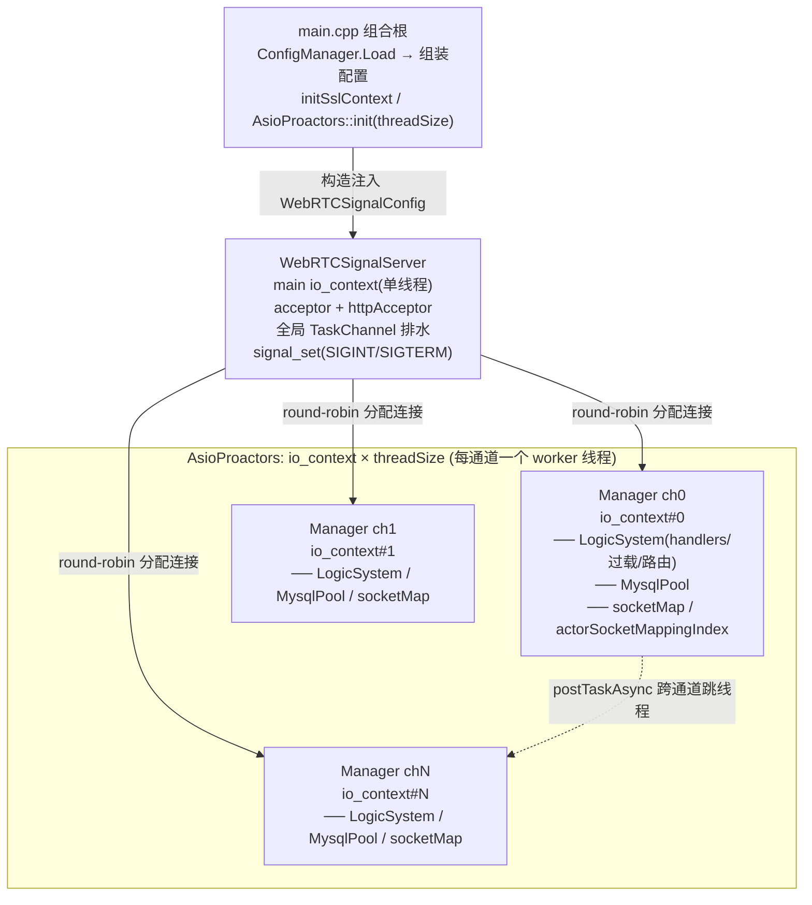
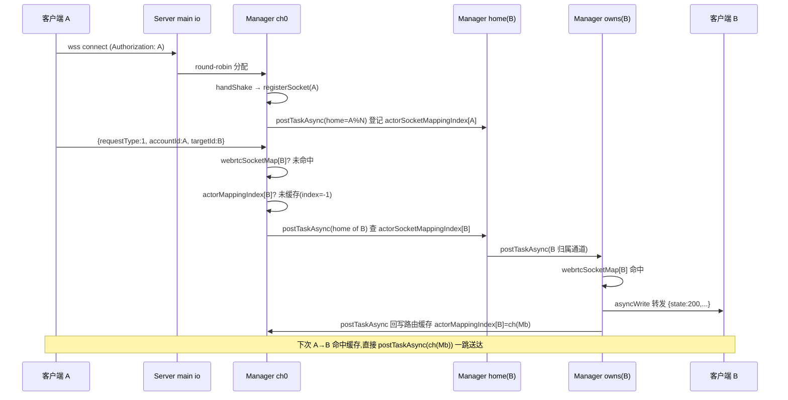
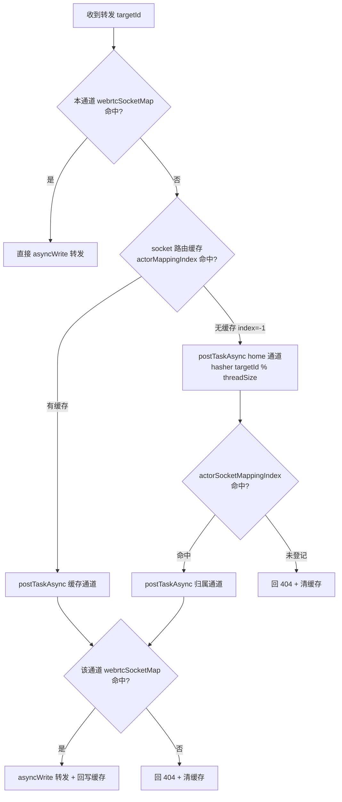
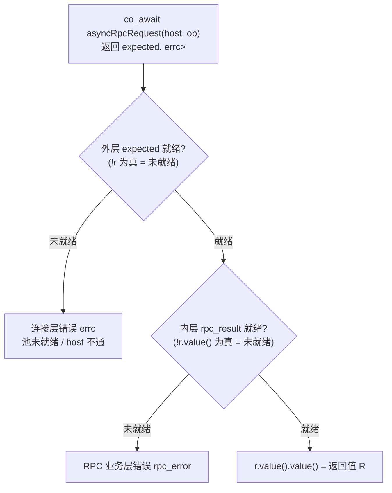
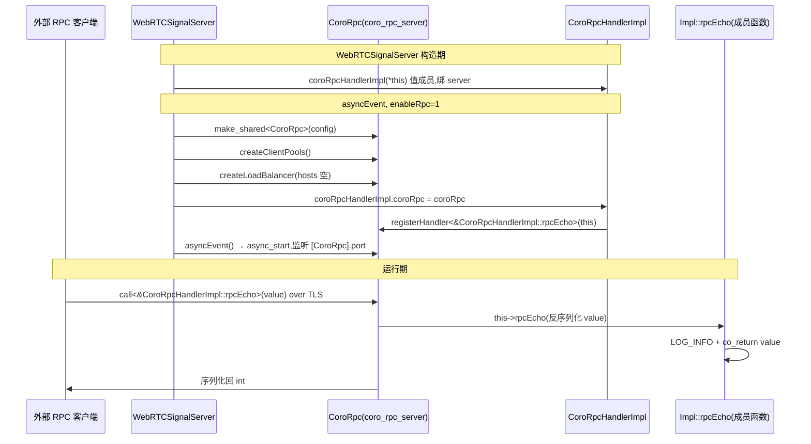

# WebRTCSignalServer 架构文档

> 一台多通道、协程化、SSL 可选的 WebRTC 信令服务器。WebSocket 承载信令转发，HTTP 承载运维查询，预留 CoroRpc 做节点间 RPC、HttpClient 做服务注册发现（Polaris）。
>
> 本文按「架构 → 流程 → 性能 → 使用方式 → 信令 → HTTP → HttpClient → CoroRpc → MySQL」组织，对应代码目录 `WebRTCSignalServer/`。

---

## 1. 概述

WebRTCSignalServer 是 WebRTC 信令面的中转服务：

- **信令通道**：WebSocket（`wss://` 默认开 SSL），客户端用 `accountId` 鉴权接入，服务器按 `requestType` 处理/转发信令到 `targetId`。
- **运维通道**：HTTPS，提供通道/连接统计接口。
- **分片并发**：启动时按 `threadSize` 切出 N 个「通道(channel)」，每个通道独占一个 `io_context`+线程；连接按 round-robin 分配，路由按 `accountId` 一致性哈希跨通道寻址。
- **过载保护**：本地协程派发 + 全局任务队列两级调度，超阈值走全局队列削峰，满则回 503。
- **配置解耦**：`ConfigManager` 只在 `main.cpp` 出现，业务类全部构造注入 / 全局配置，不在类内读 ini。

平台：Linux 为主（makefile 用 clang++ + io_uring + ThinLTO），Windows 仅作开发/调试编译路径。SSL 默认开启，可用宏关闭。

---

## 2. 目录结构

```
server/
├── main.cpp                      # 组合根:读 ini、组装配置结构体、启动
├── Ssl.h / Ssl.cpp               # 全局 ssl::context + initSslContext/getSslContext
├── config.ini                    # 配置文件(ini)
├── makefile                      # clang/linux 构建
├── iocp/
│   └── AsioProactors.h/.cpp      # io_context 池(每线程一个 io_context)
├── signal/                       # 信令+HTTP 主体
│   ├── WebRTCSignalServer.*      # 顶层服务:acceptor、全局任务队列、通道编排
│   ├── WebRTCSignalManager.*     # 单通道:socket 表、actor 路由索引、LogicSystem
│   ├── WebRTCSignalSocket.*      # WebSocket 连接:握手、收发协程、keepalive
│   ├── WebRTCLogicSystem.*       # 业务派发:handler 表、过载调度、forward 路由、HTTP 路由
│   ├── WebRTCSignalPacket.*      # 信令包:socket+json request+requestType
│   ├── HttpSocket.*              # HTTPS 连接:握手、keep-alive、读写
│   ├── HttpClient.*              # 出站 HTTP 客户端(对接 Polaris 等服务发现)
│   ├── AsioConcurrentQueue.h     # moodycamel 队列 + sam 信号量 的 awaitable 封装
│   └── AwaitableTask.h           # TaskChannel:全局任务队列(concurrent_channel + moodycamel)
├── rpc/
│   ├── CoroRpc.h/.cpp            # ylt/coro_rpc 封装(server+client pool+LB)
│   └── CoroRpcHandlerImpl.h/.cpp # RPC handler 注册(rpcEcho 自由函数 + 全局访问 server)
├── mysql/
│   ├── MysqlConfig.h             # 全局 MysqlConfig 结构体 + inline globalMysqlConfig
│   ├── WebRTCMysqlManagerPools.* # boost::mysql 连接池(每通道一个)
│   └── AsyncTransactionGuard.h   # 事务 RAII(START TRANSACTION / COMMIT / ROLLBACK)
└── utils/
    ├── ConfigManager.h           # ini/json/xml 配置单例(只在 main 用)
    ├── Utils.h/.cpp              # 日志(LOG_INFO/...)、控制台级别
    ├── concurrentqueue.h         # moodycamel::ConcurrentQueue(改名 hopeMoodycamel 隔离)
    └── SpinLock.h
```

## 3. 整体架构

### 3.1 分层



### 3.2 线程模型

| 线程 | io_context | 职责 |
|------|-----------|------|
| main loop(1 个) | `ioContext{1}` | accept(WebSocket+HTTP)、全局 TaskChannel 排水、`signal_set` |
| worker × `threadSize` | `AsioProactors` 池中各自一个 | 本通道连接的握手/读写协程、handler 执行、MySQL pool |

- **连接绑定通道**：accept 后 `loadBalanceWebrtcManger()` 用 `managerIndex.fetch_add(1) % threadSize` round-robin 选一个 Manager，socket 的 `co_spawn` 落在该 Manager 的 io_context 上；此后该连接的收发、handler 都在同一个 worker 线程，**无跨线程锁**。
- **跨通道通信**：通过 `WebRTCSignalServer::postTaskAsync(channelIndex, lambda)`，内部 `co_spawn` 到目标通道 io_context，lambda 收到 `shared_ptr<WebRTCSignalManager>`。这是路由转发的线程跳转原语。
- **条件编译**：
  - `__linux__`：accept 走每通道 `SO_REUSEPORT` 多 acceptor（`WebRTCSignalManager::asyncAccept`），Linux 专用路径。
  - 非 Linux（含 Windows）：单 acceptor 在 main loop，accept 后分发。
  - `HOPE_RTC_SIGNAL_SERVER_LOGIC`：LogicSystem 用独立 logic io 池（`AsioProactors::getLogicInstance`）而非本通道 io。
  - `WEBRTC_SIGNAL_SOCKET_DISABLE_SSL` / `WEBRTC_SIGNAL_HTTP_SOCKET_DISABLE_SSL`：关闭对应连接的 SSL。

### 3.3 配置解耦（重点）

`ConfigManager`（`utils/ConfigManager.h`，boost::property_tree，单例）**只在 `main.cpp` 用一次**：

```
main.cpp: ConfigManager.Instance().Load("config.ini")
        → 读 [WebRTCSignalServer] 填 WebRTCSignalConfig(构造注入)
        → 读 [CoroRpc]          填 WebRTCSignalConfig.coroRpcServerConfig + enableRpc
        → 读 [Mysql]            填 globalMysqlConfig(全局)
```

两条注入路径：

1. **浅层(3 跳)走构造注入**：`WebRTCSignalConfig` → `WebRTCSignalServer` → `WebRTCSignalManager`（用标量小结构体 `WebRTCSignalChannelConfig` 收拢，避免把 CoroRpc 头拖进 Manager）→ `WebRTCLogicSystem`（threshold/exitThreshold/asyncThreshold）/ `WebRTCSignalSocket`（socketWaitTime）。
2. **深层(4 跳、跨子系统)走全局**：`mysql/MysqlConfig.h` 里 `inline MysqlConfig globalMysqlConfig;`，main 填一次，`WebRTCMysqlManagerPools` 读。穿透 server→manager→logicSystem→pools 四层，中间三层不关心 mysql 参数，故按约定走全局而非透传。

业务类内部**不再出现 `ConfigManager::Instance()`**。

---

## 4. 启动与关闭流程

### 启动（`main.cpp`）

1. 设置控制台 UTF-8。
2. `ConfigManager.Load("config.ini")`，`initLogger()`，按 `DEBUG/INFO/WARN/ERROR` 设控制台日志级别。
3. `initSslContext(certificateFile, privateKeyFile)`（主 WebSocket/HTTP 的 SSL 上下文）。
4. 组装 `WebRTCSignalConfig`（port/httpPort/enableHttp/enablePublicPort/threadSize/overload/threshold/exitThreshold/asyncThreshold/socketWaitTime + `[CoroRpc]` 子配置）与 `globalMysqlConfig`。
5. `AsioProactors::init(threadSize)` 启动 worker 线程池。
6. 构造 `WebRTCSignalServer(ioContext, webrtcSignalConfig)`（内部 `initialize()` 建 N 个 Manager，每个 Manager 建 LogicSystem+MysqlPool 并 `asyncEvent()`）。
7. `webrtcSignalServer->asyncEvent()`：开 accept 协程、全局任务队列排水协程、各 LogicSystem 的 `asyncTaskExecute()`。
8. `signal_set(SIGINT/SIGTERM).async_wait(...)`。
9. `ioContext.run()`。

### 关闭（收到 SIGINT/SIGTERM）

1. `webrtcSignalServer->closeEvent()`：`taskQueues.close()`、清空 managers（触发各 Manager/LogicSystem/MysqlPool 析构 → `pool->cancel()`）。
2. `work.reset()` + `ioContext.stop()`。
3. `closeLogger()`。
4. `AsioProactors` 析构：各 worker `work.reset()`→`io_context.stop()`→`join`。

---

## 5. 信令流程（WebSocket）

### 5.1 接入握手（`WebRTCSignalSocket::handShake`）

1. （SSL 时）`async_handshake(server)`，带 `cancel_after(handshakeTimeout)`（`socketWaitTime` ms，注入）。
2. `async_read` 读 HTTP Upgrade 请求。
3. 取 `accountId`：优先 `Authorization` 头，否则 `?authorization=` query。
4. 缺 `accountId` → `LOG_WARN` 拒绝 + `closeSocket()`。
5. `webSocket.async_accept(req)` 完成 WebSocket 升级。
6. `setTcpKeepAlive`（按平台调 SO_KEEPALIVE / TCP_KEEPIDLE/INTVL/CNT）。
7. `manager->registerSocket(accountId, this)`：
   - 若同 `accountId` 已有旧连接 → 旧连接 `closeEvent()`（踢旧）。
   - 写入 `webrtcSocketMap[accountId]`。
   - `postTaskAsync(mapChannelIndex, ...)` 在 home channel 的 `actorSocketMappingIndex[accountId] = {sessionId, channelIndex}` 登记归属。

### 5.2 收发循环

- `asyncEvent()` 起 `reviceCoroutine` + `writerCoroutine` 两个协程。
- **revice**：`async_read` → 解析 JSON 到 `WebRTCSignalPacket.request`（`monotonic_resource` arena）→ 取 `requestType` → `logicSystem->postTaskAsync(packet)`。
- **writer**：从 `AsioConcurrentQueue<std::string>`（moodycamel + sam 信号量）dequeue → `async_write`。`asyncWrite(packet)` 入队。
- 异常/断开 → `onDisConnectHandle(accountId, sessionId)` → `removeConnection`。

### 5.3 关闭：RST 强关

`closeSocket()` 设 `linger{1,0}` 后 `close()`，跳过 TCP FIN 四次挥手直接发 RST，**避免 TIME_WAIT 堆积、快速释放资源**。

### 5.4 业务派发与过载（`WebRTCLogicSystem`）

`postTaskAsync(packet)`：

```
handler = webrtcHandlers[requestType]
若找不到 → LOG_ERROR "Unknown Request Type"
找到:
  taskQueueSize++
  if taskQueueSize>=threshold && localTaskQueueSize>=threshold && webrtcLogicHandlers[type]==true:
      走全局队列: taskQueues.enqueue(lambda)  // 削峰
      失败(队列满) → taskQueueSize--, 回 503 busy
  else:
      localTaskQueueSize++
      co_spawn(本通道 io, func(packet))       // 快路径,本线程就地跑
      完成回调: taskQueueSize--, localTaskQueueSize--,
               若 localTaskQueueSize 回落到 asyncThreshold+1 → 重启 asyncTaskExecute()
```

- `webrtcLogicHandlers[type]` 标记该 handler 是否可搬到全局队列。**当前信令 1–7 全为 false**，即信令始终本地派发（低延迟、贴在连接所在线程）；全局队列主要服务可搬迁的 HTTP handler（`overview` 为 true）。
- 全局 `TaskChannel` 由 `threadSize+1` 个排水协程消费（main loop 1 个 + 每通道 LogicSystem 1 个），moodycamel 多消费安全。

### 5.5 forward 路由（核心）

转发 handler（requestType 1/2/3/6/7）把消息送到 `targetId`。三级寻址：

```
1) 本通道直查: manager.webrtcSocketMap[targetId] 命中 → 直接 asyncWrite 转发
2) 命中失败 → 查 socket 本地路由缓存 actorMappingIndex[targetId] → channelIndex
   ├─ 有缓存: postTaskAsync(缓存通道) 去找
   └─ 无缓存(index=-1): postTaskAsync(home 通道 = hasher(targetId)%hashSize)
3) 到达目标通道后查 actorSocketMappingIndex[targetId] → 真正归属通道
   ├─ 命中: 跳到归属通道,webrtcSocketMap 取 socket 转发;回写本地路由缓存
   └─ 未登记: 回 404 "TargetId is not register",清掉过期缓存项
```

要点：
- **一致性哈希 home 通道**：`hasher(accountId) % hashSize`（`hashSize=threadSize`），让任意 accountId 到 home 通道的映射稳定，跨通道寻址最多两跳。
- **两级缓存**：每个 socket 的 `actorMappingIndex`（targetId→channel）做就近缓存；每个通道的 `actorSocketMappingIndex`（accountId→{sessionId,channel}）做全局索引。命中缓存省一跳。
- **过期自愈**：转发 404 时清掉缓存里指向错误通道的项，下次重新寻址。
- **线程安全**：所有对 `webrtcSocketMap`/`actorSocketMappingIndex`/`actorMappingIndex` 的访问都在该数据所属通道的 io_context 线程上（通过 `postTaskAsync` 跳线程），无锁。

### 5.6 转发图示（Mermaid）

**转发时序图**（客户端 A 接入 ch0，向 targetId B 转发；B 的 home 通道与归属通道不同）：



**三级寻址决策图**：



### 5.7 requestType 一览

| requestType | 含义 | handler |
|-------------|------|---------|
| 1 | REQUEST（普通转发） | forwardHandler |
| 2 | RESTART | forwardHandler |
| 3 | STOPREMOTE | forwardHandler |
| 4 | 主动断开 | `removeConnection(accountId, sessionId)` |
| 6 | CLOSESYSTEM | forwardHandler |
| 7 | SYSTEMREADLY | forwardHandler |

5 未使用。所有转发类 handler 复用同一个 `forwardHandler`，仅 `requestTypeStr` 不同（日志区分）。

---

## 6. HTTP 接口（`HttpSocket` + `WebRTCLogicSystem::initHttpHandlers`）

### 6.1 连接处理

- SSL（默认）或 plain；`asyncHandShake` 带 5s 超时。
- `asyncRead` → `postHttpTaskAsync(socket, request)` → `asyncReadKeepAlive`：
  - 解析 `Keep-Alive: timeout=N` 设 `timeoutSec`。
  - 起保活定时器协程，到期未活动则 `async_shutdown` + `closeSocket`。
  - 继续异步读下一个请求（HTTP keep-alive pipeline）。
- `asyncWrite` 在 keep-alive 时刷新保活定时。

### 6.2 派发与过载

`postHttpTaskAsync` 与信令同构：`httpHandlers[targetUrl]` 命中 → 过载判断（`httpLogicHandlers[url]` 决定可否搬全局队列）→ 本地 co_spawn 或全局队列；满则回 503；未命中路由回 404。

### 6.3 路由

| 方法+路径 | 鉴权 | 作用 |
|-----------|------|------|
| `/api/v1/managers/overview` | Bearer token | 返回 `totalManagers`(通道数) |
| `/api/v1/managers/stat` | Bearer token | body `{"channelIndex":N}`，返回该通道 socket 列表(accountId/remoteAddr/sessionId/cachedRouteCount) |
| 其他 | — | 404 JSON |

- **鉴权**：`Authorization: Bearer 913140924@qq.com`（`verifyAuthorization` 里硬编码 token，仅示例，生产需替换）。
- **跨通道查询**：`/stat` 若查询的不是当前通道，用 `postTaskAsync(targetIdx,...)` 跨通道取数据，再 `postTaskAsync` 回当前通道写响应（`threadChannelIndex` 是 thread_local，用于判断同通道直接 `co_await` 还是跨通道 `co_spawn`）。

### 6.4 响应序列化

`serializeHttpResp(state, message, data)` 用 `monotonic_resource` arena 构 JSON：`{"state":..,"message":"..","data":..}`。固定文案错误用 `absl::StrFormat` 内联，带变量的走 boost::json 转义。

---

## 7. HttpClient（出站 HTTP 客户端）

`signal/HttpClient.*`，基于 boost::beast + boost::urls，协程化出站 HTTP（**与服务端 HttpSocket 不同**：HttpSocket 是入站服务端连接，HttpClient 是主动请求外部服务）。

### 7.1 接口

- `HttpClient(io_context, enableSsl)`。
- `connect(host, port)`：resolve → `async_connect` →（SSL 时）`async_handshake(client)`。
- `asyncRequest(url, request) -> awaitable<Response>`：
  1. 解析 `host:port`（IPv6 带 `[]` 不拆，默认端口 443/80）。
  2. 补 `target` 默认 `/`、补 `Host` 头。
  3. **连接复用**：socket 仍开且 host/port 未变 → 复用，否则 `closeStream` + 重连。
  4. `async_write` + `async_read`。
  5. 按响应 `Connection: close` / HTTP 版本判断 keep-alive，不 keep-alive 则 `close()`。

### 7.2 用途：对接 Polaris 服务发现

HttpClient 是出站客户端，供服务端（或调用方）访问外部 HTTP 服务。典型场景是 **Polaris 服务注册发现**：

- `POST /v1/RegisterInstance` 注册实例（service/namespace/host/port/healthCheck heartbeat ttl/location/metadata）。
- `POST /v1/Discover` 发现实例。
- `POST /v1/Heartbeat` 心跳。
- `POST /v1/DeregisterInstance` 反注册。
- `GET /naming/v1/namespaces` 等。

示例（向 Polaris 注册实例）：

```cpp
auto client = std::make_shared<HttpClient>(ioc, /*enableSsl=*/false);  // Polaris 常用明文 80

boost::asio::co_spawn(ioc, [client, token]() mutable -> boost::asio::awaitable<void> {
    HttpClient::Request req;
    req.version(11);
    req.method(boost::beast::http::verb::post);
    req.target("/v1/RegisterInstance");
    req.set(boost::beast::http::field::content_type, "application/json");
    req.set("X-Polaris-Token", token);                 // 纯 Token,不加 "Bearer "

    boost::json::object obj;
    obj["service"] = "webrtc-signal-server";
    obj["namespace"] = "coro";
    obj["host"] = "127.0.0.1";
    obj["port"] = 10087;
    obj["protocol"] = "tcp";
    obj["version"] = "1.0.0";
    obj["weight"] = 100;
    obj["healthy"] = true;
    obj["enableHealthCheck"] = true;
    boost::json::object healthCheck;
    healthCheck["type"] = "HEARTBEAT";
    boost::json::object heartbeat;
    heartbeat["ttl"] = 5;
    healthCheck["heartbeat"] = heartbeat;
    obj["healthCheck"] = healthCheck;
    req.body() = boost::json::serialize(obj);
    req.prepare_payload();

    auto resp = co_await client->asyncRequest("127.0.0.1:8090", req);
    // Discover / Heartbeat / DeregisterInstance 同理,换 target + body
}, boost::asio::detached);
```

> HttpClient 由调用方自行使用；信令服务器启动流程当前未调用它。

---

## 8. CoroRpc（节点间 RPC）

`rpc/CoroRpc.*`，封装 ylt/coro_rpc（`#define YLT_ENABLE_SSL`），提供 server + client pool + load balancer。`enableRpc=1` 时由 `WebRTCSignalServer::asyncEvent()` 拉起（见 §8.5）。

### 8.1 配置（`CoroRpcServerConfig`，对应 `[CoroRpc]` ini）

| 字段 | 含义 |
|------|------|
| port / threadSize | RPC 端口 / 线程 |
| enableSsl | 是否 TLS |
| basePath / certFile / keyFile | 证书目录与服务端证书/私钥 |
| caCertFile | 校验客户端证书的 CA（仅 mTLS，单向不配） |
| enableClientVerify | 是否校验客户端证书（mTLS 时为 true） |
| enableDoubleSsl | mTLS 双向认证 |
| clientCertFile / clientKeyFile | mTLS 时作为下游客户端出示的证书/私钥 |

`WebRTCSignalConfig.enableRpc` 控制是否启用（默认 0）。

### 8.2 Server 侧

handler 必须是**命名空间作用域的自由函数（或成员函数指针）**——ylt 按编译期函数指针注册，不接受 `std::function`/lambda/局部变量。

```cpp
// 自由协程函数 handler
struct RpcRequest { int request; std::string json; };
async_simple::coro::Lazy<RpcRequest> calculate(RpcRequest req) {
    auto val = co_await coro_io::post([req]() { return req; });
    co_return val.value();
}

auto rpc = std::make_shared<CoroRpc>(config);
rpc->registerHandler<calculate>();                 // 自由/静态函数
rpc->registerHandler<&Foo::bar>(&foo);             // 成员函数:foo 携带状态(server 经此传入),生命周期需长于 rpc
rpc->createClientPools();
rpc->createLoadBalancer(hosts, weights, lba);      // RR/WRR
rpc->asyncEvent();   // coro_rpc_server.async_start()
// ...
rpc->closeEvent();   // stop()
```

### 8.3 Client 侧

`CoroRpc` 既是 server 也是 client 框架：`createClientPools()` 建连接池、`createLoadBalancer(hosts)` 建负载均衡器后，即可向下游发 RPC。

**两层错误模型**：`asyncRpcRequest` / `asyncLbRpcRequest` 返回 `Lazy<expected<rpc_result<R>, std::errc>>`，要拆两层判：



调用自由函数 handler（服务端按 `registerHandler<func>` 注册的）：

```cpp
auto r = co_await rpc->asyncRpcRequest(
    "127.0.0.1:10011",
    [](coro_rpc::coro_rpc_client& cli)
    -> async_simple::coro::Lazy<coro_rpc::rpc_result<RpcRequest>> {
        RpcRequest req{ 1, R"({"name":"Alice","age":30})" };
        co_return co_await cli.call<calculate>(req);        // 自由函数:call<func>
    });

if (!r)              { /* 连接层失败 */ }
else if (!r.value()) { /* RPC 业务失败 */ }
else                 { auto& resp = r.value().value(); /* resp.request / resp.json */ }
```

调用成员函数 handler（服务端按 `registerHandler<&Class::method>(obj)` 注册的）——`call` 的模板参数写成员函数指针：

```cpp
auto result = co_await rpc->asyncRpcRequest(
    "127.0.0.1:10011",
    [](coro_rpc::coro_rpc_client& client)
    -> async_simple::coro::Lazy<coro_rpc::rpc_result<int>> {
        co_return co_await client.call<&hope::rpc::CoroRpcHandlerImpl::rpcEcho>(20260724);  // 成员函数:call<&Class::method>
    });
```

**负载均衡版** `asyncLbRpcRequest(op)`：用 `createLoadBalancer` 配好的 host 列表轮询 / 加权分发，`op` 多一个 `string_view host` 参数告诉你这次落到哪台：

```cpp
auto r = co_await rpc->asyncLbRpcRequest(
    [](coro_rpc::coro_rpc_client& cli, std::string_view host)
    -> async_simple::coro::Lazy<coro_rpc::rpc_result<int>> {
        co_return co_await cli.call<someFunc>();
    });
```

**原始字节（attachment）** `asyncRequestRaw<func>(host, payload)`：不走 `call<func>(args)` 的序列化，直接传字节。服务端 handler 须为 `void(coro_rpc::context<void>)`，用 `release_request_attachment()` 取请求字节、`set_response_attachment()` 回字节。返回的 `string_view` 指向客户端响应缓冲，拿到后立即用、不要长期保存：

```cpp
auto r = co_await rpc.asyncRequestRaw<echoRaw>("127.0.0.1:10011", std::string(payload));
// r: Lazy<expected<rpc_result<string_view>, std::errc>>
```

**异步等待** `asyncAwait(lazy)`：`syncAwait` 的非阻塞版——把 Lazy 扔到 io 池异步跑、立即返回。用于在一个异步回调里嵌套发起 RPC（传进去的 Lazy 里照常 `co_await rpc->asyncRpcRequest(...)`），不阻塞当前协程：

```cpp
rpc->asyncAwait([&]() -> async_simple::coro::Lazy<void> {
    auto r = co_await rpc->asyncRpcRequest(host, op);
    /* 处理结果 */
}());
```

**host 黑名单**：对端下线后把它从可用集合剔除，后续 `asyncRpcRequest` 对该 host 直接返回 `std::errc::not_connected`，不再走网络。若该 host 之前发过请求（池里已有 pool），顺带 clear 它的空闲连接。

- `removeHost(host)`：移除单个。
- `removeHosts(hosts)`：批量移除。
- `removeHostsNotIn(existingHosts)`：按"仍在线清单"裁剪，移除不在清单里的 host——用于服务发现回调后同步可用节点集合。

### 8.4 SSL 三模式

- `SSL_MODE_NONE`：明文（`enableSsl = false`）。
- `SSL_MODE_SINGLE`：单向 TLS。
- `SSL_MODE_DOUBLE`：mTLS（`enableDoubleSsl` + `enableClientVerify` + clientCert/Key）。

配置示例：

```cpp
CoroRpcServerConfig cfg{};
cfg.port = port;
cfg.threadSize = 4;

// SSL_MODE_SINGLE(单向 TLS):服务端只出示 cert/key,不校验客户端
cfg.enableSsl = true;
cfg.basePath = CERT_DIR;
cfg.certFile = "server.crt";
cfg.keyFile = "server.key";
cfg.enableClientVerify = false;
// caCertFile 不配——单向不校验客户端证书

// SSL_MODE_DOUBLE(mTLS) 在 SINGLE 基础上,服务端校验客户端:
cfg.enableDoubleSsl = true;
cfg.enableClientVerify = true;
cfg.caCertFile = "server.crt";          // 校验客户端证书的 CA,仅 mTLS 配
cfg.clientCertFile = "server.crt";
cfg.clientKeyFile = "server.key";
```

构造时校验：mTLS 必须同时给 clientCertFile + clientKeyFile；`enableClientVerify=true` 必须配 mTLS，否则抛 `runtime_error`。

### 8.5 在信令服务器中的集成

`enableRpc=1` 时，`WebRTCSignalServer::asyncEvent()` 按以下顺序拉起 RPC：

```cpp
coroRpc = std::make_shared<hope::rpc::CoroRpc>(webrtcSignalConfig.coroRpcServerConfig);
coroRpc->createClientPools();
std::vector<std::string> hosts;               // 当前为空,暂无下游 LB(hosts 为空时 createLoadBalancer 直接返回)
coroRpc->createLoadBalancer(hosts);
coroRpcHandlerImpl.coroRpc = coroRpc;          // 把 rpc 赋给 handler 对象
coroRpcHandlerImpl.registerRpcHandler();       // 注册 rpcEcho
coroRpc->asyncEvent();                         // coro_rpc_server.async_start()
```

`coroRpc` 是 `WebRTCSignalServer` 的 `shared_ptr<CoroRpc>` 成员；`coroRpcHandlerImpl` 是 `CoroRpcHandlerImpl` **值成员**，在 `WebRTCSignalServer` 构造列表里以 `coroRpcHandlerImpl(*this)` 初始化（此时只绑 server，`coroRpc` 还是 nullptr），到 `asyncEvent` 才把 `coroRpc` 赋进去再注册。`closeEvent()` 里 `if (coroRpc) coroRpc->closeEvent();` 停 RPC server。

handler 注册由 `rpc/CoroRpcHandlerImpl.*` 负责。`rpcEcho` 是 `CoroRpcHandlerImpl` 的**私有成员函数**，`registerRpcHandler()` 调 `coroRpc->registerHandler<&CoroRpcHandlerImpl::rpcEcho>(this)` 注册——`this` 携带 `webrtcSignalServer`，无需全局：

```cpp
class CoroRpcHandlerImpl {
public:
    CoroRpcHandlerImpl(hope::signal::WebRTCSignalServer& webrtcSignalServer);
    void registerRpcHandler();
private:
    async_simple::coro::Lazy<int> rpcEcho(int value);
public:
    std::shared_ptr<CoroRpc> coroRpc;                 // 由 WebRTCSignalServer 在 asyncEvent 赋值
    hope::signal::WebRTCSignalServer& webrtcSignalServer;
};

CoroRpcHandlerImpl::CoroRpcHandlerImpl(WebRTCSignalServer& s)
    : webrtcSignalServer(s), coroRpc(nullptr) {}

void CoroRpcHandlerImpl::registerRpcHandler() {
    if (!coroRpc) return;
    coroRpc->registerHandler<&CoroRpcHandlerImpl::rpcEcho>(this);  // this 携带 server
}

async_simple::coro::Lazy<int> CoroRpcHandlerImpl::rpcEcho(int value) {
    LOG_INFO("rpcEcho value: %d", value);
    co_return static_cast<int>(webrtcSignalServer.getChannelNumbers());  // 经 this 用 server
}
```

`webrtcSignalServer` 是对象引用成员，这就是「把 server 传进 handler」的方式（ylt 按成员函数指针注册，对象指针在调用时传入）。`coroRpcHandlerImpl` 作为 `WebRTCSignalServer` 的值成员，生命周期随 server。注意：`&CoroRpcHandlerImpl::rpcEcho` 必须是**完全限定**的成员函数指针（不能写 `&rpcEcho`），且成员函数注册必须传 `this`，否则 ylt 会 `static_assert` 报 "register member function but lack of the parent object"。

ylt/coro_rpc 是头文件库，无需额外链接库；`rpc/CoroRpcHandlerImpl.cpp` 需列入 makefile `SRCS`。

### 8.6 RPC 自调时序（Mermaid）



---

## 9. MySQL（`mysql/`）

### 9.1 连接池 `WebRTCMysqlManagerPools`

- 每个 `WebRTCLogicSystem` 构造时建一个 `boost::mysql::connection_pool`，跑在该通道 io_context 上（`co_spawn` `pool->async_run`）。
- 配置来自全局 `globalMysqlConfig`（host/port/user/password/database/multiQueries/poolInitialSize/poolMaxSize/connectTimeout/pingInterval/pingTimeout），main 启动时填一次，启动后只读无锁。
- `getTransactionMysqlManager() -> awaitable<ScopedMysqlConnection>`：`async_get_connection` 取连接，包成 `ScopedMysqlConnection`（`getConnection()` 拿 `any_connection*`）。
- 析构：`post` 一个 `pool->cancel()`。

### 9.2 事务守卫 `AsyncTransactionGuard`

RAII 事务：`create(conn)` 执行 `START TRANSACTION`；`commit()`/`asyncRollback()` 显式提交/回滚；`rollback()` 同步回滚。**析构不自动异步回滚**——调用方需显式 `commit()` 或 `asyncRollback()`，否则事务悬空（依赖连接归还/服务端超时）。

> 现状：MysqlPool 已在每通道构造，但信令 handler 里未见实际 SQL 调用——是预留的持久化层。

---

## 10. 任务队列与过载保护

### 10.1 数据结构

- `TaskChannel`（`AwaitableTask.h`）：`concurrent_channel<void(error_code)>`（awaitable 信号）+ `hopeMoodycamel::ConcurrentQueue<AwaitableTask>`（无锁队列）+ `atomic<ptrdiff_t> queueSize` + `maxCapacity`。
  - `enqueue`：先 `fetch_add` 比容量，超限回滚返回 false（背压）；否则入队 + `channel.try_send` 唤醒。
  - `dequeue`：先 `try_dequeue`，拿不到则 `async_receive` 挂起；channel 关闭则排空并返回 `nullopt`。
- `AsioConcurrentQueue<T>`（`AsioConcurrentQueue.h`）：同样的 moodycamel + `boost::sam::basic_semaphore`，给 socket 写队列用。

### 10.2 阈值（注入，来自 `WebRTCSignalConfig`）

| 参数 | 含义 |
|------|------|
| `overload` | 全局 `TaskChannel` 容量 = `overload*(threadSize+1)` |
| `threshold` | 本地+全局队列深度同时达到才走全局削峰 |
| `exitThreshold` | 本地队列深度达到则本地排水协程退出（让位） |
| `asyncThreshold` | 本地深度回落到此+1 时重启本地排水 |

### 10.3 两级调度

- **快路径（本地）**：`co_spawn` 到本通道 io，就地执行，低延迟。
- **慢路径（全局）**：入 `TaskChannel`，由 `threadSize+1` 个排水协程跨线程消费，削峰填谷。
- **背压**：全局队列满 → 直接回 503，保护服务不被拖垮。

---

## 11. 性能设计要点

1. **io_context-per-thread proactor 池**（`AsioProactors`），连接按通道分片，**单连接生命周期内绑定单线程，无锁**。
2. **一致性哈希路由**（`accountId % threadSize`）+ 每 socket 路由缓存，跨通道寻址最多两跳，命中缓存一跳。
3. **无锁队列** moodycamel::ConcurrentQueue（仓库自带副本改名为 `hopeMoodycamel` 隔离，避免与 ylt 自带 moodycamel 撞名/共享宏守卫）。
4. **concurrent_channel / sam 信号量** 做协程唤醒，避免轮询。
5. **RST 强关**（`linger{1,0}`）避免 TIME_WAIT，短连接高 churn 场景友好。
6. **TCP keepalive** 按平台精细调参，及时探活。
7. **boost::json `monotonic_resource`** arena 分配信令包/HTTP 响应，减少堆分配。
8. **过载两级调度 + 503 背压**，防止雪崩。
9. **构建优化**：clang `-O3 -march=native -flto=thin`、`-ffunction-sections -Wl,--gc-sections -Wl,--icf=all`、tcmalloc、Linux `io_uring`（`BOOST_ASIO_HAS_IO_URING`）、`-MMD -MP` 头依赖。
10. **round-robin accept** 均衡连接到各通道；Linux 下 `SO_REUSEPORT` 多 acceptor 分流。

---

## 12. 使用方式

### 12.1 配置 `config.ini`

```ini
[WebRTCSignalServer]
port = 8088              ; WebSocket 信令端口
httpPort = 9099          ; HTTP 运维端口
enableHttp = 1           ; 是否开 HTTP
enablePublicPort = 1     ; 1=监听 0.0.0.0,0=仅 127.0.0.1
size = 0                 ; 通道数,0=硬件并发数
certificateFile = server.crt
privateKeyFile = server.key
socketWaitTime = 10000   ; 握手超时 ms
DEBUG=0 INFO=1 WARN=1 ERROR=0   ; 控制台日志级别
overload = 256           ; 全局队列容量因子
threshold = 256          ; 削峰阈值
exitThreshold = 128
asyncThreshold = 32

[Mysql]
host = 127.0.0.1
port = 3306
username = root
password = root
database = mysql
poolInitialSize = 2
poolMaxSize = 4
connectTimeoutSeconds = 20
pingIntervalSeconds = 3600
pingTimeoutSeconds = 10
multiQueries = 0

[CoroRpc]
enableRpc = 0            ; 1 才启用 RPC(当前无消费者)
port = 9001
threadSize = 4
enableSsl = 0
basePath = .             ; 证书目录,=当前工作目录
certFile = server.crt
keyFile = server.key
caCertFile =
enableClientVerify = 0
enableDoubleSsl = 0
clientCertFile =
clientKeyFile =

[Protect]
process = WebRTCSignalServer.exe   ; 预留,当前无代码消费
```

### 12.2 构建

```sh
make clean && make
# 产物 release-x64/WebRTCSignalServer,附带拷贝 .so 与符号链接
```

- 需要 `include/{openssl,absl,boost,coroRpc}` 与 `lib/{openssl,absl,boost,tcmalloc}`（构建环境准备）。
- `-Iinclude/coroRpc` 提供 ylt 头。
- ylt/coro_rpc 为头文件库，无需额外链接库。

### 12.3 运行

```sh
cd <含 config.ini + server.crt + server.key 的目录>
./WebRTCSignalServer
```

### 12.4 客户端协议（信令）

- 连接：`wss://host:8088`，请求头带 `Authorization: <accountId>`（或 `?authorization=<accountId>`）。
- 发送 JSON：`{"requestType":1,"accountId":"A","targetId":"B", ...}`。
- 服务器转发给 B：原 JSON 补 `"state":200,"message":"webrtcSignalServer forward"`。
- 目标未注册：回 `{"requestType":1,"state":404,"message":"TargetId is not register"}`。
- 过载：回 `{"requestType":1,"state":503,"message":"webrtcSignalServer busy, please retry later"}`。
- requestType 4 = 主动断开。

### 12.5 运维 HTTP

```sh
curl -k https://host:9099/api/v1/managers/overview \
  -H "Authorization: Bearer 913140924@qq.com"

curl -k -X POST https://host:9099/api/v1/managers/stat \
  -H "Authorization: Bearer 913140924@qq.com" \
  -H "Content-Type: application/json" \
  -d '{"channelIndex":0}'
```

---

## 13. 关键数据结构速查

| 结构 | 位置 | 作用 |
|------|------|------|
| `WebRTCSignalConfig` | `WebRTCSignalServer.h` | 信号子系统配置（注入） |
| `WebRTCSignalChannelConfig` | `WebRTCSignalManager.h` | 透传到通道的标量配置 |
| `CoroRpcServerConfig` | `CoroRpc.h` | RPC 配置 |
| `MysqlConfig` / `globalMysqlConfig` | `mysql/MysqlConfig.h` | MySQL 全局配置 |
| `WebRTCSignalPacket` | `WebRTCSignalPacket.h` | 信令包（socket+json+requestType） |
| `TaskChannel` | `AwaitableTask.h` | 全局任务队列 |
| `AsioConcurrentQueue<T>` | `AsioConcurrentQueue.h` | socket 写队列 |
| `AwaitableTask` | `AwaitableTask.h` | `absl::AnyInvocable<awaitable<void>()>` |
| `ActorMapping` | `WebRTCSignalManager.h` | `{sessionId, channelIndex}` |
| `AsyncTransactionGuard` | `mysql/AsyncTransactionGuard.h` | 事务 RAII |

---

## 14. 注意事项

- ConfigManager 只在 main.cpp 使用；signal 子系统走构造注入（`WebRTCSignalConfig` / `WebRTCSignalChannelConfig`），MySQL 走全局 `globalMysqlConfig`。
- 仓库自带的 moodycamel 副本改名为 `hopeMoodycamel`、宏前缀改为 `HOPE_MOODYCAMEL_*`，避免与 ylt 自带的 moodycamel 撞名并共享 `#ifndef MOODYCAMEL_ALIGNAS` 守卫。升级上游 moodycamel 时需重新套用这两处改名（见 `utils/concurrentqueue.h` 顶部注释）。
- makefile：`SRCS` 按子目录列出全部 cpp；对象落 `release-x64/<子目录>/`，编译规则用 `@mkdir -p $(dir $@)` 建子目录；`-MMD -MP` 自动头依赖；`-Iinclude/coroRpc` 提供 ylt 头。`rpc/CoroRpcHandlerImpl.cpp` 需确保在 `SRCS` 中。
- CoroRpc 在 `enableRpc=1` 时由 `WebRTCSignalServer::asyncEvent()` 拉起（见 §8.5）；ylt/coro_rpc 为头文件库，无需额外链接库。
- HttpClient 由调用方自行使用，信令服务器启动流程当前未调用它（见 §7.2）。
- MySQL 连接池每通道建好，handler 暂无 SQL 调用；`AsyncTransactionGuard` 析构不自动回滚，需显式 `commit()` / `asyncRollback()`。
- `[Protect]` 段当前无代码消费。
- HTTP 鉴权 token `913140924@qq.com` 为示例硬编码，生产环境需替换为真实鉴权。
