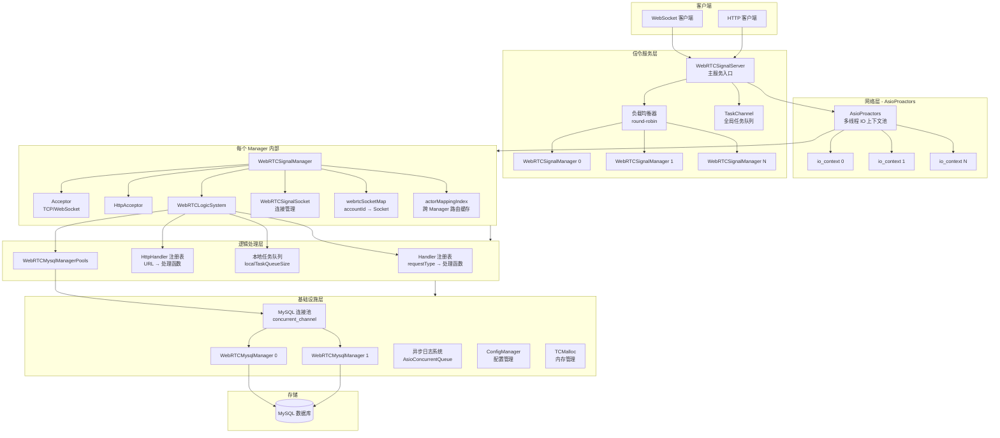
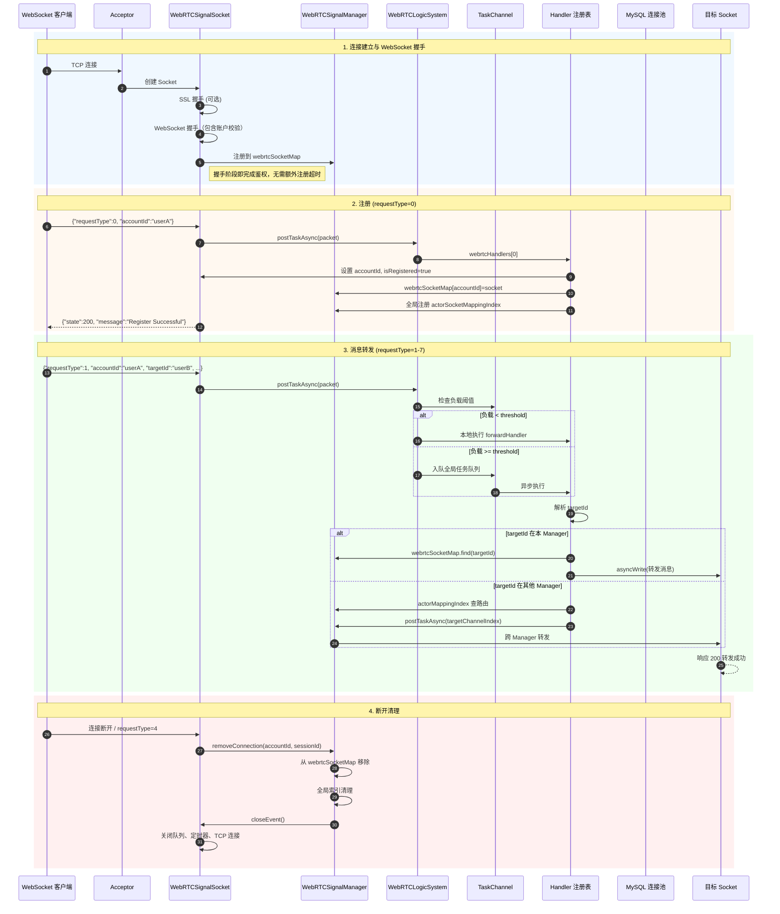
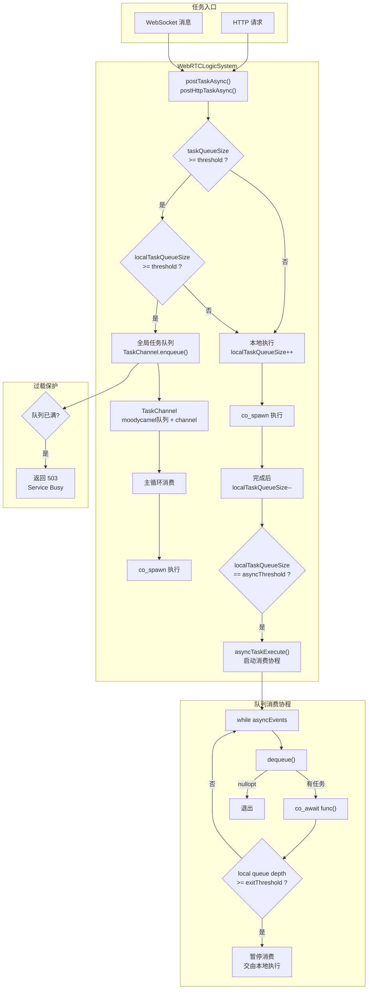
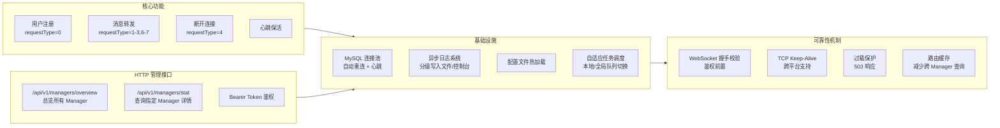
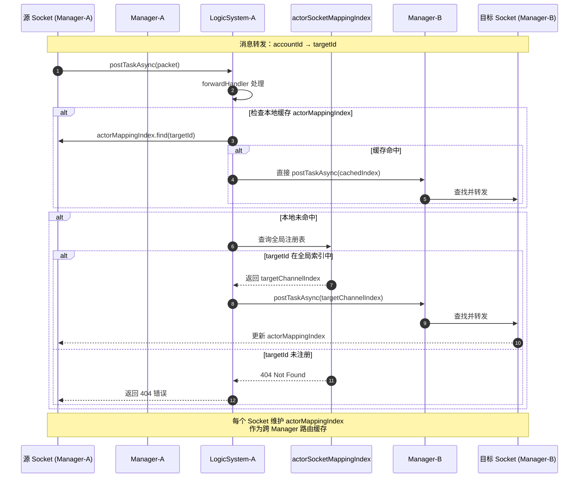

# webrtc-signal-server

## 一、整体架构图

---

## 二、核心业务流程 - 连接与消息处理

---

## 三、异步任务调度机制

---

## 四、功能模块总览

---

## 五、跨 Manager 路由机制

---
1. **多 Proactor 模型**：每个 IO 线程独立运行 `io_context`，通过 `AsioProactors` 管理线程池
2. **两级任务队列**：本地队列 + 全局队列，根据负载动态切换，防止单点瓶颈
3. **跨 Manager 路由**：`actorSocketMappingIndex` 全局索引 + 本地缓存，减少跨线程查询
4. **C++20 协程**：大量使用 `boost::asio::awaitable`，代码可读性强
5. **连接池**：MySQL 连接池带自动重连和心跳，`ScopedMysqlConnection` RAII 自动归还
